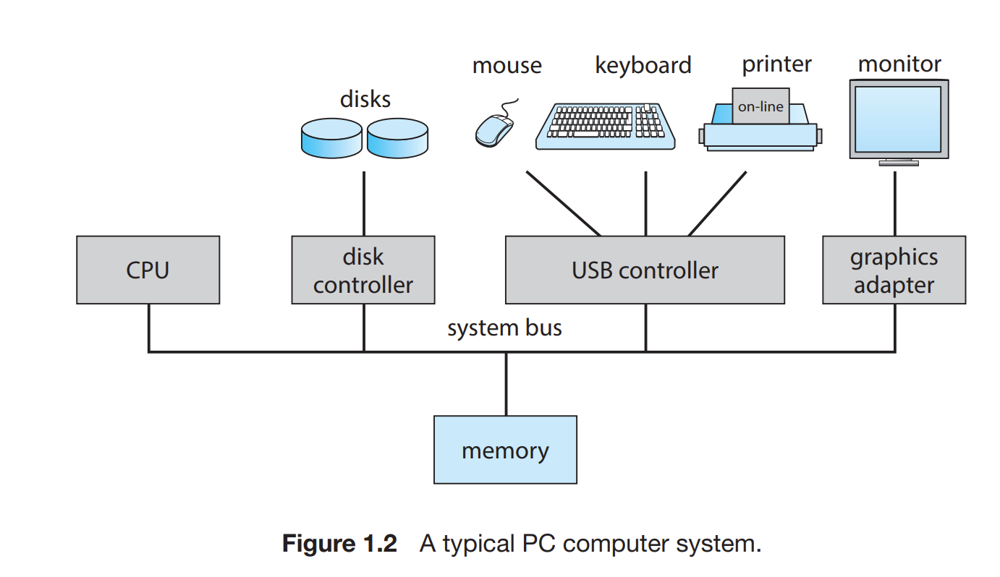

|         작성자          |   작성일   |
| :-: | :-: |
| yunselee | 2022.03.27 |

# 1.1 What Operating Systems Do 4

운영체제는 컴퓨터 하드웨어를 관리하는 소프트웨어다.

컴퓨터 시스템의 네 가지 구성요소
- 하드웨어(cpu/ 메모리 및 입출력(I/O)장치)
- 운영체제
- 응용프로그램
- 사용자

# 1.2 Computer-System Organization 7

시스템의 작동방식의 기본사항에 관한 세가지 주요 측면

## 1.2.1 인터럽트

하드웨어는 시스템버스로 서로 연결되어 있음.

인터럽트 : 하드웨어가 운영체제와 상호 작용하는 주요 방법
시스템 버스를 통해 CPU에 신호를 보내 인터럽트를 발생 시킬 수 있다.(쉘에서 ctrl + C, ctrl + \ 등등)

하드웨어만이 아닌 소프트웨어에서도 가능 ex) kill() 함수 

1. CPU가 인터럽트 될때 하던 일을 중단
2. 인터럽트 서비스 루틴 시작 주소 위치로 실행을 옮김
3. 인터럽트 서비스 루틴 실행
4. 인터럽트 되었던 연산 재개

인터럽트 루틴로서 포인터들의 테이블(인터럽트 벡터 테이블) 이용가능 

signal()로서 특정 시그널에 대한 handler를 등록했을때 해당 프로세스의 메모리구조상 그 핸들러의 함수포인터들을 가지고 있는 배열을 가지고 있음. 

종류
- 마스크 불가능 인터럽트 : 복구할 수 없는 메모리 오류 같은 이벤트
- 마스킹 가능 인터럽트 : 복구할 수 있는 이벤트

IO시에 입출력 사이클 write()함수를 호출 했을때 일어나는 상황

## 1.2.2 저장장치 구조

## 1.2.3 입출력 구조

# 1.3 Computer-System Architecture 15

- 단일 처리기 시스템
- 다중 처리기 시스템
- 클러스터형 시스템

# 1.4 Operating-System Operations 21

OS의 작동
## 1.4.1 다중 프로그래밍과 다중 태스킹

- 다중 프로그래밍 : CPU가 항상 한 개는 실행할 수 있도록 프로그램을 구성. 이를 위해 다음 기능들이 되어야함
  - CPU 스케줄링(5장)
  - 가상메모리 (10장)
  - 파일시스템 (13, 14, 15장)
  - 저장장치 관리 (11장)
  - 자원 보호 (17장)
  - 프로세스 동기화 및 통신을 위한 기법 제공(6,7장)
  - 교착상태 방지(8 장)
- 프로세스 : 다중 프로그램 시스템에서 실행 중인 프로그램

## 1.4.2 이중모드와 다중모드 운용

- 사용자 모드(mode bit 1) : 사용자-정의 코드 실행 시스템 콜(os 함수)을 통해 커널모드로 전환
- 커널 모드(0) : 운영체제 코드 실행

특권 명령 : 커널모드에서만 수행되도록 허용한 명령
-  I/O 제어
-  타이머 관리
-  인터럽트 관리

시스템 콜은 인터럽트를 일으켜 적합한 인터럽트 벡터에서 처리

## 1.4.3 타이머

타이머를 통한 인터럽트로 프로그램이 무한루프로 빠지는 등의 여러 문제를 방지

# 1.5 Resource Management 27

1. 프로세스 관리
   - 사용자 프로세스와 시스템 프로세스의 생성과 제거
   - CPU에 프로세스와 스레드 스케줄하기
   - 프로세스의 일시 중지와 재수행
   - 프로세스 동기화를 위한 기법 제공
   - 프로세스 통신을 위한 기법 제공
2. 메모리 관리
   - 메모리의 어느 부분이 현재 사용되고 있으며 어느 프로세스에 의해 사용되고 있는지 추적
   - 필요에 따라 메모리 할당 및 회수
   - 어떤 프로세스들을 메모리에 적재하고 제거 할 것인지 결정
3. 파일 시스템 관리
   - 파일 생성 및 제거
   - 디렉터리 생성 및 제거
   - 파일과 디렉터리를 조작하기 위한 프리미티브 제공
   - 파일을 보조저장장치로 매핑
   - 안정적인 저장 매체에 파일을 백업
4. 저장장치 관리
   - 마운팅 언마운팅
   - 사용 가능 공간 관리
   - 저장장소 할당
   - 디스크 스케줄링
   - 저장장치 분할
   - 보호   
5. 캐시 관리
6. 입출력 시스템 관리
    - 버퍼링, 캐싱, 스풀링을 포함한 메모리 관리 구성요소
    - 일반적인 장치 드라이버 인터페이스
    - 특정 하드웨어 장치들을 위한 드라이버

# 1.6 Security and Protection 33
- 보호 : 컴퓨터 시스템이 정의한 자원에 대해 프로그램, 프로세스, 사용자들의 접근을 제어하는 기법
- 보안 : 외부 또는 내부의 공격을 방어하는 것

# 1.7 Virtualization 34

# 1.8 Distributed Systems 35

# 1.9 Kernel Data Structures 36

- 리스트 스택 큐
- 트리
- 해시 함수, 맵
- 비트맵

# 1.10 Computing Environments 40

# 1.11 Free and Open-Source Operating Systems 46

# Summary

- An operating system is software that manages the computer hardware, as well as providing an environment for application programs to run.
- Interrupts are a key way in which hardware interacts with the operating system. A hardware device triggers an interrupt by sending a signal to the CPU to alert the CPU that some event requires attention. The interrupt is managed by the interrupt handler.
- For a computer to do its job of executing programs, the programs must be in main memory, which is the only large storage area that the processor can access directly.
- The main memory is usually a volatile storage device that loses its contents when power is turned off or lost.
- Nonvolatile storage is an extension of main memory and is capable of holding large quantities of data permanently.
- The most common nonvolatile storage device is a hard disk, which can provide storage of both programs and data.
- The wide variety of storage systems in a computer system can be organized in a hierarchy according to speed and cost. The higher levels are expensive, but they are fast. As we move down the hierarchy, the cost per bit generally decreases, whereas the access time generally increases.
- Modern computer architectures are multiprocessor systems in which each CPU contains several computing cores.
- To best utilize the CPU, modern operating systems employ multiprogramming, which allows several jobs to be in memory at the same time, thus ensuring that the CPU always has a job to execute.
- Multitasking is an extension of multiprogramming wherein CPU scheduling algorithms rapidly switch between processes, providing users with a fast response time.
- To prevent user programs from interfering with the proper operation of the system, the system hardware has two modes: user mode and kernel mode.
- Various instructions are privileged and can be executed only in kernel mode. Examples include the instruction to switch to kernel mode, I/O control, timer management, and interrupt management.
- A process is the fundamental unit of work in an operating system. Process management includes creating and deleting processes and providing mechanisms for processes to communicate and synchronize with each other.
- An operating system manages memory by keeping track of what parts of memory are being used and by whom. It is also responsible for dynamically allocating and freeing memory space.
- Storage space is managed by the operating system; this includes providing file systems for representing files and directories and managing space on mass-storage devices.
- Operating systems provide mechanisms for protecting and securing the operating system and users. Protection measures control the access of processes or users to the resources made available by the computer system.
- Virtualization involves abstracting a computer’s hardware into several different execution environments.
- Data structures that are used in an operating system include lists, stacks,queues, trees, and maps.
- Computing takes place in a variety of environments, including traditionalcomputing, mobile computing, client–server systems, peer-to-peer systems, cloud computing, and real-time embedded systems.
- Free and open-source operating systems are available in source-code format. Free software is licensed to allow no-cost use, redistribution, and modification. GNU/Linux, FreeBSD, and Solaris are examples of popular open-source systems

# Practice Exercises 53

# Further Reading 54
