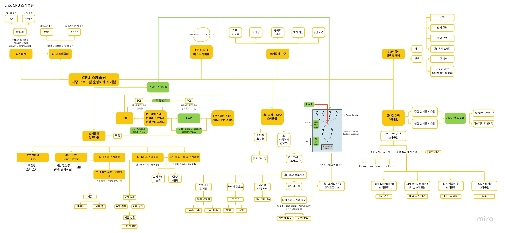
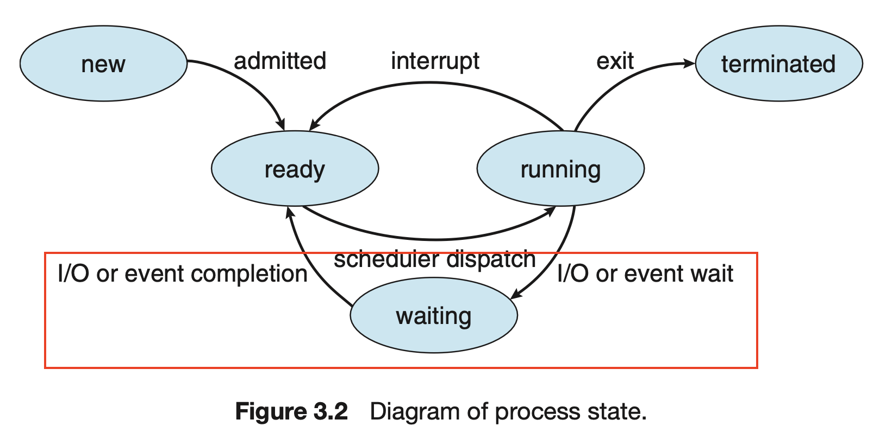

|         작성자          |   작성일   |
| :-: | :-: |
| jaekim | 2022.04.22 |

# ❏ ch5 정리도


# ❏ CPU 스케줄링

⭐️ 어떤 스케줄링이던 최상에 해결책은 없다. 

## ❏ 5.1 기본 개념

> 스케줄링이란?
> 

CPU를 프로세스 간에 서로 교환하여 컴퓨터를 생산적으로 만들며, 다중 프로그램 운영체제의 기본이다.
<br/><br/>

> 왜 스케줄링이 생겼는가?
> 

다중 프로그래밍이 생기면서 CPU 스케줄링이 생겼다.
<br/><br/>


> 다중 프로그래밍은 왜 생겼는가?
> 

코어가 하나인 시스템에서는 하나의 프로세스만이 실행되는데, 나머지 프로세스는 CPU의 코어가 이용 가능해질 때까지 기다려야 한다.

문제는 CPU가 프로세스에 할당되면 CPU는 I / O 요청이 완료될 때까지 기다려야한다. 즉, CPU는 놀고 있는 것이다. 그림 3.2에서 빨간 박스의 상태를 얘기한다.

다중 프로그래밍의 목적은 CPU가 항상 실행 중인 프로세스를 가지게 하여 CPU 이용률을 최대화 하는 것이다. 프로세스가 대기해야 하는 경우, 운영체제는 CPU를 프로세스로부터 회수해 다른 프로세스에 할당하는 것이다.


<br/><br/>


> 결론
> 

다중 프로그래밍에서 대기 중인 CPU 를 다른 프로세스에 “어떤 기준”으로 할당할지에 대한 고민으로 CPU 스케줄링 및 알고리즘이 생겼다.
<br/><br/>
<br/><br/>


### **5.1.1 CPU-I/O 버스트 사이클**

> CPU 버스트란?
> 

CPU 가 일을 수행하는 시간이다.
<br/><br/>


> I / O 버스트란?
> 

I / O 가 일을 수행하는 시간이다. 즉, I / O 요청에 대한 응답을 기다리는 시간이다.
<br/><br/>


> CPU - I / O 버스트 사이클이란?
> 

프로세스는 CPU 실행과 I / O 응답을 기다리는 시간의 반복으로 구성된다.

1) CPU 버스트로 프로세스가 실행된다.

2) 뒤이어 I / O 버스트가 발생한다.

3) 1과 2가 반복 된다.

4) 마지막 CPU 버스트 다음에는 실행 종료를 위한 시스템 요청과 함께 프로세스가 끝난다.


<br/><br/>

> CPU 버스트 특징
> 

- I / O 중심의 프로그램은 짧은 CPU 버스트를 가질 것이다.
    - 계산보다는 입출력을 많이 하는 프로세스
- CPU 중심의 프로그램은 긴 CPU 버스트를 가질 것이다.
    - 입출력보다는 계산을 많이 하는 프로세스


<br/><br/>
<br/><br/>


### **5.1.2 CPU 스케줄러**

> CPU 스케줄러
> 

CPU가 쉴 때마다, 준비 큐에 있는 한 가지 프로세스를 선택해서 CPU 를 할당하는 주체이다.
<br/><br/>


> 특징
> 

- 여러가지 스케줄링 알고리즘을 고려하여 CPU 를 할당한다.
- 준비 큐에 있는 자료 구조는 일반적으로 PCB이다.


<br/><br/>
<br/><br/>


### **5.1.3 선점 및 비선점 스케줄링**

선점과 비선점에 대해 알기 전에 CPU 스케줄링이 발생하는 상황에 대해 알아야한다.
<br/><br/>


> CPU 스케줄링이 발생하는 4가지 상황
> 

각 상태 앞에는 프로세스가 생략되어 있다.

1. 실행 → 대기 전환
    1. I / O 요청 또는 자식 프로세스 종료를 기다리는 상태
2. 실행 → 준비 완료
    1. 인터럽트 발생 상태
3. 대기 → 준비 완료
    1. I / O 요청 종료 상태
4. 종료


<br/><br/>


> 선점과 비선점
> 

스케줄링의 필요성 유무에 따라 선점과 비선점으로 나뉜다. ( 준비 큐에 하나라도 새로운 프로세스가 존재할 경우 )

- 비선점
    - 스케줄링이 반드시 필요한 경우
    - 대기 상태 or 종료 상태
    - 1번과 4번
- 선점
    - 스케줄링 진행을 여부 선택 가능
    - 준비 완료 상태
    - 2번과 3번

거의 모든 최신 운영체제들은 선점 스케줄링 알고리즘을 사용한다.
<br/><br/>


> 선점과 비선점 특징
> 
- 커널의 자료를 변경하는 I / O 버스트 과정 중, 해당 프로세스가 선점되면 혼란이 발생할 수 있다. 이 때문에 커널은 선점과 비선점 방식으로 설계될 수 있다.
- 선점은 경쟁조건을 초래할 수 있다.
    - 경쟁 조건
        - 공유 자원에 대해 여러 개의 프로세스가 동시에 접근을 시도할 때 접근의 타이밍이나 순서 등이 결과값에 영향을 줄 수 있는 상태
        - a, b 프로세스가 자료를 공유하고 있는 상황에서, a 가 자료를 갱신하는 동안 b로 선점되어 데이터를 읽으려고 하면 데이터의 일관성이 깨진다.
    - 경쟁 조건은 mutax 락을 통해서 방지할 수 있다.
- 비선점은 인터럽트나 입출력이 완료될 때까지 프로세스의 봉쇄를 기다린다. 이를 통해 경쟁 조건으로 인한 혼란을 방지한다.
- 비선점은 커널 구조가 단순하지만 실시간 컴퓨팅을 지원하기에는 부족하다.

→ 경쟁 조건에 대한 예시로 아래 상황을 볼 수 있지 않을까? ( 이게 뮤텍스 락인가? )

같은 파일을 오픈하는 상황에서는 ATTENTION 문구가 나오게 된다.  경쟁 조건이 발생할 수 있다는 경고 문구인 것 같다.


<br/><br/>
<br/><br/>


### **5.1.4 디스패처**

> 디스패처
> 

CPU 코어의 제어를 CPU 스케줄러가 선택한 프로세스에 주는 모듈
<br/><br/>


> 하는 일
> 
- 프로세스에서 프로세스로 문맥을 교환하는 일
    - 사용자 모드로 전환하는 일
    - 프로그램을 재시작을 위해 사용자 프로그램의 적절한 위치로 이동(jump) 하는 일
<br/><br/>


> 특징
> 
- 모든 프로세스의 문맥 교환 시 호출한다.
- 디스패치 지연
    - 프로세스에서 다른 프로세스 수행 시작까지 걸리는 시간
    
    
    
- 자발적 문맥 교환과 비자발적 문맥 교환
    - 자발적 문맥 교환은 CPU가 포기
    - 비자발적 문맥 교환은 타임 슬라이스 만료나 우선순위에 의해 선점 당함.
<br/><br/>
<br/><br/>


## ❏ 5.2 스케줄링 기준

> CPU 스케줄링 알고리즘을 비교하기 위한 기준
> 
- CPU 이용률 ( utilization )
    - 40% ~ 90% 까지의 범위가 적절
- 처리량 ( throughput )
    - 단위 시간당 완료된 프로세스 개수
- 총처리시간 ( turnaround time )
    - 프로세스 제출 시간과 완료 시간의 간격 ( 준비 큐 대기 시간 + CPU 실행 시간 + I / O 시간 )
- 대기 시간 ( waiting time )
    - 준비 큐에서 대기하면서 보낸 시간의 합
- 응답 시간 ( response time )
    - 하나의 요구를 제출한 후 첫 번째 응답이 시작하기까지의 시간
    - 대화식 시스템에서는 총처리 시간이 최선의 기준이 아닐 수 있기 때문에 응답 시간을 고려한다.
<br/><br/>

> 기준이 어떠면 바람직한가?
> 

경우에 따라 최적화 기준이 다르다. 대부분의 경우 평균 시간을 최적화 하려고 하지만 최솟값이나 최댓값을 최적화하는 것이 바람직 할 때도 있다. 모든 사용자가 좋은 서비스를 얻도록 보장하기 위해서 응답 시간을 최소화하는 것처럼 말이다.

- 최대화 : CPU 이용률, 처리량
- 최소화 : 총처리 시간, 대기 시간, 응답 시간

대화식 시스템에서는 평균 응답 시간을 최소화하기 보다 응답 시간의 편차(각 응답 시간 사이의 시간 차이)를 최소화 하는 것을 제안한다. 예를 들어 a 와 b 는 1초와 9초이고, c와 d 는 4초와 6초라면 평균 응답 시간은 같지만, 편차는 c 와 d가 낮기 때문에 후자가 바람직하다고 볼 수 있다.
<br/><br/>
<br/><br/>

## ❏ 5.3 스케줄링 알고리즘

정확한 알고리즘을 설명하려면 수 백개의 CPU 버스트와 I / O 버스트 열을 갖는 프로세스로 설명해야하지만, 간단한 설명을 위해 하나의 CPU 버스트만을 고려한다. 이때 평균 대기시간을 기준으로 알고리즘을 논의한다.
<br/><br/>

### **5.3.1 선입 선처리 스케줄링 ( FCFS ) → 비선점형**

> FCFS 란?
> 

First Come First served 의 약자로 CPU를 먼저 요청하는 프로세스가 CPU를 먼저 할당받는다.

선입선출 (FIFO) 큐로 관리한다.

1) 프로세스가 준비 큐에 진입하면, 해당 프로세스의 PCB를 큐의 끝에 연결한다.

2) CPU가 가용상태가 되면 준비 큐의 앞부분에 있는 프로세스에 CPU를 할당한다.

3) 할당 받은 프로세스는 실행 상태가 되고 준비 큐에서 제거된다.
<br/><br/>

> 특징
> 
- 코드 작성과 이해가 쉽다.
- 평균 대기 시간이 길 수 있다. 선입선처리의 평균 대기 시간은 일반적으로 최소가 아니며, 프로세스 CPU 버스트 시간이 크게 변할 경우 평균 대기 시간도 많이 변한다.
- 호위 효과 ( convoy effect )가 발생하여 CPU 와 장치 이용률이 저하되는 결과를 낳는다.
    - CPU 중심 프로세스는 처리시간이 길지만, I / O 중심 프로세스는 처리 시간이 짧다. CPU 중심 프로세스를 처리하는 시간동안, I / O 중심 프로세스는 대기해야하만한다. 이러한 상황을 호위 효과라고 한다.
- 비선점형이다. 대화형 시스템에는 부적절한 알고리즘이다. 대화형 시스템은 **규칙적인 간격**으로 CPU를 얻는 것이 중요한데, CPU 가 프로세스에 할당되면 종료 또는 I/O 처리 요구 등으로 CPU 를 방출하기 전까지 CPU를 점유하기 때문에 문제가 된다.
<br/><br/>

> 예시
> 


위 프로세스와 함께 2가지 경우를 간트 차트와 함께 확인해 보자.

<aside>
💡 Gantt 차트는 참여한 각 프로세스의 시작과 종료 시각을 포함하여 특정 스케줄 기법을 보여주는 막대형 차트이다.

</aside>

1)

프로세스가 P1, P2, P3 순으로 도착


- 평균 대기 시간
    - P1 대기 시간 : 0
    - P2 대기 시간 : 24
    - P3 대기 시간 : 27
    - 평균 대기 시간 : (0 + 24 + 27)/3 = 17

2)

프로세스가 P2, P3, P1 순으로 도착


- 평균 대기 시간
    - P1 대기 시간 : 6
    - P2 대기 시간 : 0
    - P3 대기 시간 : 3
    - 평균 대기 시간 : (6 + 0 + 3)/3 = 3
<br/><br/>
<br/><br/>

### **5.3.2 최단 작업 우선 스케줄링**

> SJF
> 

Shortest - Job - First 의 줄임말이며, CPU 가 이용 가능해지면 **가장 작은 CPU 버스트**를 가진 프로세스에 할당한다. 만약 동일한 CPU 버스트 길이라면 FCFS 를 적용한다.
<br/><br/>


> 예시
> 


위 프로세스와 함께 2가지 경우를 간트 차트와 함께 확인해 보자.


- 평균 대기 시간
    - P1 대기 시간 : 3
    - P2 대기 시간 : 16
    - P3 대기 시간 : 9
    - P4 대기 시간 : 0
    - 평균 대기 시간 : ( 3 + 16 + 0 + 0 ) / 4 = 7

만약 FCFS 을 사용한다면, ( 0 + 6 + 14 + 21 ) / 4 = 10.25 로 SJF 보다 길다. SJF 는 주어진 프로세스 집합에 대해 최소의 평균대기 시간을 가진다는 점에서 최적이다.
<br/><br/>

> 특징
> 
- 프로세스 전체 길이가 아닌, 다음 CPU 버스트의 길이를 기준으로 스케줄링 하기 때문에, 최단 다음 CPU 버스트( shortest - next - CPU -burst ) 알고리즘이라고도 한다.
- SJF 는 선점형이거나 비선점형일 수 있다.
    - 예를 들어, 프로세스가 실행되는 동안 **새로운 프로세스가 준비 큐**에 도착하면 선택이 발생한다.
        - 새 프로세스가 현재 실행되고 있는 프로세스의 남은 시간보다 짧은 CPU 버스트를 가진다면 선점.
        - 새 프로세스가 현재 실행되고 있는 프로세스의 남은 시간보다 긴 CPU 버스트를 가진다면 비선점.
        - 이런 관점에서 선점형 SJF는 최소 잔여 시간 우선 스케줄링이라고 한다. (Shortest remaining time first).
            
            예를 들어 아래와 같은 프로세스가 있다. P1은 P2(4)와 P4(5)가 도착할 때 남은 시간이 7 이다. 그렇기 때문에 P2와 P4는 P1을 선점한다.
            
            
            
            
            
            - 대기 시간 : (10 - 1) + (1 - 1) + (17 - 2) + (5 - 3) / 4
- 최소 평균대기 시간을 가진다는 점에서 SJF 알고리즘이 최적이긴 하지만, 다음 CPU 버스트의 길이를 알 수 없기 때문에 CPU 스케줄링 수준에서 구현할 수 없다.
    - 이전의 버스트와 다음 버스트이 길이가 비슷하다고 기대하여 근사값 계산
        
        
        
        - tn : n 번째 CPU 버스트의 길이
        - Tn+1 : 다음 CPU 버스트에 대한 예측값
        - α 범위 : 0 ≤ α ≤ 1
<br/><br/>
<br/><br/>
        

### **5.3.3 라운드 로빈 스케줄링 ( Round-Robin Scheduling ) → 선점형**

> 라운드 로빈
> 

선입 선처리 스케줄링과 유사하지만 프로세스들 사이를 옮겨 다닐 수 있도록 선점이 추가된 알고리즘이다. 스케줄러는 준비 큐에 있는 모든 프로세스를 돌면서 CPU 를 할당한다. 이때 시간 할당량 동안 할당하고 다음 프로세스로 넘어간다.
<br/><br/>

> 구현
> 
- 선입선출 큐로 준비 큐가 동작하게 만든다.
- 새로운 프로세스들은 준비 큐의 꼬리에 추가된다.
- CPU 스케줄러는 준비 큐의 첫 번째 프로세스에 정해진 시간동안 CPU 를 할당한다.
- 그 후 인터럽트를 걸도록 타이머를 설정한 후, 다음 프로세스로 디스패치 한다.

이 때 **두가지 경우가** 발생한다.

- 시간 할당량 > CPU 버스트
    
    1) 프로세스가 CPU 를 방출한다.
    
    2) 준비 큐에 있던 다음 프로세스를 진행한다.
    

- 시간 할당량 < CPU 버스트 ( 선점 )
    
    1) 타이머가 끝나고 인터럽트가 발생한다.
    
    2) 문맥 교환이 일어나며 실행하던 프로세스는 준비 큐의 꼬리로 간다.
    
    3) 준비 큐에 있던 다음 프로세스를 진행한다.
<br/><br/>
    

> 예시
> 


시간 할당량을 4로 한다면, 다음과 같다.


- 평균 대기 시간
    - P1 대기 시간 : 6 ( 10 - 4 )
    - P2 대기 시간 : 4
    - P3 대기 시간 : 7
    - 평균 대기 시간 : ( 6 + 4 + 7 ) / 3 = 5.66
<br/><br/>

> 특징
> 
- 선점형이다.
- 준비 큐는 원형 큐 ( circular queue ) 로 동작한다.
- 시간 할당량 ( Time Quantum ) 또는 타임 슬라이스( Time Slice )라는 작은 단위의 시간을 기준으로 선점이 반복된다. 일반적으로 10 ~ 100밀리초 동안이다. 0.001초 = 1밀리초
- 준비 큐에 프로세스가 한 개가 아니라면 연속적으로 두 번 이상의 시간 할당량을 할당받는 프로세스는 없다.
- 시간 할당량이 CPU 버스트의 80% 이상이어야 한다.
- RR 알고리즘의 성능은 시간 할당량의 크기에 많은 영향을 받는다.
    - 큰 경우 선입선처리 정책이 된다.
    - 작을 경우 많은 문맥 교환이 생긴다.
        - 프로세스의 실행이 느려진다. 그렇기 때문에 시간 할당량이 문맥 교환 시간과 비교해 더 크기를 바란다.
        - 문맥 교환 시간이 시간 할당량의 10%라면, CPU 사용률의 10%는 문맥 교환에 사용 된다.
        - 현대 운영체제는 10 ~ 100 밀리초(0.010 ~ 0.100초) 범위의 시간 할당량을 가지고 있다. 문맥 교환에 걸리는 시간은 보통 10 마이크로초(0.000010초) 미만이다. 문맥 교환은 시간 할당량의 작은 부분을 차지한다.
- 총처리 시간 또한 시간 할당량의 크기에 좌우된다. 문맥 교환 시간이 추가된다면 더 많은 문맥 교환이 요구되기 때문에, 작은 시간 할당량에 대해서는 평균 총처리 시간이 증가한다.
    
    
    
- 시간 할당량이 문맥 교환 시간에 비해 커야 하지만 너무 커서는 안된다. 앞서 지적한 것처럼 시간 할당량이 너무 크다면 RR 스케줄링은 선입 선처리로 퇴보한다.
<br/><br/>
<br/><br/>

### **5.3.1 우선순위 스케줄링 ( Priority Scheduling )**

> 우선 순위의 정의
> 

우선 순위는 내부적, 외부적으로 정의될 수 있다.

- 내부적
    
    시간 제한, 메모리 요구, 열린 파일의 수, 평균 CPU 버스트에 대한 평균 입출력 버스트의 비율 등
    
- 외부적
    
    프로세스의 중요성, 작업 담당 부서, 정치적 요인 등 운영체제 외부적 기준
<br/><br/>
    

> 특징
> 
- 선점형이거나 비선점형일 수 있다.
- 새로 도착한 프로세스의 우선순위를 현재 실행 중인 프로세스의 우선순위와 비교한다.
    
    새로운 프로세스의 우선순위가 실행되는 프로세스의 우선순위보다 높다면 CPU를 선점하고, 그렇지 않다면 준비 큐의 머리부분에 새로운 프로세스를 넣는다.
<br/><br/>
    

> 주요 문제와 해결 방안
> 
- 주요 문제
    - 무한 봉쇄 ( indefinite blocking )
        
        우선 순위가 낮은 프로세스들은 CPU 를 무한히 대기하는 겨우가 발생한다. 실행 준비는 되었지만 CPU 를 사용하지 못하기 때문에 프로세스가 무한 봉쇄되었다고 간주한다.
        
    - 기아 상태 ( starvation )
        
        부하가 큰 컴퓨터 시스템에는 높은 우선순위 프로세스가 꾸준히 들어온다. 낮은 우선순위의 프로세스들은 CPU를 얻지 못하여 매우 늦게 실행되거나, 프로세스를 잃어버린다.
        
- 해결 방안
    - 노화 ( aging )
        - 오랫동안 시스템에 대기하는 프로세스들의 우선순위를 점진적으로 증가시킨다.
    - 라운드 로빈과 우선순위 스케줄링을 결합한다.
        
        
        
        우선순위는 다음과 같다. P4 → P2 = P3 → P1 = P5 이다. 우선 순위에 맞게 처리하되, 우선 순위가 같은 프로세스는 라운드 로빈 방식으로 처리한다.
        
        
<br/><br/>
<br/><br/>
        

### **5.3.5 다단계 큐 스케줄링 ( Multilevel Queue Scheduling )**

> 다단계 큐 스케줄링
> 

다단계 큐 스케줄링은 프로세스를 우선순위에 따라 여러 개의 큐로 분할하고 스케줄러는 우선순위가 가장 높은 큐에서 프로세스를 실행한다. 큐마다 다른 스케줄링 알고리즘이 사용될 수 있다.


<br/><br/>

> 프로세스 유형에 따라 큐들로 분할하기 위한 스케줄링 알고리즘
> 

두 가지 경우가 있다.

- 고정 우선순위가 있으며, 이에 따라 선점형으로 스케줄된다.
    
    
    
    1순위) 실시간 프로세스
    
    2순위) 시스템 프로세스
    
    3순위) 대화형 프로세스
    
    4순위) 배치 프로세스
    
- 큐 사이에 사용량을 나누어 사용
    
    CPU 사용량을 나누어 사용한다.
    
    예, 포그라운드 큐는 라운드 로빈 스케줄링을 위해 80%, 백그라운드 큐는 선입 선처리를 위해 20%
<br/><br/>
    

> 특징
> 
- 일반적으로 프로세스는 영구적으로 하나의 큐에 할당된다.
- 우선 순위와 라운드 로빈 스케줄링을 사용할 때 모든 프로세스가 단일 큐에 배치되고 스케줄러는 우선순위가 가장 높은 프로세스를 선택하여 실행시킬 수 있다.
<br/><br/>
<br/><br/>

### **5.3.6 다단계 피드백 큐 스케줄링 ( Multilevel Feedback Queue Scheduling )**

> **다단계 피드백 큐 스케줄링**
> 

다단계 큐 스케줄링과 같지만, 프로세스가 큐에 영구 할당되지 않고 큐 사이를 이동할 수 있다.
<br/><br/>

> 특징
> 
- 다단계 큐 스케줄링 알고리즘과 다르게 프로세스가 큐 사이를 이동한다.
- 가장 일반적인 CPU 스케줄링 알고리즘
- 매개 변수들의 값을 선정하는 특정 방법이 필요하여 복잡한 알고리즘이다.
    - 매개 변수 5개
        - 큐의 개수
        - 각 큐를 위한 스케줄링 알고리즘
        - 프로세스를 높은 우선순위로 이동하는 시기 결정
        - 낮은 우선순위로 이동하는 시기 결정
        - 프로세스에 서비스가 필요할 때 프로세스가 들어갈 큐를 결정
<br/><br/>

> 예시
> 


1. 0 ~ 2 까지 세 개의 큐가 있다.
    
    큐 0과 1은 라운드 로빈 스케줄링이며 각각의 시간할당량은 8, 16이다. 큐 3은 FCFS 이다.
    
2. 스케줄러는 큐 0의 모든 프로세스를 실행한다.
3. 큐 0의 시간할당량 안에 프로세스가 끝나지 않으면 큐 1 꼬리에 이동한다. 마찬가지로 큐 1에서 끝나지 않으면 큐 2의 꼬리로 이동한다.

다단계 피드백 큐 알고리즘은 CPU 버스트가 8 이하인 프로세스에 우선순위를 부여한다. 8 ~ 24 역시 괜찮은 우선순위를 받지만, 큐 0과 1의 시간 할당량을 넘어가는 CPU 버스트의 프로세스는 큐2로 이동한다. 그 후 큐 0과 1에 남아있는 프로세스가 없을 때 FCFS 방식으로 처리한다.
<br/><br/>
<br/><br/>

## ❏ 5.4 스레드 스케줄링

> 개념
> 

스레드는 사용자 수준과 커널 수준으로 구분한다. 최신 운영체제에서 스케줄 되는 대상은 프로세스가 아니라 커널 수준 스레드이다.

사용자 수준 스레드는 스레드 라이브러리에 의해 관리되며 커널은 사용자 수준 스레드에 대해 모른다. 사용자 수준 스레드는 CPU 상에서 실행되기 위해서 LWP 를 통해 간접적인 방식으로 커널 수준 스레드에 매핑되어야한다.


<br/><br/>

### **5.4.1 경쟁 범위 (Contention Scope)**

사용자 수준과 커널 수준 스레드는 스케줄 되는 방식에 따라 다르다. 다대다 또는 다대일로 사용자 수준 스레드가 스케줄 된 LWP 는 커널 수준 스레드에 일대일 매핑 된다.

> 사용자 수준 스레드
> 

다대일, 다대다 모델을 구현하는 시스템에서는 사용자 수준 스레드를 LWP에서 스케줄 한다. 동일한 프로세스에 속한 스레드들 사이에서 CPU 를 경쟁하기 때문에 **프로세스 - 경쟁 - 범위( PCS, Process-contention scope )**로 알려져있다.

사용자 수준 스레드를 LWP 에 스케줄 한다는 것은 CPU 상에 실행 중이라는 것을 의미하지 않는다. CPU 에서 실행되기 위해서 LWP의 커널 스레드를 물리적인 CPU 코어로 스케줄 하는 것이 필요하다.

- 특징
    - 우선순위에 따라 스케줄링한다.
    - 우선순위는 프로그래머에 의해 지정된다.
<br/><br/>

> 커널 수준 스레드
> 

CPU 상에서 실행되기 위해서 LWP의 커널 스레드를 물리적인 CPU 코어로 다시 스케줄해야한다. 어떤 커널 스레드를 사용할지 시스템 - 경쟁 범위( SCS, System-contention scope ) 에서 정한다.

일대일 모델을 사용하는 시스템은 오직 SCS만으로 스케줄 한다.
<br/><br/>
<br/><br/>

### **5.4.2 Pthread 스케줄링**

> POSIX Pthreads 프로그램
> 

PCS 또는 SCS 를 지정할 수 있다. Pthreads는 다음처럼 범위 값을 구분한다.

- PTHREAD SCOPE PROCESS
    - PCS 스케줄링을 사용하여 스레드를 스케줄 한다.
    - 사용자 수준 스레드를 LWP로 스케줄 한다.
- PTHREAD SCOPE SYSTEM
    - SCS 스케줄링을 사용하여 스레드를 스케줄 한다.
    - 사용자 스레드를 위한 LWP를 만들고 바인드한다. 일대일 모델을 사용하며 사용자 수준 스레드가 스케줄 된 LWP에 커널 스레드를 효과적으로 매핑하도록 한다.
<br/><br/>

> pthread 함수
> 

Pthread IPC ( Interprocess Communication ) 는 경쟁 범위 정책의 정보를 얻어내고 지정하기 위해 두 함수를 제공한다.

- pthread_attr_setscope(pthread_attr_t *attr, int scope)
    - 두 번째 인자 = PTHREAD SCOPE PROCESS, PTHREAD SCOPE SYSTEM 의 값
- pthread_attr_getscope(pthread_attr_t *attr, int *scope)
    - 경쟁 범위의 현재 값을 저장할 int 값을 가리키는 포인터
- 코드
    
    ```c
    #include <pthread.h>
    #include <stdio.h>
    #define NUM THREADS 5
    
    int main(int argc, char *argv[])
    {
    	int i, scope;
    	pthread t tid[NUM THREADS];
    	pthread attr t attr;
    	
    /* get the default attributes */
    	pthread attr init(&attr);
    
    /* first inquire on the current scope */
    	if (pthread attr getscope(&attr, &scope) != 0)
    		fprintf(stderr, "Unable to get scheduling scope∖n");
    	else {
    		if (scope == PTHREAD SCOPE PROCESS)
    			printf("PTHREAD SCOPE PROCESS");
    		else if (scope == PTHREAD SCOPE SYSTEM)
    			printf("PTHREAD SCOPE SYSTEM");
    		else
    			fprintf(stderr, "Illegal scope value.∖n");
    	}
    
    	/* set the scheduling algorithm to PCS or SCS */
    	pthread_attr_setscope(&attr, PTHREAD SCOPE SYSTEM);
    
    	/* create the threads */
    	for (i = 0; i < NUM THREADS; i++)
    		pthread_create(&tid[i],&attr,runner,NULL);
    	
    	/* now join on each thread */
    	for (i = 0; i < NUM THREADS; i++)
    		pthread_join(tid[i], NULL);
    }
    
    /* Each thread will begin control in this function */
    void *runner(void *param) {
    /* do some work ... */
    	pthread exit(0);
    }
    ```
<br/><br/>
<br/><br/>
    

## ❏ 5.5 다중 처리기 스케줄링( Mutiple-Processor Scheduling )

다중 처리기라는 용어는 여러 개의 물리적 프로세스를 제공하는 시스템을 말하며, 각 프로세서에는 하나의 단일 코어 CPU 가 포함되어 있다. 하지만 다중 처리기의 정의는 발전했고, 다음과 같은 컴퓨팅 시스템에서 사용할 수 있다.

- 다중 코어 CPU
- 다중 스레드 코어
- NUMA 시스템
- 이기종 다중 처리
<br/><br/>

### **5.5.1 다중 처리기 스케줄링에 대한 접근 방법 (Approaches to Multiple-Processor Scheduling)**

다중 처리기 시스템에 대한 CPU 스케줄링에는 여러가지 방법이 있다.

> 비대칭 다중 처리 ( asymmetric multiprocessing )
> 
- 한 코어만 시스템 자료구조에 접근. 자료 공유의 필요성이 없다. 그래서 단순하다.
    - 마스터 서버라는 하나의 처리기가 모든 스케줄링 결정과 I / O 처리 그리고 다른 시스템의 활동을 취급하는 것이다. 다른 처리기들은 사용자 코드만을 수행한다.
- 단점
    - 마스터 서버가 전체 시스템 성능을 저하할 수 있는 병목이 된다.(bottleneck)
<br/><br/>

> 대칭 다중 처리 ( SMP, symmetric multiprocessing )
> 


- 각 프로세서가 스스로 스케줄링 한다. 준비 큐를 검사하고 실행할 스레드를 선택하여 스케줄링을 진행한다.
- 스케줄 대상이 되는 스레드를 관리하기 위한 두가지 방법이 있다.
    - 모든 스레드가 공통 준비 큐에 있는 방식
        - 특징
            - 공유 준비 큐에 경쟁 조건이 생길 수 있다
            - 프로세서가 동일한 스레드를 스케줄 하지 않도록, 큐에서 스레드가 없어지지 않도록 보장해야한다.
                - 락킹으로 경쟁 조건으로부터 보호할 수 있지만, 락소유권으로 인해 공유 큐 액세스가 성능의 병목이 될 수 있다.
    - 각 프로세서는 자신만의 스레드 큐를 갖는 방식
        - 특징
            - 공유 실행 큐로 인해 성능 문제를 겪을 일이 없다.
            - SMP 를 지원하는 시스템에서 가장 일반적이다.
            - 자신만의 프로세스별 큐가 있으면 캐시 메모리를 보다 효율적으로 사용할 수 있다.
            - 한가지 특징은 프로세스별 실행 큐가 가진 부하의 양이 다를 수 있다는 것이고, 균형 알고리즘을 사용하여 부하를 균등하게 만들 수 있다.
<br/><br/>
<br/><br/>

### **5.5.2 다중 코어 프로세서 (Multicore Processors)**

> 다중 코어 프로세서
> 

컴퓨터 하드웨어는 동일한 물리적 칩 안에 여러 개의 처리 코어를 장착하여 다중 코어 프로세서(multicore processor)가 된다. 각 코어는 운영체제 입장에서 개별적인 논리적 CPU처럼 보이게 된다.
<br/><br/>

> 특징
> 
- 다중 코어 프로세서를 사용하는 SMP 시스템은 각 CPU 가 자신의 물리 칩을 가지는 시스템과 비교해 속도가 빠르고 적은 전력을 소모한다.
- 다중 코어 프로세서는 메모리 스톨(memory stall) 때문에 스케줄링 문제를 복잡하게 한다.
    - 메모리 스톨은 메모리가 작업을 요청하는 속도보다 프로세서 처리 속도가 빨라서, 프로세서가 매 요청을 기다리게 되는 상황이다. 즉, 프로세서가 작업 요청을 기다리며 시간을 허비하는 것을 말한다.
        
        
        
<br/><br/>

> 다중 스레드 처리 코어
> 

메모리 스톨을 해결하기 위해 다중 스레드 처리 코어를 구현했다. 하나의 코어에 2개 이상의 하드웨어 스레드를 할당한다. 하나의 스레드가 메모리를 기다리며 중단되면 코어가 다른 스레드로 전환한다.


<br/><br/>

> 특징
> 
- 운영체제 관점에서 하드웨어 스레드는 소프트웨어 스레드를 실행할 수 있는 논리적 CPU로 본다.
    - 예를 들어 아래와 같은 상황이라면, “1개의 프로세서 - 4개의 코어 - 8개의 하드웨어 스레드”가 있고, 8개의 논리적 CPU가 있는 것이다. 다중 스레드 다중 코어 프로세서
    
    
    
- 칩 다중 스레딩(CMT)라고도 한다.
    - Intel 프로세서는 단일 코어에 다중 스레드 할당하는 것을 하이퍼 - 스레딩( 동시 다중 스레딩, simultaneous multithreading )라고 칭한다.
<br/><br/>

> 다중 스레드화 방식
> 

코어를 다중 스레드화하는  방식에는 세밀한 방식과 거친 방식 2가지가 있다.

- 세밀한(교차) 다중 스레딩 ( fine-grained )
    - 명령어 주기의 경계처럼 세밀한 정밀도를 가진 시점에서 교환이 생긴다.
    - 설계 시 스레드 교환을 위한 회로가 포함되어 스레드 간 교환의 비용이 적어진다.
- 거친 다중 스레딩 ( coarse-grained )
    - 긴 지연시간(예. 메모리 스톨)을 가진 이벤트가 발생할 때까지 한 코어에서 수행된다.
    - 이벤트 발생 시, 코어에서 다른 스레드가 수행되기 전에 명령어 파이프라인을 완전히 정리하고, 새로운 스레드 실행 시 명령어 파이프라인을 채워야하기 때문에 스레드 간 교환은 비용이 많이 든다.
<br/><br/>

> 다중 스레드 다중 코어 프로세서 스케줄링 단계
> 

2가지 스케줄링 단계가 있다.


- 1 단계
    - 운영체제가 각 하드웨어 스레드 (논리적 CPU)에서 실행할 소프트웨어를 선택하는 스케줄링
    - 5.3 절에서 나온 알고리즘을 포함하여 임의의 스케줄링 알고리즘을 선택
- 2단계
    - 각 코어가 실행할 하드웨어 스레드를 선택하는 스케줄링
    - 2가지 방식의 스케줄링
        - 라운드 로빈
            - UltraSPARC T3에 의해 채택
        - 긴급도
            - 0 ~ 7까지 동적 긴급도가 있다.
            - Intel Itanium 에서 사용

☝🏻  만약 운영체제가 프로세서의 자원 공유를 인식하면 더 효과적인 스케줄링 결정을 할 수 있다.


<br/><br/>
<br/><br/>

### **5.5.3. 부하 균등화 (Load Balancing)**

> 개념
> 

SMP 시스템에서 처리기가 하나 이상이라는 것을 활용하려면, 처리기마다 부하가 균등해야한다.
<br/><br/>

> 방식
> 

Push 이주와 Pull 이주 2가지 방식이 있다.

- Push
    - 특정 테스크가, 쉬고 있거나 덜 바쁜 처리기로 스레드 이동시킴.
- Pull
    - 쉬고 있는 처리기가, 바쁜 처리기에서 기다리는 프로세스를 가져옴.
<br/><br/>

> 특징
> 
- 각 처리기가, 실행할 스레드를 위한 자기 자신만의 준비 큐를 갖고 있는 시스템. **(b 시스템)**
    - 공통의 실행 큐라면**(a 시스템)** 한 처리기가 쉬게 되면 곧바로 공통 큐에서 새로운 프로세스를 실행하기 때문이다.


- 균등 부하의 기준은 상황에 따라 다르다.
    - 모든 큐에 비슷한 수의 스레드가 존재
    - 모든 큐에 스레드 우선순위를 균등하게 분배
<br/><br/>
<br/><br/>
    

### **5.5.4. 처리기 선호도 (Processor Affinity)**

> 배경 지식
> 

처리기에서 스레드가 실행 중일 때 최근에 접근된 데이터가 해당 처리기의 캐시를 채우고, 스레드는 메모리 접근을 할 때 캐시 메모리를 이용한다. warm cache라고 한다.

예. 프로세스가 RR처럼 시간 할당량에 의해 선점 당하면서 여러번에 걸쳐 진행되는 경우, 이전 진행 상황을 캐시에 채우는 것을 얘기하는 것 같다.
<br/><br/>

> 개념
> 

부화 균등화 같은 이유로 인해 스레드를 한 처리기에서 다른 처리기로 이주하게 되면 캐시를 무효화 및 다시 채우는 과정에서 비용이 많이 든다. 이 때문에 SMP 를 지원하는 운영체제는 프로세서 간의 이주보다 같은 프로세서에서 계속 실행하며 warm chache를 이용하는 것을 선호하는데, 이를 프로세서 선호도라고 한다.
<br/><br/>

> 여러 형태의 처리기 선호도
> 

약한 선호도와 강한 선호도

- 약한 선호도
    - 처리기 사이에 프로세스가 이주하는 것이 가능하다. 운영체제가 동일한 처리기에서 프로세스를 실행시키는 정책이 있지만 보장되지 않는 정도.
- 강한 선호도
    - 프로세스는 자신이 실행될 처리기 집합을 명시할 수 있다. 이때 시스템 콜을 사용한다.
- 리눅스는 약한 선호도를 구현하고 있지만, sched_setafficnity() 시스템 콜을 통해 스레드가 CPU 집합을 지정할 수 있게 하는 강한 선호도를 지원한다.
<br/><br/>

> 영향을 미치는 것
> 
- SMT 시스템의 2가지 전략에 따라 선호도에 미치는 영향이 다르다.
    - 공통 준비 큐
        - 스레드가 어떤 프로세서에서든 실행될 수 있기 때문에, 스레드가 스케줄 될 때마다 해당 처리기의 캐시를 다시 채워야한다.
    - 프로세서별 준비 큐
        - 항상 동일한 프로세서에 스레드가 스케줄 되므로, 캐시를 매번 채울 필요 없이 warm cache 의 내용을 활용하면 된다. 프로세서 선호도를 무료로 제공한다.
- 시스템 메인 메모리 아키텍처
    - 운영체제의 CPU 스케줄러 및 메모리 배치 알고리즘이 메모리 아키텍처를 인식하고 협력 한다면 특정 CPU 에 스케줄 된 스레드를 가장 가까운 위치의 메모리에 할당하여 빠른 메모리 액세스를 제공할 수 있다.
- 부하 균등
    - 종종 프로세서 선호도의 이점을 상쇄. 스레드가 한 프로세서에서 다른 프로세서로 이동하면, 동일한 프로세서에서 실행하던 스레드가 해당 프로세서의 캐시 메모리에 있는 데이터를 활용할 수 없다. 다른 프로세서로 스레드를 이동시키면 캐시 메모리를 무효화 및 다시 채워야한다.


<br/><br/>
<br/><br/>

### **5.5.4. 이기종 다중 처리 (HMP, Heterogeneous Multiprocessing)**

지금까지는 기능 면에서 동일한 프로세서였기 때문에 어떤 스레드이건 모든 처리 코어에서 실행될 수 있었다.

> 이기종 다중 처리
> 

전력 소비를 유휴 수준으로 조정하는 기능, 클럭 속도, 소비 전력이 다른 코어를 사용하여 설계된 시스템을 이기종 다중 처리라고 한다.
<br/><br/>

> 목적
> 

작업의 특정 요구에 적절한 특정 코어를 할당하여 전력 소비를 잘 관리하는 것이다.
<br/><br/>

> 예
> 

ARM 프로세서는 big.LITTLE 이라는 아키텍쳐를 통해 이기종 다중 처리를 지원한다.

- big 코어 → 많은 에너지 소모 / 짧은 사용시간
    - 많은 처리 능력이 필요한 대화형 응용 프로그램
- little 코어 → 적은 에너지 소모 / 긴 사용시간
    - 백그라운드 작업, 절전 모드인 경우 little 코어 활용.

☝🏻 Windows 10 은 전원 관리 요구를 지원하는 HMP 스케줄링을 지원한다. Windows 는 절전 모드를 설정하는 기능이 있는데, 이기종 다중 처리이지 않을까 생각한다. m1에는 사용자가 조정할 수 있는 절전 모드는 없지만, big 과 little 코어들을 갖고 있다고 한다. 시스템 내부에서 스스로 절전 관리를 하는 것 같다.
<br/><br/>
<br/><br/>

## ❏ 5.6 실시간 CPU 스케줄링 ( Real - Time CPU Scheduling )

> 실시간 운영체제란?
> 

실시간 운영 체제 또는 RTOS (real-time operating system)는 실시간 컴퓨팅을 보장하는 운영 체제이다.

- RTOS가 들어가는 기기는 대부분 임베디드 시스템이다.
    - 보통 일반 PC보다 성능이 낮은 것들이 들어간다. Real-time인데 왜 성능이 낮은 걸 쓰느냐고 할 수 있는데, Real-time과 High performance는 다른 개념이다.
        - 만약 1초마다 끝마쳐야 하는 작업이 있다고 하면, 일반적인 PC OS를 쓰는 고성능 컴퓨터는 보통의 경우 0.1초만에 끝낼 수는 있지만 다른 프로세스에 의해서 막히면 2초, 심하면 10초도 걸릴 수 있다. PC OS를 쓰다보면 알겠지만 평소보다 느려질 때가 분명히 있다. 하지만 RTOS를 탑재한 기기는 평균 약 0.8초가 걸리더라도 어떠한 상황에서도 1초 내에 끝내는 것을 보장한다.
            - RTOS는 대체로 수 밀리초(1000분의 1초), 심지어는 마이크로초(100만 분의 1초)단위로 컨트롤하기 위해 쓰인다. 리눅스나 윈도우에선 밀리초 단위로 정교하게 프로그래밍하기 매우 힘들다.
- RTOS는 임베디드 기기가 특정 작업만 하도록 설계되어있다.
- 원하는 작업에 대한 성능만 갖추면 되지 굳이 비싸고 크기가 큰 고성능의 칩셋을 쓸 필요가 없다.
    - 이러한 특성 때문에 엄밀한 처리가 요구되는 시스템에서 주로 사용한다. 대개 데스크톱 PC 환경에서는 실행 시간이 몇 초 정도 느려져도 별 문제가 없지만, 항공 제어, 생산 관리나 병원 등 특정한 시스템에서는 단 1, 2초의 지연이 처참한 결과를 불러올 수 있기 때문이다.
- 시스템의 시간 관리 부분에 많은 비중을 투자하여, 응용 프로그램의 처리 요청을 정해진 시간 내에 끝마칠 수 있는 성능에 비중을 둔다.
- 선점형 멀티 태스킹을 지원하고 각 프로세스의 실행 순서를 정의하는데 많은 비중을 투자한다.
- 재부팅을 수시로 할 수 있는 데스크톱 시스템과는 달리, 임베디드 시스템은 몇 달에서 길게는 몇 년간 재부팅 없이 실행되는 경우가 흔히 있다. 이 때문에 동적 메모리 할당을 최적화하여 메모리 단편화(memory fragmentation)를 허용하지 않는다. 즉, C에서의 malloc() 같은 함수를 거의 쓰지 않는다는 이야기다.
<br/><br/>

> 실시간 CPU 스케줄링 ( Real - Time CPU Scheduling )
> 

실시간 운영체제에서 CPU 스케줄링 할 때는 2가지 쟁점을 고려해야 한다.

- 연성 실시간 시스템
    - 중요한 프로세스가 그렇지 않은 프로세스들에 비해 우선권을 가지는 것만 보장
- 경성 실시간 시스템
    - 태스크는 마감 시간까지 서비스를 받으며, 마감 시간이 지나면 서비스를 받지 않은 것과 동일한 결과를 낳는다.
<br/><br/>
<br/><br/>

### **5.6.1. 지연 시간 최소화**

> 배경 지식
> 
- 실시간 시스템의 이벤트-중심 특성이 있다.  일반적으로 실시간으로 발생하는 이벤트를 기다린다.
<br/><br/>

> 이벤트 지연 시간
> 

이벤트 지연시간은 이벤트가 발생해서 그에 맞는 서비스가 수행될 때까지의 시간이다.


<br/><br/>

> 지연 시간 최소화
> 

실시간 운영체제에서는 인터럽트와 디스패치 지연시간을 최소화해서 이벤트가 즉시 작동하도록 해야한다.
<br/><br/>

> 실시간 시스템의 성능을 좌우하는 지연 시간의 두 가지 유형
> 
- 인터럽트 지연시간
    - 인터럽트가 발생한 시점부터 해당 ISR이 시작하기까지의 시간.
        - [수행 중이었던 명령어 완수 + 인터럽트 종류 결정 + 수행 중이었던 프로세스 상태 저장] 의 시간


- 디스패치 지연시간
    - 스케줄링 디스패처가 하나의 프로세스를 블록하고, 다른 프로세스를 시작하는 데까지 걸리는 시간.
    - 디스패치 지연시간을 최소화하는 가장 효과적인 방법은 선점형 커널을 제공하는 것이다.
    - 디스패치 지연 시간은 2 가지 충돌 단계로 구성된다.
        - 커널에서 동작하는 프로세스에 대한 선점
        - 우선순위가 낮은 프로세스의 자원을 방출 ( 높은 우선순위에 자원을 스케줄하기 위해 )


<br/><br/>
<br/><br/>

### **5.6.2 우선 순위 기반 스케줄링**

> 우선 순위 기반 스케줄링
> 

실시간 운영체제 스케줄러는 선점을 이용한 우선순위 기반 알고리즘을 지원한다. 실시간 프로세스에 CPU가 필요할 때 바로 응답해야하기 때문이다.
<br/><br/>

> 특징
> 
- 선점 및 우선순위 기반의 스케줄러를 제공하는 것은 단지 연성 실시간 기능을 제공하는 것에 불과하다.
- **실시간 태스크가 마감시간 내에 확실히 수행되는 것을 보장**하기 위해 **경성 실시간 시스템**을 제공해야한다.
    - 경성 실시간 프로세스에 적합한 스케줄링 알고리즘
        - Rate-Monotonic, Earliest-Deadline-First, 일정 비율의 몫, POSIX 실시간 스케줄링
    - 스케줄러는 **승인 제어 알고리즘**을 이용해서 마감시간 이내에 완수할 수 있는 프로세스는 실행을 허가하고, 그렇지 않으면 거절해야한다.
- 스케줄 될 프로세스들의 특성
    - 주기적이다. 즉, 일정 간격으로 CPU 가 필요하다.
        - 고정된 수행시간 t, 마감시간 d, 주기 p 가 정해져있다. 이들의 관계 “ 0 ≤ t ≤ d ≤ p “
        - 스케줄러는 마감시간과 주기적 프로세스의 실행 빈도에 따라서 우선 순위를 정한다.
            - 마감시간 d, 실행 빈도 1/p
                
                
<br/><br/>
<br/><br/>
                

### **5.6.3 Rate-Monotonic 스케줄링**

> **Rate-Monotonic 스케줄링**
> 

스케줄링 기준은 **주기**이다. 짧은 주기의 태스크는 높은 우선순위, 긴 주기의 태스크는 낮은 우선순위가 배정된다.
<br/><br/>

> 특징
> 
- CPU를 자주 필요로 하는 태스크가 더 높은 우선순위를 갖는다.
- 주기 프로세스들의 처리 시간은 각각의 CPU 버스트(burst)와 같다고 바라본다.
- 우선 순위가 고정되어 있다.
<br/><br/>

> 예시
> 
- 마감이 안되는 상황
    - 주기가 긴 태스크가 더 높은 우선순위를 가질 경우
        - P1 주기 : 50, P2 주기 : 100
        - P1 수행시간 : 20, P2 수행시간 : 35
        - P1을 나중에 수행하면 55에서 끝나므로, P1 주기안에 마감되지 않는다.
        
        
        
    
- 주기가 낮은 태스크가 더 높은 우선순위를 가질 경우 (Rate-Monotonic)
    - 주기가 낮은 태스크가 더 높은 우선순위를 가질 경우
        - P1 주기 : 50, P2 주기 : 100
        - P1 수행시간 : 20, P2 수행시간 : 35
        - P1과 P2가 주기 안에 마감된다.
        
        
        
    - CPU 이용률
        - P1 : 20/50, P2 : 35/100 ⇒ 0.4 + 0.35 = 0.75 ⇒ 75%
<br/><br/>

> 최악의 경우의 CPU 이용률
> 

CPU 이용률에는 제약이 있기 때문에, CPU 자원을 최대화해서 사용하는 것이 불가능하다. 프로세스가 1개일 때만 100%로 이용할 수 있고, 두 개일 경우 83%가 한계이다.

아래 이미지의 경우 P1 = 50, P2 = 80 의 주기. 각각 25, 35의 수행시간이다. CPU 이용률은 25/50 + 35/80 = 0.94로 94%인 것을 볼 수 있지만 한계인 83%를 넘었기 때문에 두프로세스의 마감시간을 만족시킬지 보장할 수 없다.


<br/><br/>
<br/><br/>

### **5.6.4 Earliest-Deadline-First 스케줄링**

> Earliest-Deadline-First 스케줄링
> 

스케줄링 주기는 **마감시간**이다. 마감시간에 따라서 우선순위를 동적으로 부여한다. 마감 시간이 빠를수록 우선순위가 높아지고, 늦을수록 낮아진다. 
<br/><br/>

> 특징
> 
- 이론적으로 최적의 스케줄링 기법이다. 하지만 실제로는 프로세스 사이, 인터럽트 때의 문맥 교환 비용 때문에 100% CPU 사용률은 불가능하다.
- Rate-monotonic 과 다른 점이 있다.
    - 프로세스가 실행 가능하게 되면 자신의 마감시간을 시스템에 알리고, 시스템은 스케줄을 조정한다.
<br/><br/>

> 예시
> 
- P1 주기 : 50, P2 주기 : 80
- P1 수행시간 : 20, P2 수행시간 : 35


1) P1의 마감시간이 50으로 더 빠르기 때문에 P1가 높은 우선순위를 차지한다.

2) P1 이 종료되고 P2를 시작한다.

3) P1 의 주기가 되었을 때, 마감 시간을 비교한다.

P2 는 85, P1 은 100으로 P2가 더 빠르기 때문에, P2 가 높은 우선순위를 차지하며 진행한다.

4) P2 가 종료되고, P1을 시작한다.

5) P2 의 주기가 되었을 때, 마감 시간을 비교한다.

P2는 160, P1 은 100 으로 P1이 더 빠르기 때문에, P1 이 높은 우선순위를 차지하며 진행한다.

6) P1 이 종료되고, P2를 시작한다.

7) P1 의 주기가 되었을 때, 마감 시간을 비교한다.

P2는 160, P1은 150 으로 P1이 더 빠르기 때문에, P1 이 높은 우선순위를 차지하며 선점한다.
<br/><br/>
<br/><br/>

### **5.6.5 일정 비율의 몫 스케줄링**

> 일정 비율의 몫 스케줄링
> 

모든 응용 소프트웨어에 T 개의 **CPU 몫(사용률)**을 부여한다. 한 개의 응용 프로그램이 N개의 몫을 부여 받으면, 모든 프로세스 시간 중에 N / T 사용률을 할당 받는 것이다.
<br/><br/>

> 특징
> 
- 응용 소프트웨어가 시간 몫을 할당받는 것을 보장하는 승인 제어 정책과 함께 동작
- 범위 내의 몫을 요구하는 클라이언트에게만 실행을 허가, 범위를 넘어가면 거부
    - 예
        - 전체 100
        - A = 50, B = 15, C = 20
        - 일정 비율의 몫 스케줄링 기법은 A, B, B 각각 50%, 15% 20%를 할당
        - D 프로세스가 추가되면서 30 몫을 요구
        - 현재 85%에 30%를 더 할 경우 100이 넘기 때문에 스케줄링 거부
<br/><br/>
<br/><br/>

### **5.6.6 POSIX 실시간 스케줄링**

> POSIX 실시간 스케줄링
> 

POSIX 는 실시간 컴퓨팅용으로 POSIX.1b라는 확장을 제공하며, 두 개의 스케줄링 클래스를 정의한다.
<br/><br/>

> 스케줄링 클래스
> 
- SCHED FIFO
    - FIFO 큐 사용. 선입 선출정책
- SCHED RR
    - 시간할당량을 제공하며 FIFO
- SCHED_OTHER
    - 구현이 정의되지 않아 시스템마다 다르다.
<br/><br/>

> 함수
> 
- pthread_attr_getschedpolicy(pthread_attr_t *attr, int *policy)
- pthread_attr_setschedpolicy(pthread_attr_t *attr, int policy)

두 번째 인자는 현재의 스케줄링 정책 또는 스캐줄링 클래스를 나타내는 정수 값이다.

- 코드
    
    ```c
    #include <pthread.h>
    #include <stdio.h>
    #define NUM THREADS 5
    
    int main(int argc, char *argv[])
    {
    	int i, policy;
    	pthread t tid[NUM THREADS];
    	pthread attr t attr;
    
    /* get the default attributes */
    pthread attr init(&attr);
    
    /* get the current scheduling policy */
    if (pthread attr getschedpolicy(&attr, &policy) != 0)
    	fprintf(stderr, "Unable to get policy.∖n");
    else {
    	if (policy == SCHED OTHER)
    		printf("SCHED OTHER∖n");
    	else if (policy == SCHED RR)
    		printf("SCHED RR∖n");
    	else if (policy == SCHED FIFO)
    		printf("SCHED FIFO∖n");
    }
    
    /* set the scheduling policy - FIFO, RR, or OTHER */
    if (pthread attr setschedpolicy(&attr, SCHED FIFO) != 0)
    	fprintf(stderr, "Unable to set policy.∖n");
    
    /* create the threads */
    for (i = 0; i < NUM THREADS; i++)
    	pthread create(&tid[i],&attr,runner,NULL);
    
    /* now join on each thread */
    for (i = 0; i < NUM THREADS; i++)
    	pthread join(tid[i], NULL);
    }
    
    /* Each thread will begin control in this function */
    void *runner(void *param)
    {
    	/* do some work ... */
    	pthread exit(0);
    }
    ```
    
<br/><br/>
<br/><br/>

## ❏ 5.8 알고리즘의 평가

> 알고리즘의 선택
> 

알고리즘 선택에 있어서 2가지 순서가 있다.

- 알고리즘 선택에 대한 기준을 정의해야 한다.
    - CPU 이용률, 응답 시간, 처리량에 의해 기준이 정의된다.
- 기준에 대한 상대적인 중요성을 정의해야 한다.
    - 최대 응답 시간이 300밀리초라는 제약 조건에서 CPU 이용률을 극대화한다.
    - 총 처리 시간이 전체 실행 시간에 평균적으로 선형 비례가 되도록 처리량을 극대화 한다.
<br/><br/>

> 알고리즘의 평가
> 

기준을 선택한 후 고려 중인 여러 알고리즘들을 평가한다.
<br/><br/>

> 결정론적 모델링
> 
- 분석적 평가의 한 유형이다. 작업 부하를 가정하고 각 알고리즘에 대입하여 평가 기준에 따라 성능을 정의한다.
- FCFS, SJF, RR 알고리즘의 평균 대기 시간을 비교해서 짧은 것으로 한다.
    
    
    
    - FCFS → ( 0 + 10 + 39 + 42 + 49 ) / 5 = 28
    
    
    
    - SJF → ( 10 + 32 + 0 + 20 ) / 5 = 13
    
    
    
    - RR ( 시간 할당량 = 10밀리초 ) → ( 0 + 32 + 20 + 23 + 40 ) / 5 = 23
    
    
    
    위 상황에서는 SJF의 평균 대기 시간이 가장 빠르다.
    
- 특징
    - 단순하고 빠르다.
    - 입력 값으로 정확한 숫자를 요구한다.
    - 주로 스케줄링 알고리즘을 설명하고, 예를 제공하는 데 사용한다.
    - 프로세스의 각종 시간 등, 특징에 변화가 없을 경우에만 적용할 수 있는 평가 모델링
<br/><br/>

> 큐잉 모델
> 

프로세스들은 날마다 변화하기 때문에, 결정론적 모델링을 사욜할 수 있는 프로세스들의 정적인 집합이 없다. 하지만 CPU와 I / O 버스트의 크기를 측정하고 추정할 수 있다. 이를 통해 2가지 정보를 얻을 수 있다.

- 수학적인 공식을 통해 CPU 버스트의 확률을 측정 (서비스율)
- 프로세스들이 시스템에 도착하는 시간의 분포도 (도착률)

컴퓨터 시스템은 서버들의 네트워크로 기술된다. 각 서버는 대기 프로세스들의 큐를 가지고 있다. CPU 는 준비 큐를 가진 서버, I / O 는 장치 큐를 가진 서버이다. 도착률과 서비스율(버스트)을 알기 때문에, 이용률 / 평균 큐 길이 / 평균 대기 시간 등을 계산할 수 있다. 이를 큐잉 네트워크 분석이라고 한다.

- Little’s formula
    
    ⭐️ n = ㅅ * w 
    
    - n : 평균 큐 길이
    - w : 큐 평균 대기시간
    - ㅅ : 새로운 프로세스들의 큐 평균 도착 개수
    - 프로세스가 대기하는 w시간 동안, w * ㅅ 개의 새로운 프로세스들이 큐에 도착한다는 것을 알 수 있다.
        
        시스템이 안정 상태라면 큐를 떠나는 프로세스 수와 도착하는 프로세스 수가 같아야한다.
        
    - 예
        - 초당 7개의 프로세스가 평균적으로 도착 → ㅅ
        - 큐에는 평균 14개의 프로세스 존재 → n
        
        14 = 7 * w ⇒ w = 2 즉, 큐 평균 대기시간은 2초라는 것을 알 수 있다.
        
- 특징
    - 분석할 수 있는 알고리즘이 상당히 제한되어 있다.
    - 일반적으로 가정이 많이 필요하다.
    - 근사치이며 연산 결과의 정확성에는 의심의 여지가 있다.
<br/><br/>

> 모의실험
> 

더욱 정확하게 평가하기 위해서 모의실험을 할 수 있다. 컴퓨터 시스템의 모델을 프로그래밍하는 것까지 포함한다. 


- 모의실험기
    - 시간을 나타내는 변수
    - 변수 값 변화에 따른 시스템 상태 수정 장치
    - 프로세스 및 스케줄러 등의 활동 반영
- 모의 실험을 구동하기 위한 데이터 생성 방법
    - 난수 발생기
        - 프로세스, CPU 버스트 시간, 도착, 출발 등을 생성
            - 수학적 또는 경험적으로 정의될 수 있다.
                - 수학적 = 균등, 지수 등
                - 경험적 = 실제 시스템에 대한 측정이 필요
        - 실제 시스템을 관찰하며 실제 이벤트 순서를 기록하여 추적 파일을 생성할 수 있다.
            - 추적 파일 활용은 실제 입력들과 정확히 동일한 입력으로 알고리즘을 비교할 수 있는 좋은 방법이다.
- 특징
    - 컴퓨터를 오랜 시간 사용하기 때문에 매우 큰 비용이 소요된다.
    - 추적 파일은 대량의 저장 공간을 요구할 수 있다.
<br/><br/>

> 구현
> 

모의실험도 정확성에 한계가 있다. 스케줄링을 알고리즘을 완벽히 평가하는 유일한 방법은 실제 코드로 작성해 운영체제에 넣고 실행해 보는 것이다. 

- 특징
    - 비용이 많이 든다.
    - 회귀 테스트
    - 새 프로그램 작성, 문제 유형의 변화, 스케줄러 수행 능력 결과에 따라 알고리즘이 사용되는 환경이 변화하고 다시 구현해야한다. 이때 변화하는 환경에서 발생하는 문제를 파악하여, 문제에 따라 환경을 바꿔주는 도구 또는 스크립트를 사용한다.
        - 예를 들어, 단말기 I / O 의 양을 보고 프로세스들을 자동으로 대화, 비대화형으로 분류하는 시스템이 있다.
            
            1초 내에 규칙적인 간격으로 임의의 문자를 단말기에 출력하도록 하는 스크립트를 만든다. 
            
            스크립트를 활용하여, 프로세스가 1초 이내에 단말기로 입력하거나 출력하지 않으면 비대화형으로 분류하고, 낮은 우선순위 큐로 이동시킨다.
