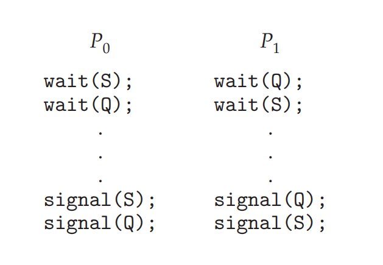

|작성자|   작성일   |
| :-: | :-: |
| yunselee | 2022.04.29 |

# Chapter 6 Synchronization Tools

- Describe the critical-section problem and illustrate a race condition.
- Illustrate hardware solutions to the critical-section problem using memory barriers, compare-and-swap operations, and atomic variables.
- Demonstrate how mutex locks, semaphores, monitors, and condition variables can be used to solve the critical-section problem.
- Evaluate tools that solve the critical-section problem in low-, moderate-, and high-contention scenarios.


# 6.1 Background 257

3.5절의 IPC상황에서 여러 프로세스가 동일한 메모리에 접근하는 경우에 발생하는 문제점

```c++
while (true) {
    /* produce an item in next produced */
    while (count == BUFFER SIZE)
        ; /* do nothing */
    buffer[in] = next produced;
    in = (in + 1) % BUFFER SIZE;
    count++;
}


while (true) {
    while (count == 0)
        ; /* do nothing */
    next consumed = buffer[out];
    out = (out + 1) % BUFFER SIZE;
    count--;
    /* consume the item in next consumed */
}
```

```c++
register1 = count
register1 = register1 + 1
count = register1
```

```c++
register2 = count
register2 = register2 − 1
count = register2
```
이 경우 프로세스간 명령어 실행 순서에 따라서 count의 값이 바뀌는 상황이 나온다 이런 상황을 *race condition*이라 함
- race condition : 실행결과가 실행 순서에 의존하는 상황

캐시메모리 write back 정책에 의해서 일어날 수도 있다.


결론 : 하나의 프로세스만이 특정 데이터에 접근가능 하도록 프로세스간의 동기화가 필요

# 6.2 The Critical-Section Problem 260

임계구역(critical section) : 하나 이상의 다른 프로세스와 공유하는 데이터에 접근하고 갱신 할 수 있는 구역

임계구역의 해결안의 요구조건


1. 상호배제 : 프로세스 하나가 임계구역에 있을때 다른 프로세스는 임계구역에서 실행 될 수 없음
2. 진행 : 프로세스 하나가 임계구역에 있을때 다른 프로세스는 다음에 진입할 순서를 정할 수 있는지 결정
3. 한정된 대기 : 무한정 대기하면 안됨

커널에서의 경쟁조건

단일코어 환경에서 interrupt disable로 critical section은 해결 가능 그러나 다중 처리기에서 모든 프로세스에 message를 보내야하기에 시간이 오래걸린다

https://stackoverflow.com/questions/53919482/whats-the-process-of-disabling-interrupt-in-multi-processor-system

- 선점형 커널 :  프로세스가 커널 모드에서 수행되는 동안 선점되는 것
- 비선점형 커널 : race condition 염려할 필요없음

선점형 커널이 race condition을 고려해야하기에 설계하기 힘드나 응답시간이 빠르기에 선호됨


# 6.3 Peterson’s Solution 262

| 고전적인 소프트웨어 기반 해결책. 완벽한 해결 방안은 아님.

임계구역과 그 외 구역을 번갈아 실행하는 두개의 프로세스로 한정

두 프로세스가 두 개의 데이터 항목을 공유

```c++
int turn
bool flag[2]
```

```c++
// in process P_I
while (true) {
    flag[i] = true;
    turn = j;
    while (flag[j] && turn == j)
        ;
    
    /* critical section */
    
    flag[i] = false;
    /*remainder section */
}
```


```c++
// in process P_0
while (true) {
    flag[0] = true;
    turn = 1;
    while (flag[1] && turn == 1)
        ;
    
    /* critical section */
    
    flag[0] = false;
    /*remainder section */
}


// in process P_1
while (true) {
    flag[1] = true;
    turn = 0;
    while (flag[0] && turn == 0)
        ;
    
    /* critical section */
    
    flag[1] = false;
    /*remainder section */
}
```

초기 flag와 상관없이 작동

최신의 경우에는 컴파일러 최적화로 인해 단일 프로세서 내의 명령어 실행 순서가 바뀔 수 있기 때문에(Instruction Reordering) 순서가 깨질 가능성이 있음


결론 : 유일한 방법은 하드웨어가 지원하는 동기화 도구를 사용해야한다

# 6.4 Hardware Support for Synchronization 265

## Memory Barriers

컴퓨터 아키텍처의 메모리 모델 
- 강한순서 : 메모리 변경 결과가 다른 모든 프로세서에 즉시 보임 (write through)
- 약한순서 : 즉시 보이지 않음 (write back)

memory barriers(fence) : 메모리의 모든 변경 사항을 다른 모든 프로세서로 전파 하는 명령어

## test_and_set / campare_and_swap

atomic : 어떠한 작업이 실행될때 언제나 완전하게 실행되거나 아니면 실패하는 경우

*test_and_set*  [c++](https://en.cppreference.com/w/cpp/atomic/atomic_flag/test_and_set)

```c++
boolean test and set(boolean *target) {
    boolean rv = *target;
    *target = true;
    return rv;
}
```

이를 이용하면 하나의 boolean 변수로 상호배제를 구현할 수 있음

```c++
do {
    while (test and set(&lock))
        ; /* do nothing */
    /* critical section */
    lock = false;
    /* remainder section */
} while (true);
```

*compare and swap(CAS)*

```c++
int compare and swap(int *value, int expected, int new value) {
    int temp = *value;
    if (*value == expected)
      *value = new value;
    return temp;
}
```


## Atomic Variables

원자적 변수 

- [linux에서의 atomic variables](https://tuxthink.blogspot.com/2011/10/atomic-variables.html#:~:text=There%20is%20another%20solution%20in,instruction%20with%20out%20any%20interruption%20.)
- [C11의 atomic variables](https://en.cppreference.com/w/c/thread)
- [C++11의 atomic variables] (https://en.cppreference.com/w/cpp/atomic/atomic)

연산이 원자적이라고해서 경쟁조건이 무조건 해결되는 것은 아님. 대기가 여러개일때 순서 없이 동시에 대기를 벗어나는 경우 역시 동시에 critical section에 진입하기 때문


# 6.5 Mutex Locks 270

- acquire() : 락 흭득
- release() : 락 반환

사용 예

``` c++
while (true) {
    acquire lock
        
    /*critical section*/

    release lock
    remainder section
}
```


```c++
acquire() {
    while (!available)
        ; /* busy wait */
    available = false;
}
```
- 스핀락 : 위와 같이 busy waiting방식을 이용한  구현
- busy waiting : 프로세스가 무한정 cpu를 점유하면서 대기를 하는 상태, cpu를 점유하는 대신 context switch하는 비용이 없다. 예상 대기 기간이 짧을 수록 spin lock의 이점이 많음.


세마포어를 사용한 mutex 구현 

```C++
/* Lock. */
struct lock 
  {
    struct thread *holder;      /* Thread holding lock (for debugging). */
    struct semaphore semaphore; /* Binary semaphore controlling access. */
  };

void lock_acquire (struct lock *lock)
{
  ASSERT (lock != NULL);
  ASSERT (!intr_context ());
  ASSERT (!lock_held_by_current_thread (lock));

  sema_down (&lock->semaphore);
  lock->holder = thread_current ();
}

void lock_release (struct lock *lock) 
{
  ASSERT (lock != NULL);
  ASSERT (lock_held_by_current_thread (lock));

  lock->holder = NULL;
  sema_up (&lock->semaphore);
}
```

- [linux의 pthread mutex lock](https://linux.die.net/man/3/pthread_mutex_lock)
- [c++의 mutex class](https://en.cppreference.com/w/cpp/thread/mutex)

# 6.6 Semaphores 272

- 정수 변수 
- 다익스트라가 고안
- 두개의 표준 원자적 연산 wait() signal()을 사용.


```C
struct semaphore 
  {
    unsigned value;             /* Current value. */
    struct list waiters;        /* List of waiting threads. */
  };

void sema_down (struct semaphore *sema) 
{
  enum intr_level old_level;

  ASSERT (sema != NULL);
  ASSERT (!intr_context ());

  old_level = intr_disable ();
  while (sema->value == 0) 
    {
      list_push_back (&sema->waiters, &thread_current ()->elem);
      thread_block ();
    }
  sema->value--;
  intr_set_level (old_level);
}

void sema_up (struct semaphore *sema) 
{
  enum intr_level old_level;

  ASSERT (sema != NULL);

  old_level = intr_disable ();
  if (!list_empty (&sema->waiters)) 
    thread_unblock (list_entry (list_pop_front (&sema->waiters),
                                struct thread, elem));
  sema->value++;
  intr_set_level (old_level);
}
```


# 6.7 Monitors 276

- [C# monitor class](https://docs.microsoft.com/ko-kr/dotnet/api/system.threading.monitor?view=net-6.0)
- [linux condition](https://linux.die.net/man/3/pthread_cond_wait)
- [c++ condition variable](https://en.cppreference.com/w/cpp/thread/condition_variable)


```C++
struct condition 
  {
    struct list waiters;        /* List of waiting threads. */
  };

struct semaphore_elem 
  {
    struct list_elem elem;              /* List element. */
    struct semaphore semaphore;         /* This semaphore. */
  };

void cond_wait (struct condition *cond, struct lock *lock) 
{
  struct semaphore_elem waiter;

  ASSERT (cond != NULL);
  ASSERT (lock != NULL);
  ASSERT (!intr_context ());
  ASSERT (lock_held_by_current_thread (lock));
  
  sema_init (&waiter.semaphore, 0);
  list_push_back (&cond->waiters, &waiter.elem);
  lock_release (lock);
  sema_down (&waiter.semaphore);
  lock_acquire (lock);
}

void cond_signal (struct condition *cond, struct lock *lock UNUSED) 
{
  ASSERT (cond != NULL);
  ASSERT (lock != NULL);
  ASSERT (!intr_context ());
  ASSERT (lock_held_by_current_thread (lock));

  if (!list_empty (&cond->waiters)) 
    sema_up (&list_entry (list_pop_front (&cond->waiters),
                          struct semaphore_elem, elem)->semaphore);
}
```


# 6.8 Liveness 283

라이브니스 : 프로세스가 실행동안 진행되는 것을 보장하기 위해 시스템이 충족해야하는 일련의 속성

라이브니스 실패
- 무한루프
- critical section 진입시의 무기한 대기
- 교착상태
- 우선순위역전

## 교착상태

대기중인 두 개 이상의 프로세스들이 대기중인 다른 프로세스에 의해서 일어날 수 있는 이벤트를 무한정 기다리는 상황



## 우선순위 역전 priority inversion

높은 우선순위의 프로세스가 필요한 자원이 낮은 우선순위의 프로세스가 점유하고 있어 대기하는데 이 낮은 우선순위의 프로세스는 또 다른 높은 우선순위의 프로세스에게 선점되어 대기가 밀리는 상황

priority inheritance protocol : priority inversion 상황에서 낮은 우선순위의 프로세스가 높은 우선순위를 상속 받는 형식으로 priority inversion를 해결하는 방법


# 6.9 Evaluation 284

lock free 알고리즘 : 락 오버헤드 없이 경쟁 조건으로부터 보호하는 알고리즘, CAS 명령을 주로 사용

CAS기반 동기화와 mutex,세마포어 같은 기존 동기화와의 성능차이

- 경합 X : CAS가 기존 동기화보다 조금 더 나을 수 있음
- 적당한 경합 : CAS 동기화가 기존동기화보다 훨씬 빠르게 작동할 것으로 기대
- 심한 경함 : 기존 동기화가 더 빠름


선택

- 원자적 변수 : 기존 락보다 가벼움, 카운터와 같은 공유변수에 대한 단일 업데이트에 적합
- spin lock : 락이 짧은 기간 유지될때 적합
- mutex  : 세마포어보다 간단하고 오버헤드가 적음, 임계구역 접근은 세마포어 보다 선호
- 카운트 세마포어 : 한정된 수의 자원에 대한 접근을 제어 등


# 6.10 Summary 286

- A race condition occurs when processes have concurrent access to shared data and the final result depends on the particular order in which concurrent accesses occur. Race conditions can result in corrupted values of shared data.
- A critical section is a section of code where shared data may be manipulated and a possible race condition may occur. The critical-section problem is to design a protocol whereby processes can synchronize their activity to cooperatively share data.
- A solution to the critical-section problem must satisfy the following three requirements: (1) mutual exclusion, (2) progress, and (3) bounded waiting. Mutual exclusion ensures that only one process at a time is active in its critical section. Progress ensures that programs will cooperatively determine what process will next enter its critical section. Bounded waiting limits how much time a program will wait before it can enter its critical section.
- Software solutions to the critical-section problem, such as Peterson’s solution, do not work well on modern computer architectures.
- Hardware support for the critical-section problem includes memory barriers; hardware instructions, such as the compare-and-swap instruction; and atomic variables.
- A mutex lock provides mutual exclusion by requiring that a process acquire a lock before entering a critical section and release the lock on exiting the critical section. 
- Semaphores, like mutex locks, can be used to provide mutual exclusion. However, whereas a mutex lock has a binary value that indicates if the lock is available or not, a semaphore has an integer value and can therefore be used to solve a variety of synchronization problems.
- A monitor is an abstract data type that provides a high-level form of process synchronization. A monitor uses condition variables that allow processes to wait for certain conditions to become true and to signal one another when conditions have been set to true.
- Solutions to the critical-section problem may suffer from liveness problems, including deadlock.
- The various tools that can be used to solve the critical-section problem as well as to synchronize the activity of processes can be evaluated  under varying levels of contention. Some tools work better under certain contention loads than others.