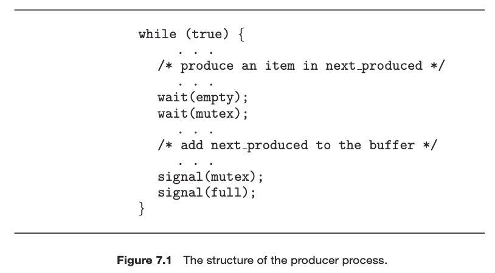

| 작성자  |   작성일   |
| :-----: | :--------: |
| sujpark | 2022.05.06 |

# Chapter 7 Synchronization Examples

## 들어가기 전에

6장에서는 임계구역 문제를 제시하고 여러 병행 프로세스가 데이터를 공유할 때 어떻게 경쟁조건이 발생할 수 있는지 이야기했다. 그리고 임계구역 문제를 해결하는 몇가지 도구를 검토하였다. 이러한 도구는 저수준 하드웨어 해결책에서 더 높은 수준의 도구에 이르기까지 다양했다. 7장에서는 6장에서 제시된 방법들을 몇가지 고전적인 동기화 문제에 적용한다. 또한 Linux, Window 운영체제에서 사용되는 동기화 기법을 살펴보고 Java및 POSIX 시스템의 API 세부 사항을 설명한다.

### 잠시 복습

- 세마포어

  - 특수한 명령들만 접근할 수 있게 허용되는 보호된 변수

  ```c
  wait(S) {
  	while(S <= 0)
  		;
  	S--;
  }

  signal(S) {
  	S++;
  }
  ```

  - wait과 signal 연산시 세마포어의 정수 값을 변경하는 연산은 반드시 원자적으로 수행되어야 한다.

- 모니터
  - 프로그래머의 프로그래밍 오류에 의해 동기화 문제가 발생하는 것을 방지하기 위하여 프로그래밍 언어 수준에서 제공하는 모듈
  - 모니터로 진입가능한 프로세스를 하나로 제한하여 상호배제를 실현한다.

# 고전적인 동기화 문제들

## 유한 버퍼 문제 (생산자 - 소비자 문제)

생산자-소비자 문제에서 생산자는 데이터를 만들어 버퍼에 저장하고 소비자는 버퍼에 있는 데이터를 꺼내서 소비하는 프로세스를 말한다. 이들 사이에서 버퍼는 공유자원이므로 버퍼에 대한 접근들이 상호배제되어야한다. 이를 세마포어를 통해 구현해본다.


생산자와 소비자는 위와 같은 자료구조를 공유한다.

mutex 변수는 상호배제를 위한 변수, empty와 full 은 버퍼의 상태를 나타내는 변수이다.

생산자 프로세스 구조와 소비자 프로세스 구조는 다음과 같다.

**생산자 프로세스 구조**



- wait(empty) - 버퍼가 하나라도 비워진 상태를 기다린다.
- wait(mutex) - 버퍼가 사용가능한 상태가 되기를 기다린다.
- signal(mutex) - 버퍼를 사용가능한 상태로 만든다.
- signal(full) - 버퍼가 하나 채워졌음을 알린다.

**소비자 프로세스 구조**


- wait(full) - 버퍼가 하나라도 채워진 상태를 기다린다.
- wait(mutex) - 버퍼가 사용가능한 상태가 되기를 기다린다.
- signal(mutex) - 버퍼를 사용가능한 상태로 만든다.
- signal(empty) - 버퍼가 하나라도 채워졌음을 알린다.

## Readers-Writers 문제

하나의 데이터베이스가 여러 병행 프로세스 간에 공유될 때, 프로세스들 중 일부는 데이터베이스의 내용을 읽기만 하고 어떤 프로세스들은 데이터베이스를 갱신할 수 있다. 전자 프로세스를 readers, 후자 프로세스를 writers 라고 한다.

두 reader가 동시에 데이터베이스에 접근했을 때는 문제가 없지만, writers와 다른 프로세스가 동시에 데이터베이스에 접근하면 문제가 생길 수 있다. 이런 문제를 방지하기 위해서는 writer가 작업하는 동안에 공유 데이터베이스에 대해 배타적 접근 권한을 가져야한다.

Readers-Writers 문제에는 여러 변형이 있는데, 우리가 다룰 가장 간단한 문제에서는 readers가 대기중인 writers 에게 양보하지 않는다는 조건이 있다.

이 문제에 대한 해결안에서 readers 프로세스는 다음과 같은 자료구조를 공유한다.


rw_mutex - readers 와 writers 사이의 상호 배제를 위한 변수, writers 도 공유한다.

mutex - read_count를 갱신할 때 상호 배제하기 위한 변수

read_cont - 현재 실행중인 readers 수

W**riters 프로세스의 구조**


- wait(rw_mutex) - 공유데이터에 대한 상호배제가 해제되기를 기다린다.
- signal(rw_mutex) - 공유 데이터에대한 상호배제를 해제한다. 대기중인 여러 readers 혹은 한개의 writer 가 실행된다. 어느 쪽이 실행(running)될지는 스케줄러가 결정한다.

**Readers 프로세스의 구조**


- wait(mutex) - 다른 readers 가 read_count에 대한 상호배제를 해제하기를 기다린다.
- if (read_count == 1) wait(rw_mutex);
  - 대기하는 readers 중 첫번째 reader인 경우
  - writers 에 의해 공유 데이터가 상호배제되어있는지 확인하고 해제되기를 기다린다.
- signal(mutex) - read_count 에 대한 상호배제를 해제한다.
- if (read_count == 0) signal(rw_mutex);
  - 대기하는 readers 가 없는 경우 rw_mutex 에 대한 상호배제를 해제한다.

이 해결안은 reader가 끊임 없이 들어올 경우 writer가 기아상태에 빠질 수 있다.

**기아 문제 없는 해결책에 대한 추가설명 환영!**

## 식사하는 철학자 문제

생각하거나 식사하기를 반복하는 철학자 5명이 앉은 원형테이블을 가정한다. 5개의 그릇과 5개의 젓가락이 번갈아가며 놓여있고, 철학자는 한번에 하나의 젓가락만 잡을 수 있으며 양쪽의 젓가락을 모두 잡아야 식사를 할 수 있다. 옆 사람 손에 들어간 젓가락을 빼앗을 수는 없다.


철학자는 프로세스, 젓가락은 자원으로 볼 수 있다. 다같이 왼쪽의 젓가락을 집은 경우 아무도 식사를 할 수 없는데 이를 교착상태라고 한다. 양쪽의 철학자가 젓가락을 계속 먼저 집어서 식사를 할 수 없는 철학자를 기아상태에 빠졌다고 한다.

### 세마포어 해결안 (교착상태 문제)

세마포어 해결안에서는 젓가락을 세마포어로 표현하며 모두 1로 초기화된다.


**철학자 i의 구조**


왼쪽과 오른쪽의 젓가락을 상호배제 상태에서 순서대로 잡는 방식이다. 하지만 5명의 철학자가 동시에 왼쪽에 있는 젓가락을 잡을 경우 모두 식사를 하지 못하는 교착상태에 빠진다.

**교착상태에 대한 해결안**

- 최대 4명의 철학자만이 테이블에 앉을 수 있게한다.
- 한 철학자가 젓가락 두 개를 모두 잡을 수 있을 때만 젓가락을 잡도록 허용한다.
- 홀수 번호의 철학자는 왼쪽 젓가락을 먼저 잡고, 짝수 번호의 철학자는 오른쪽 젓가락을 먼저 잡는다.

### 모니터 해결안

이 해결안은 교착 상태를 방지하기 위해 양쪽 젓가락을 모두 얻을 수 있을 때만 젓가락을 집을 수 있다는 제한을 강제한다. 이 해결안을 구현하려면 다음과 같은 자료구조를 도입해야한다.


또한 self 라는 조건변수를 통해 배고프지만 젓가락을 잡을 수 없을 때 젓가락을 잡는 것을 미룬다.


**모니터 정의**


- test(int i)
  - 양옆이 모두 식사하는 상태가 아니고, i 가 배고픈 상태라면
  - i 는 식사하는 상태가 되고, i 프로세스를 대기상태에서 해지한다.
- pickup(int i)
  - i 를 배고픈 상태로 만들고 test(i) 를 수행한다.
  - i 가 젓가락을 집는 것에 실패했다면 대기상태가 된다.
- putdown(int i)
  - i 가 식사를 마치고 생각하는 상태가 된다.
  - test(왼쪽), test(오른쪽) 을 수행한다.

# 커널 안에서의 동기화

## Windows 에서의 동기화

- 단일 처리기 시스템에서 전역 자원에 접근할 때 동일한 전역 자원에 접근할 가능성이 있는 인터럽트 핸들러가 실행되지 않도록 인터럽트를 잠시동안 막는다.
- 다중 처리기 시스템에서는 Windows는 스핀락을 써서 전역정보에 대한 접근을 통제한다.
- dispatcher 객체를 사용하여 커널 외부에서 스레드를 동기화 할 수 있다.
  - mutex lock, 세마포어, event, timer 등 다양한 기법 사용 가능
  - Signaled 상태 - 사용가능
  - Nonsignaled 상태 - 사용불가, 얻으려는 시도 시 스레드가 봉쇄됨


## Linux의 동기화

- Linux 커널에서는 atomic_t 데이터 형을 사용하여 원자적 정수를 제공한다.
  - 해당 정수를 사용한 수학 연산은 중단됨 없이 수행된다.
  - 락 기법을 사용할 때의 오버헤드가 없어서 유용하지만 경쟁조건에 기여하는 변수가 많은 경우 다른 도구가 필요하다.
- Linux 는 커널 안에서의 락킹을 위하여 스핀락과 세마포어를 제공한다.
  - SMP(Symmetric multi-processing) 기계에서 기본적인 락킹방법은 스핀락이다.
  - 하나의 처리코어를 가진 단일 처리기에서는 스핀락을 획득하는 것이 아니라 커널이 커널 선점을 불가능하게 한다.
  - 스핀락과 커널 선점 불능 및 가능은 짧은 시간 동안 유지될때만 사용된다. 오래 유지되어야 한다면 세마포어 또는 mutex 락을 사용하는 것이 적절하다.

# POSIX 동기화

이전 절에서 설명한 동기화 내용은 커널 내에서의 동기화에만 적용된다.

POSIX API 는 사용자 수준에서 프로그래머가 사용할 수 있으며 특정 운영체제의 일부가 아니다.

## POSIX mutex 락

Mutex 락은 코드의 임계구역을 보호하기 위해 사용된다.

스레드는 임계구역에 진입하기 전에 락을 획득하고 임계구역에서 나갈 때 락을 방출한다.

Pthreads는 mutex락의 데이터형으로 `pthread_mutex_t`를 사용한다.


- pthread_mutex_init - mutex 초기화
- pthread_mutex_lock - 락 획득, 획득 불가시 봉쇄
- pthread_mutex_unlock - 락 방출

## POSIX 세마포어

### named 세마포어


여러 관련 없는 프로세스가 세마포어 이름만 참조하여 공통 세마포어로 사용할 수 있다.

위의 예에서 세마포어 SEM이 생성되면 다른 프로세스가 sem_open() 을 호출하여 기존 세마포어의 디스크립터를 반환할 수 있다.


- sem_wait() - wait();
- sem_post() - signal();

### unnamed 세마포어

unnamed 세마포어는 sem_init() 함수를 사용하여 생성 및 초기화되며 세 개의 매개변수가 전달된다.

1. 세마포어를 가리키는 포인터
2. 공유 수준을 나타내는 플래그
3. 세마포어의 초기 값

   

플래그 0 : 세마포어를 만든 프로세스에 속하는 스레드만 이 세마포어를 공유할 수 있다.

0이 아닌 값 : 세마포어를 공유 메모리 영역에 배치하여 서로 다른 프로세스간에 공유한다.


## POSIX 조건변수

Pthread는 일반적으로 C 프로그램에서 작동되며 C에는 모니터가 없으므로 조건 변수에 mutex락을 연결하여 락킹을 제공한다.

Pthread의 조건변수는 데이터형으로 `pthread_cond_t`를 사용하고

pthread_cond_init()을 통해 초기화된다.


다음 코드는 스레드가 a == b 가 될 때까지 대기하는 방법을 보여준다.


위 예에서 조건변수 cond_var와 연결된 mutex 락은 pthread_cond_wait 함수가 호출되기전에 획득되어야한다.

a ≠ b 인경우 스레드는 pthread_cond_wait() 을 호출한다. 그 결과 mutex 락이 해제되어 다른 스레드가 공유 데이터에 접근하고 해당 값을 갱신하여 조건 절이 true 로 계산될 수 있다.

공유 데이터를 변경하는 스레드는 pthread_cond_signal() 함수를 호출하여 조건 변수를 기다리는 하나의 스레드에 신호할 수 있다.


pthread_cond_signal 호출은 mutex 락을 해제하지 않는다. mutex 락을 해제하는 것은 이후의 pthread_mutex_unlock 호출이다. mutex 락이 해제되면 신호받은 스레드는 mutex 락의 소유자가 되고 pthread_cond_wait 호출에서부터 제어를 넘겨받아 실행을 재개한다.

# JAVA 에서의 동기화

## JAVA 모니터

이 장에서는 생산자-소비자 문제를 예로 들어 모니터를 설명한다.

**자바 기본 개념**

- 클래스 - 객체를 구현하기 위한 설계도
- 객체(object) - 구현하고자 하는 대상
- 인스턴스 - 설계도를 통해 소프트웨어 상에서 객체를 구현한 것
- java의 모든 객체는 하나의 락과 연결되어 있다(?) : 인스턴스마다 락을 가진다고 생각하면 됨.
- 메소드(클래스 내부 함수)가 synchronized로 선언된 경우 메소드를 호출하려면 그 객체와 연결된 락을 획득해야한다.

생산자 - 소비자 를 구현하기 위한 BoundedBuffer 클래스는 다음과 같다.


- 생산(insert)과 소비(remove)는 모두 synchronized로 선언되었다.
- insert()나 remove()를 호출하려면 BoundedBuffer 의 객체 인스턴스와 연결된 락을 소유해야한다.
- 다른 스레드가 이미 락을 소유한 경우 insert()나 remove()를 호출한 스레드는 봉쇄되고 entry set 에 추가된다.


- 진입집합 - 락을 획득하기를 기다리는 스레드 집합
- insert()나 remove()를 호출했을 때 락을 소유할 수 있는 경우 락을 소유자가 되어 메소드로 진입한다. 메소드가 종료되면 락이 해제된다.
- 객체 락을 소유한 후 특정 조건이 충족되지 않아 계속 할 수 없는 경우 **wait()** 을 호출하여 락을 해제하고 조건이 충족될 때 까지 wait set에서 기다리게 된다.
  - insert() 메소드로 진입했는데 버퍼가 다 찬 경우
  - remove() 메소드로 진입했는데 버퍼가 비어있는 경우
  - 스레드가 객체의 락을 해제한다.
  - 스레드 상태가 봉쇄됨으로 설정된다.
  - 스레드는 그 객체의 대기 집합에 넣어진다.


- insert() 와 remove() 메소드 끝에서 **notify()** 메소드를 호출하여 소비자와 생산자가 진행될 수 있음을 알린다.
  - wait set 에서 임의의 스레드를 선택한다.
  - 해당 스레드를 wait set에서 entry set으로 이동시킨다.
  - 해당 스레드의 상태를 봉쇄됨에서 실행가능으로 설정한다.

## 재진입 락

## 세마포어

## 조건 변수

# 대체 방안들

## 트랜잭션 메모리

## OpenMP

## 함수형 프로그래밍 언어
