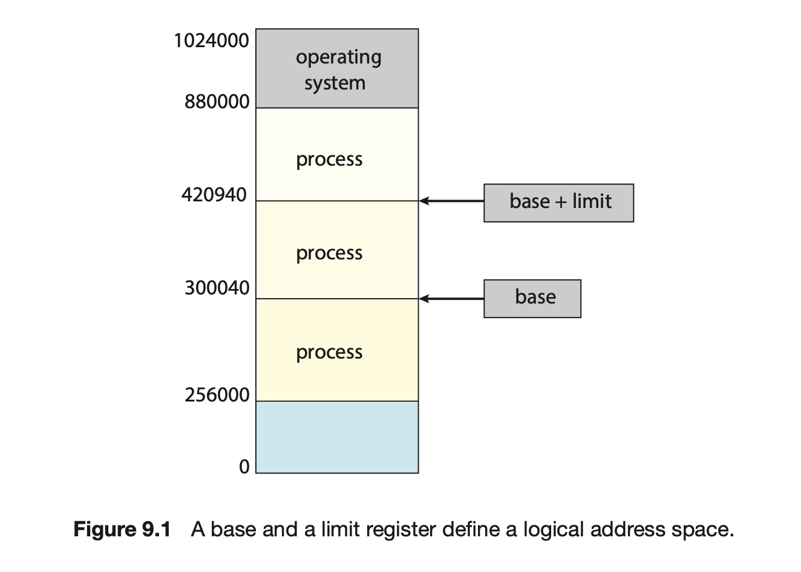
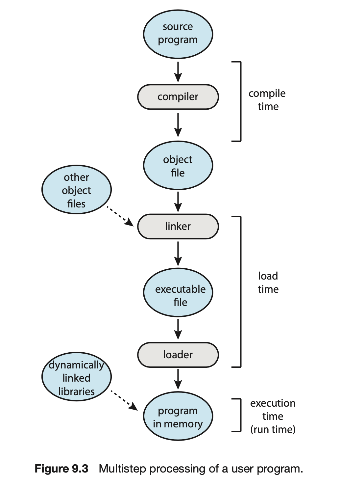
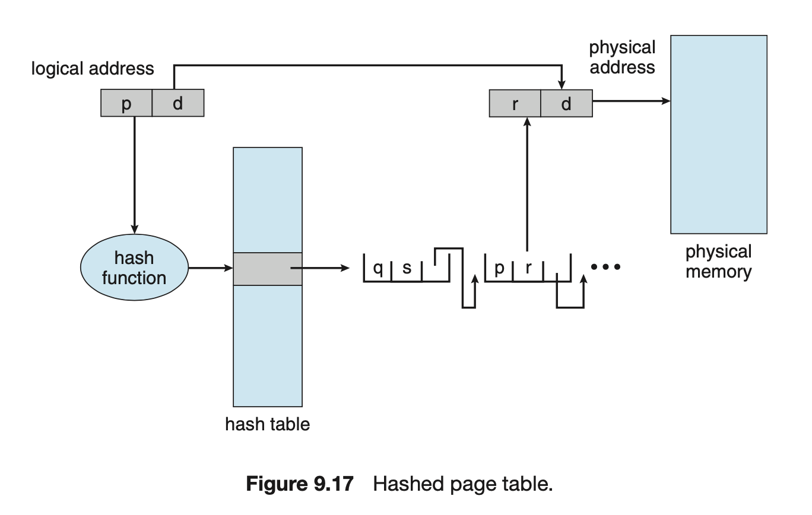

| 작성자  |   작성일   |
| :-----: | :--------: |
| sujpark | 2022.05.20 |

# Chapter 9 Main Memory

이 장에서는 메모리를 관리하는 다양한 방법에 대해 이야기한다.

## 간단 설명

### KB, MB, GB
> KB = 2 ^ 10
>
> MB = 2 ^ 20
>
> GB = 2 ^ 30

### 페이징 VS 세그멘테이션

> 페이징 : 메모리를 일정하게 같은 크기로 나누어서 할당하는 것
>
> 세그멘테이션 : 메모리를 다른 크기의 논리적인 단위로 나누어서 할당하는 것 (논리적 이점)

+ 세그멘테이션 내부에 페이징을 사용하는 기법도 있음

---

## 배경

### 기본 하드웨어
#### 메모리
CPU는 각 처리 코어에 내장된 레지스터와 메인 메모리에만 접근할 수 있다.
따라서 실행되어야하는 명령어와 데이터들은 CPU가 직접 접근할 수 있는 레지스터와 메인 메모리에 있어야한다. 만약 데이터가 메모리에 없다면 메모리로 이동시켜야한다.

#### 캐시
CPU 코어에 내장된 레지스터에는 CPU가 빠르게 접근할 수 있지만, 메모리에 접근하는 속도는 상대적으로 느리다. 이 때 CPU와 메모리 사이에 캐시라는 빠른 속도의 메모리를 추가하여 자주 접근하는 데이터를 캐시에 둠으로써 속도 차이 문제를 해결 할 수 있다.

#### 레지스터
시스템이 올바르게 동작하기 위해서는 각 프로세스가 다른 프로세스의 메모리 영역에 침범하지 않도록 서로 보호해야한다. 이 때 기준 레지스터와 상한 레지스터를 사용한다. 기준 레지스터는 해당 프로세스의 가장 작은 물리 메모리 주소를 저장하고, 상한 레지스터는 주어진 영역의 크기를 저장한다. 프로세스가 메모리에 접근할 때 해당 레지스터들과 비교하여 유효한 주소인지 확인한다.

+ 기준 레지스터와 상한 레지스터는 특권 명령을 사용하는 운영체제에 의해서만 적재된다.

+ 기준 레지스터 ( = 재배치 레지스터)

### 주소의 할당

프로그램이 실행되기 전에 위 사진과 같은 과정을 거치는데 각 단계를 거치는 동안 메모리 주소들은 여러가지 다른 표현방식을 가진다. 최초에 주소는 숫자가 아닌 심볼 형태로 표현된다. 컴파일러는 이 심볼 주소는 재배치 가능 주소로 바인딩하고, 다음에 링커나 로더가 재배치 가능 주소를 절대 주소로 바인딩 시킨다. 

주소의 바인딩은 바인딩이 이뤄지는 시점에 따라 다음과 같이 구분된다.
- 컴파일 시간 (complie time)
	- 프로세스가 메모리 내에 들어갈 위치를 컴파일 시간에 미리 알고 있다면 컴파일러는 **절대코드** 를 생성할 수 있다.
	- 그러나 만약 위치가 변경된다면 이 코드는 다시 컴파일되어야한다. 
- 적재 시간 (load time)
	- 컴파일 시점에 메모리의 어떤 위치에 올라올지 모른다면 컴파일러는 일단 이진 코드를 **재배치 가능 코드**로 작성한다.
	- 재배치 가능 코드는 시작 주소가 변경되면 코드를 다시 적재하기만 하면 된다.
- 수행 시간 (execution time)
	- 수행 도중에 메모리 내 위치가 옮겨질 수 있는 경우

### 논리주소공간 그리고 물리주소공간
논리적 주소 : CPU 가 생성하는 주소 ( = 가상 주소 )

물리적 주소 : 메모리가 실제로 다루는 주소

MMU(memory management unit) 에 의해 가상주소가 물리주소로 바뀐다.

### 동적 적재

1. 각 루틴은 실행되기 전까지는 메모리에 올라오지 않고 재배치 가능한 상태로 디스크에서 대기한다.
2. main 프로그램이 메모리에 올라와 실행되고 다른 루틴을 호출한다.
3. 호출된 루틴이 이미 메모리에 적재됐는지를 조사한다.
4. 적재되어있지 않다면 루틴을 메모리로 가져온다.

필요한 루틴만 적재되기 때문에 메인 메모리보다 큰 프로그램도 실행할 수 있다.

### 동적 연결 및 공유 라이브러리

동적 연결 개념은 동적 적재 개념과 비슷하다.

동적 적재에서는 로딩이 실행 시까지 미뤄졌지만 동적 연결에서는 연결(linking)이 실행 시기까지 미뤄진다.

주로 C 라이브러리 같은 시스템 라이브러리에 사용된다.

---

## 연속 메모리 할당

이 절에서는 초기 메모리 할당 방법인 **연속 메모리 할당** 에 대해 이야기한다.

### 메모리 보호
재배치 레지스터는 가장 작은 물리주소를 저장한다.

상한 레지스터는 논리 주소의 범위 값을 저장한다.

MMU 는 논리 주소에 재배치 레지스터의 값을 더함으로써 주소를 변환한다.

이렇게 변환된 주소를 통해 메모리에 접근한다.

+ 논리주소가 상한 레지스터가 저장하고 있는 논리 주소를 초과하는 경우 트랩을 발생시킨다.

### 메모리 할당
연속 메모리 할당에서 프로세스는 가변 크기의 메모리 파티션에 할당된다.

운영체제는 사용가능한 메모리 부분과 사용중인 메모리 부분을 나타내는 테이블을 유지한다.

위 사진의 과정을 지나면 연속되지 않은 hole 들이 생긴다.

산재해있는 hole들 중에 메모리를 할당하기 적합한 hole을 찾기 위한 기법들이 있다.
- 최초 적합 : 첫번째 사용 가능한 hole을 할당한다.
- 최적 적합 : 사용가능한 hole 중에서 가장 작은 것을 선택한다.
- 최악 적합 : 가장 큰 hole 을 할당한다.

어떤 기법을 택하더라도 작은 크기의 비연속적인 hole들이 생기게된다.

그 결과 사용하지 않는 공간이 충분이 있음에도 메모리를 할당할 수 없는 현상을 맞이하게 된다. (외부 단편화)

### 단편화

외부 단편화 : 가용 공간이 작은 크기로 분산되어있어, 충분한 공간이 있음에도 공간을 할당할 수 없는 현상

- 50% 규칙 : 최초 적합의 경우 통계적으로 메모리의 3분의 1을 쓸 수 없게 된다.

내부 단편화 : 프로세스가 요구하는 공간보다 크게 할당함으로써 내부에서 사용하지 않는 공간이 발생하는 현상
- 메모리를 미리 작은 공간으로 분할하고, 작은 공간의 정수배로 할당하기 때문에 나타난다.

외부 단편화 해결 방법
- 압축 : 프로그램 수행 중 재배치, 비용문제
- 페이징

---

## 페이징

페이징은 이전에 배운 기법과 대조적으로, 프로세스가 할당되는 물리 주소 공간이 연속되지 않고 페이지 단위로 나뉘어서 페이지(프레임) 단위로 저장하는 기법이다.

이 기법은 외부 단편화와 압축의 문제점을 해결한다.

### 기본 방법
물리 메모리는 프레임이라고 불리는 같은 크기의 블록으로 나눠진다.

프로세스는 페이지라고 불리는 같은 크기의 블록으로 나눠진다.

프레임과 페이지는 같은 크기를 가진다.

프로세스가 수행될 때 스토리지로부터 메인 메모리의 프레임으로, 페이지 단위로 적재된다.

CPU가 생성하는 논리주소는 페이지 번호와 페이지 오프셋으로 나누어진다.

페이지 번호는 프로세스 페이지 테이블에 접근할 때 사용한다.

페이지 테이블은 물리 메모리에서 페이지가 저장되어있는 각 프레임의 번호를 저장하고 있으며 오프셋은 참조되는 프레임 안에서의 위치이다. 프레임의 시작주소와 페이지 오프셋이 결합하여 물리 메모리 주소가 된다.

페이지 크기는 하드웨어에 의해 정해진다.

페이지 크기는 2의 거듭제곱으로 컴퓨터에 따라 4KB 에서 1GB 사이이다.

논리 주소 공간의 크기가 2^m 이고 페이지 크기가 2^n 바이트인 경우

논리 주소의 상위 m - n 비트는 페이지 번호를 지정하고 n 하위 비트는 페이지 오프셋을 지정한다.

 

#### 페이지 크기

페이징 기법을 사용하면 외부 단편화가 발생하지 않는다.

그러나 할당이 항상 프레임 단위로 일어나기 때문에 내부 단편화가 발생한다.

내부 단편화 측면에서는 페이지 크기가 작을 수록 유리하다. 

하지만 그에 반비례 하여 페이지 테이블의 크기가 커진다.

디스크 입장에서는 페이지 크기가 클 수록 효율적이며 일반적으로 페이지 크기는 메모리 크기가 커짐에 따라 함께 커져 왔다.

 

#### 프레임 테이블

운영체제는 물리 메모리를 관리하기 때문에 물리 메모리의 할당에 대한 정보를 파악하고 있어야한다.

어느 프레임이 할당되어있고 사용가능한지 등에 대한 정보가 프레임 테이블에 저장되어있다.

프레임 테이블은 시스템에 하나밖에 없는 자료구조이다.

 

### 하드웨어 지원

#### TLB (Translation Look-Aside Buffer)

메인 메모리에 페이지 테이블을 저장하면 메모리 액세스 시간이 지연된다.

원하는 페이지에 접근하기 위해 메모리 상의 페이지 테이블에 먼저 접근하고, 그 다음에 메모리 상의 페이지에 접근할 수 있기 때문에 메모리에 두번 접근해야한다.

이 문제를 해결하기 위해 TLB라고 불리는 매우 빠른 캐시가 사용된다.

TLB는 매우 빠르지만 성능을 위해서 크기를 작게 유지해야한다.
+ 이 때문에 TLB를 여러 층으로 사용하기도 한다.

TLB는 페이지 테이블과 함께 다음과 같이 사용된다.

1 ) CPU가 논리주소를 생성하면 MMU는 해당 페이지 번호가 TLB에 있는지 확인한다.

2-1 ) TLB에서 페이지 번호가 발견되면 프레임 번호를 알아내 메모리에 즉시 접근한다.

2-2 ) TLB에 페이지 번호가 없으면 페이지 테이블에 접근하여 프레임 번호를 알아내며 해당 페이지 번호와 테이블 번호를 TLB에 저장하여 다음번에는 빠르게 찾을 수 있도록 한다.

3 ) TLB가 다 차면 여러 교체 정책중 하나를 선택하여 교체한다.

**hit ratio**

접근하려는 메모리의 페이지 번호가 TLB에서 발견되는 비율을 hit ratio 라고 한다.

메인 메모리에 접근하는데 걸리는 시간이 10ns라고 가정하자.

페이지 번호가 TLB에서 발견되는 경우 원하는 데이터에 접근하는데 총 10ns가 소요된다.

TLB에서 페이지 번호를 찾지 못한 경우 페이지 테이블에 접근한후 페이지에 접근해야 하므로 총 20ns 가 소요된다.

이 때 **실질 메모리 접근 시간**을 계산해보자.

if ) hit ratio == 80%

	실질 접근 시간 = 0.8 * 10 + 0.2 * 20 = 12ns

if ) hit ratio == 99%

	실질 접근 시간 = 0.99 * 10 + 0.01 * 20 = 10.1ns

 

+ 몇몇 TLB는 특정 항목을 TLB에 고정한다. 주로 중요 커널 코드를 고정한다.

+ 어떤 TBL는 ASIDs(address-space identifiers)를 저장하여 어떤 프로세스에 속한 것인지 알려준다. ASID를 통해 한 TLB 안에 여러 프로세스의 정보를 함께 보관할 수 있다.

### 보호

보호 비트 : 읽고 쓰기 또는 읽기 전용인지 정의

유효 비트 : 페이지에 접근하는 것이 합법적인지 검사

### 공유 페이지

재진입 코드 : 자체 수정을 할 수 없는 코드로서 실행 중에는 절대 변경되지 않는다.

코드가 재진입 코드인 경우 공유하여 메모리 사용을 절약할 수 있다.

---

## 페이지 테이블의 구조

페이지 테이블을 구성하는 일반적인 방법들을 소개한다.

계층적 페이징, 해시 페이지 테이블 그리고 역 페이지 테이블이 있다.

### 계층적 페이징

현대 컴퓨터는 매우 큰 주소 공간을 가진다. (2^32, 2^64)

이런 환경에서는 페이지 테이블의 크기도 커진다.

예를 들어 32비트 논리 주소 공간을 가지는 시스템을 생각해보자.

이 시스템에서 페이지의 크기가 4KB(2^12)라면 페이지는 2^20 개 이상의 항목으로 구성될 것이다.

각 항목은 4B로 구성되기 때문에 페이지 테이블을 위해 4MB(2^22)의 공간이 필요하게 될 것이다.

이렇게 페이지 테이블이 커지는 경우 페이지 테이블을 나눠서, 즉 페이징해서 저장할 수 있다.

**2단계 페이징 기법**

32비트를 논리주소공간으로 가지는 기계에서 페이지가 4KB(2^12) 라면 
페이지 번호는 20비트로 표현할 수 있다. 

20 비트를 10비트씩 쪼개서 페이지에 대한 페이징을 표현하는 것이 2단계 페이징 기법이다.

위 그림에서 p1은 바깥 페이지 테이블의 인덱스이고, p2는 안쪽 페이지 테이블 내의 오프셋이다.

그러나 64비트 논리 주소 공간을 가진 시스템에서는 2단계 페이징 기법도 적절하지 않다.

64비트 구조에서는 계층적 페이지 테이블이 부적합하다.

너무 많은 메모리 접근을 필요로 하기 때문이다.

 

### 해시 페이지 테이블

주소 공간이 32비트보다 커지면 해시 페이지 테이블을 많이 사용한다.

해시 페이지 테이블의 각 항목은 연결 리스트를 가지고 있다.

해시값이 같은 원소들이 연결 리스트에 연결되게 된다.

각 원소는 세개의 필드를 가진다.

1. 페이지 번호
2. 페이지가 저장된 프레임 번호
3. 연결 리스트 상의 다음 포인터

해시 페이지 테이블은 다음과 같이 작동한다.

페이지 번호를 받으면 먼저 해싱한다. 

해시 페이지 테이블에서 해싱한 값에 대한 항목을 찾는다. 

해당 항목에서 연결리스트를 따라가며 일치하는 페이지 번호를 찾는다.

페이지 번호에 대한 프레임 번호를 통해 물리 주소를 알아내고 접근한다.

+ 64비트 시스템에서는 해시페이지 테이블의 항목이 여러 페이지를 가리키는 **클러스터 페이지 테이블** 을 사용한다. 

 

### 역 페이지 테이블

보통 프로세스는 각각 페이지 테이블을 하나씩 가진다.

또한 페이지 테이블은 프로세스가 사용하는 페이지 하나당 항목 하나를 가진다.

그런 기법들의 단점은 페이지 테이블이 차지하는 메모리가 너무 커질 수 있다는 것이다.

이를 해결하는 것이 **역 페이지 테이블** 이다.

역 페이지 테이블은 시스템 상에 하나만 존재하며, 메모리 프레임마다 한 항목을 할당한다.

한 페이지 테이블에 여러 프로세스의 페이지를 표현하기 때문에 페이지 테이블의 각 항목은 어떤 프로세스의 페이지인지 표시 해야한다.

메모리 참조가 발생하면, 역 페이지 테이블을 순차적으로 돌면서 pid와 페이지 번호가 일치하는 페이지가 있는지 확인한다.

i 번째 항목에서 일치한다면, 실제 메모리 상의 i 번째 프레임에 존재하는 것이다. 

i와 오프셋 d를 조합하여 물리 주소를 매핑할 수 있다.

**장점**
: 페이지 테이블이 차지하는 공간이 작다.

**단점** : 

(1) 페이지를 순차적으로 탐색하므로 탐색시간이 오래 걸린다. 
-> 해시 테이블, TLB를 사용하여 해결할 수 있다.

(2) 프로세스간에 페이지를 공유하려는 경우 페이지 폴트가 발생한다.

---

## 스와핑

프로세스 또는 프로세스의 일부분은 실행 중에 스토리지로 내보내졌다가 다시 메모리로 돌아올 수 있다. 

이러한 스와핑은 다중 프로그래밍의 정도를 증가시킨다.

### 기본 스와핑

기본 스와핑은 메인 메모리와 스토리지 간에 전체 프로세스를 이동한다.

스와핑을 통해 실제 물리 메모리 용량보다 더 많은 프로세스를 수용할 수 있도록 초과할당할 수 있다.

유휴 상태를 보내는 프로세스가 스와핑에 적합한 후보이다.

### 페이징에서의 스와핑

기본 스와핑은 프로세스 전체를 이동하는데 걸리는 시간이 엄청나기 때문에 최신 운영체제에서는 사용되지 않는다.

최신 시스템들은 프로세스 페이지를 스왑할 수 있는 변형 스와핑을 사용한다.

페이지 아웃 연산은 페이지를 메모리에서 스토리지로 이동시킨다.

페이지 인은 페이지를 스토리지에서 메모리로 이동시킨다.

### 모바일 시스템에서의 스와핑

모바일 시스템에서는 스와핑을 지원하지 않는다.

모바일 장치들은 스토리지로 공간을 많이 차지하는 하드디스크보다 플래시 메모리를 사용한다.

플래시 메모리는 용량이 작으며 쓰기 횟수가 한정되어있기 때문에 스와핑을 사용하지 않는다.

대신 애플의 iOS는 사용 가능한 메모리가 임계값보다 떨어지면 어플리케이션에게 메모리를 자발적으로 반환하도록 요청한다. 충분한 메모리를 반환하지 못하면 어플리케이션은 운영체제에 의해 강제로 종료될 수 있다.

Android는 iOS와 유사한 방식을 사용하나 프로세스를 종료하기 전에 응용의 상태를 플래시 메모리에 저장하여 나중에 빠르게 재시작할 수 있게 한다.

---

## 사례 : Intel 32 비트와 64비트 구조

### IA-32 구조

#### IA-32 세그멘테이션

#### IA-32 페이징

### x86-64

## 사례 : ARM 구조

