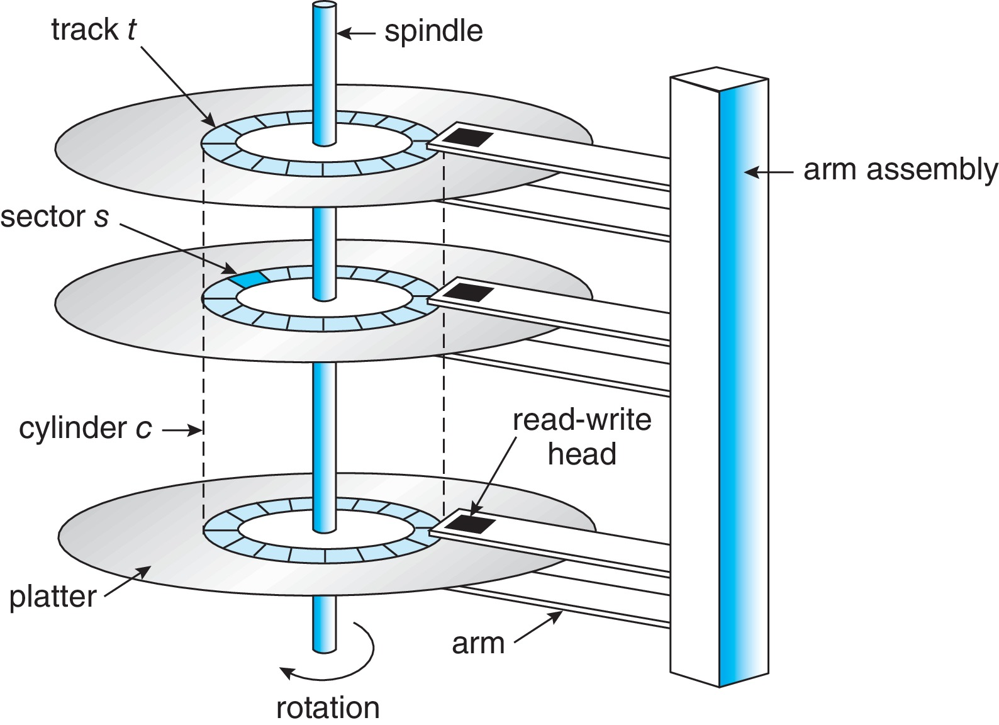
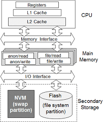

| 작성자  |   작성일   |
| :-----: | :--------: |
| chulee | 2022.06.03 |

# 운영체제 11 대용량 저장 장치 구조

# 11.0 챕터 목표

- 다양한 보조저장장치의 물리적 구조와 장치 구조가 활용에 미치는 영향을 설명한다.
- 대용량 저장장치의 성능 특성을 설명한다.
- I/O 스케줄링 알고리즘을 평가한다.
- RAID를 포함하여 대용량 저장장치를 위해 제공되는 운영체제 서비스에 대해 논의한다.

# 11.1 대용량 저장장치 구조의 개관

## 11.1.1 하드 디스크 드라이브

*Figure 11.1: HDD 이동-헤드 디스크 기법*

HDD는 자기 물질(자석)을 이용하여 데이터를 표현한다.

- Platter : 원형 평판 모양으로 되어 있고, 자기적으로 데이터를 저장한다.
- Disk head : 자기적 물질이 달려있어서 이를 통해 데이터를 읽는데 사용된다. Read와 Write 일어나는 동안 R/W 헤드는 자성을 감지할 뿐 절대 플래터의 표면을 건드리지 않는다.
- Head crash : Disk head가 플래터에 닿는 사고
- Arm : disk head를 움직이는 녀석
- Track : platter 의 표면을 원형으로 나눈 단위
- Sector : Track을 또 일정한 크기로 나눈 단위로 4KB를 주로 쓴다.
- Cylinder : 각 드라이브 플래터 표면에 동일한 트랙들의 집합으로, 헤드는 트랙 번호가 아닌 실린더 번호를 참조하게 된다.
- Transfer rate(전송 속도) : 드라이브와 컴퓨터 간의 데이터 흐름의 속도
- RPM : 드라이브 모터의 분당 회전수 전송 속도와 관련이 있다.
- Seek time(탐색 시간) : 디스크 암을 원하는 실린더로 이동하는데 필요한 시간
- Rotational latency(회전 지연시간) : 원하는 섹터가 디스크 헤드 위치까지 회전하는데 걸리는 시간

## 11.1.2 비휘발성 메모리 장치 (NVM)

NVM 장치는 전기식 방식이고, 플래시 NAND 다이 반도체 칩으로 구성된다.

*Figure 11.3: SSD*

### 11.1.2.1 비휘발성 메모리 장치 개요

NAND 반도체는 삭제마다 기능이 열화되어 일정 주기 이후에는 데이터를 유지할 수 없다. 이러한 이유로, 여러 가지 개선 알고리즘이 고안되었다.

- NVM 장점
    - 안정성 ****- 움직이는 부품이 없음
    - 빠름 - no seek or latency time (bus may limit throughput)
    - 전력 소비량이 적음
    - 크기가 작고, 가볍다
- NVM 단점
    - 비싸다
    - 용량이 작다
    - (maybe) "쓰기 마모"로 인한 수명 단축

### 11.1.2.2 NAND 플래시 컨트롤러 알고리즘

구조적으로 NAND 반도체는 한 번 쓴 후에는 바로 덮어쓸 수 없다. 삭제 이후, 다시 쓰는 방식으로 사용한다. 

그로 인해, 아래 사진처럼 NAND 블록은 유효, 비유효 페이지가 공존한다.

*Figure 11.4: 유효한 페이지와 유효하지 않은 페이지가 공존하는 NAND 블록*

사용 가능한 블록이 없을 경우에는 위와 같은 블록에 가비지 수집을 수행한다.

- 가비지 수집 : 유효한 페이지를 다른 위치로 복사하고, 블록을 비운 다음 데이터를 쓴다.

과잉 공급 공간은 장치를 언제나 쓸 수 있도록 다수의 페이지를 따로 준비해놓는 것을 말한다. 과잉 공급 공간은 삭제 횟수가 적은 블록을 먼저 배치하여 마모 평준화에 도움을 준다. NAND 반도체는 수명이 있기 때문에, 일부 블록만 반복적으로 지워주면 해당 블록을 나중에는 사용하지 못하기 때문이다.

NVM 장치는 오류 수정 코드를 제공하는데, 페이지에 오류 코드가 자주 발생하는 경우 해당 페이지를 불량으로 표시하여 후속 쓰기에 사용되지 않게 한다.

## 11.1.3 휘발성 메모리

컴퓨터에서 사용되는 RAM(DRAM)도 저장장치로 사용할 수 있다.

운영체제에서는 RAM 용량의 일부를 RAM 드라이브(RAM 디스크)로 설정하여 사용할 수 있다. 

DRAM은 NVM 장치보다 빠르기에, RAM 드라이브에 임시 파일을 저장하는데 사용하면 좋다. 

### 11.1.4 보조저장장치 연결 방법

**버스 종류 : ATA, SATA, eSATA, SCSI, SAS, USB, FC**

NVMe(NVM Express)

- NVM이 많이 빨라지면서 기존 버스 기술로는 **NVM의 병목 현상이 되는 경향이 있으므로 메인보드에 직접 시스템 PCI에 직접 연결하는 방식의 NVMe(NVM Express) 버스 기술이 생겼습니다.**

I/O 작업간 사용되는 컨트롤러

- 호스트 컨트롤러 : 컴퓨터쪽에 있는 컨트롤러
- 장치 컨트롤러 : 각 저장장치에 있는 컨트롤러

I/O작업 순서

1. 운영체제가 I/O작업 명령을 호스트 컨트롤러에 보낸다
2. 호스트 컨트롤러는 메시지를 통해 명령을 장치 컨트롤러에 전송한다.
3. 장치 컨트롤러는 명령을 수행한다.
4. DMA를 통해 데이터를 전송한다.

### 11.1.5 주소 매핑

각 논리적 블록은 장치의 섹터 또는 페이지에 매핑된다.
⇒ ex) 섹터 0 = 가장 바깥 실린더, 1트랙, 1섹터

HDD에서 논리적 주소로 물리적 주소를 알아내는 방법이 명확하지 않은 이유

1. 배트 섹터가 예비 섹터로 대체됨
2. 트랙당 섹터 수가 일부 드라이브 및 디스크 제조업체 내부에서 일정하지 않기 때문입니다. 
3. 디스크 제조업체는 논리적 주소 대 물리적 주소 매핑을 내부적으로 관리합니다.

CD-ROM 및 DVD-ROM과 같은 일부 디스크 기술은 트랙당 비트 밀도가 균일하고 CLV(일정 선형 속도)를 사용합니다.

하드 디스크는 일반적으로 내부 트랙에서 외부 트랙으로 비트 밀도가 감소하고 CAV(일정 각속도)를 사용합니다.

*Figure : CLV 방식*

*Figure : CAV 방식*

# 11.2 디스크 스케줄링

일반적으로 OS가 하드 디스크 I/O 대기열을 요청 큐로 관리합니다. 요청 큐와 스케줄링을 통해서 기본적으로 효과적인 데이터 전송 속도인 액세스 시간을 줄이고 장치 대역폭을 늘리는 데 도움이 될 수 있습니다.

최신 장치에서는 논리 주소가 물리 주소에 어떻게 대응하는지 확실히 알 수 없다

그러나, LBA가 서로 가까이 있으면 물리 블록 근접성과 같다는 가정 하에 알고리즘이 잘 수행됩니다.

### 11.2.1 선입 선처리 스케줄링

공평해 보이지만 **종종 긴 검색을 초래하기에 빠른 서비스를 제공 못함**

*Figure 11.6 : FCFS 디스크 스케줄링*

### 11.2.2 SCAN 스케줄링 (**엘리베이터 알고리즘)**

*Figure 11.7 : SCAN 디스크 스케줄링*

### 11.2.3 C-SCAN 스케줄링

*Figure 11.8 : C-SCAN 디스크 스케줄링*

### 11.2.4 디스크 스케줄링 알고리즘의 선택

대기열이 항상 거의 비어 있으면 FCFS가 좋음.

SCAN 또는 C-SCAN과 같은 것은 부하가 큰 장치에 좋음.

Linux에는 기아를 방지하는 "deadline" 스케줄러가 있습니다.

Linux Red Hat 7에는 "NOOP" 스케줄러와 "Completely Fair Queueing"(CFQ) 스케줄러 옵션이 있습니다.
⇒ CFQ 스케줄러는 우선순위를 부여하여, 다른 요청을 무시하고 해당 우선순위의 요청을 기다리기도 한다.

## 11.3 NVM 스케줄링

- NVM 장치에서는 경우에는 FCFS 정책을 사용하지만, 인접합 요청을 병합하여 사용한다.
- NVM은 임의 읽기 및 쓰기에서 HDD보다 훨씬 빠릅니다.
- HDD는 순차 I/O, 특히 순차 쓰기의 경우 NVM만큼 빠를 수 있습니다.

## 11.4 오류 감시 및 수정

오류 감지 형식: 패리티 비트, 체크섬, 순환 중복 검사(CRC), 오류 수정 코드(ECC)

- 패리티 비트 : 각 바이트에 1로 설정된 비트 수가 짝수 = 0, 홀수 = 1
⇒ 이중 비트 오류는 감지 할 수 없음
- 순환 중복 검사(CRC) : 해시 함수를 사용하여 다중 비트 오류를 감지
- 오류 수정 코드(ECC) : 문제 감지 + 보정
⇒ 소프트오류 : 몇 비트의 데이터의 손상으로 복구 가능한 오류
⇒ 하드 오류 : 너무 많은 변경이 발생하여 오류 수정할 수 없는 경우

컨트롤러는 섹터 또는 페이지를 읽거나 쓸 때마다 ECC 처리를 자동으로 수행

## 11.5 저장장치 관리

### 11.5.1 드라이브 포매팅, 파티션, 볼륨

저장장치에 자료를 쓰기전에 저수준 포매팅이 필요

저수준 포맷팅 vs 논리적 포맷팅

- 저수준 포맷팅 : 드라이브**의 섹터와 트랙을 재생성, 보통 공장에서 실시해서 나옴**
- 논리적 포맷팅 : 드라이브에 FAT32, NTFS 또는 ext3와 같은 파일 시스템을 생성

HDD에서 로우 레벨 포맷은 트랙을 컨트롤러가 읽을 수 있는 섹터로 나눕니다.

- 섹터의 요소
    - 헤더 (페이지 번호)
    - 데이터 영역 (512바이트 또는 4KB)
    - 트레일러 (오류 탐지 또는 오류 수정 코드)
- 저수준 포매팅 이후에도 운영체제는 자체 데이터 구조를 장치에 기록
    1. 장치를 일정 크기로 파티션
    2. 볼륨 생성 및 관리
    3. 논리적 포매팅
    ⇒ 파일 시스템을 유지 관리하는 데 필요한 데이터 구조를 디스크에 배치 ex) 가용공간, 할당된 공간, 최상위 디렉토리

아무런 자료구조가 없는 공간을 파티션으로 사용하기도 한다. 이를 raw 디스크라고 한다.
ex) 스왑 공간, 데이터베이스 시스템의 레코드

### 11.5.2 부트 블록

부트스트랩 로더는 하드웨어 전원이 켜지면 자동으로 실행을 시작하고 하드웨어를 초기화하고 디스크에서 전체 부트스트랩 프로그램을 복사하고 실행합니다.
⇒ 디테일한 내용 [https://github.com/proneer/Slides/blob/master/Fundamentals/(FP) 부팅 절차 (Boot Process).pdf](https://github.com/proneer/Slides/blob/master/Fundamentals/(FP)%20%EB%B6%80%ED%8C%85%20%EC%A0%88%EC%B0%A8%20(Boot%20Process).pdf)

Windows 시스템은 부트 코드를 MBR에 배치한다. 부팅시 시스템은 MBR에서 부트 코드를 읽고, 해당 부트 코드는 시스템을 커널로 안내한다.

*Figure 11.10 : Windows에서의 저장장치로부터의 부팅*

전체 부트스트랩 프로그램은 OS를 기본 메모리에 복사하고 실행합니다. 일반적으로 부트스트랩 프로그램은 보조 저장소에서 OS를 복사하지만 네트워크 서버나 다른 소스에서 가져올 수도 있습니다.

### 11.5.3 손상된 블록

디스크에는 불량 섹터가 있고 NVM에는 불량 비트, 바이트 또는 페이지가 있는 것이 일반적이다.

손상된 블록이 있는지 검사하고, 발견된 손상된 블록은 교체한다.

저수준 포매팅은 운영체제가 볼 수 없는 예비 섹터를 남겨둔다. 컨트롤러(아마 장치 컨트롤러)는 손상된 섹터를 예비 섹터와 교체한다.

주요 용어

- 섹터 예비 또는 포워딩 (Sector sparing, sector forwarding) 
⇒ 손상된 섹터를 예비 섹터로 교체하는 기법
- 섹터 밀어내기 (Sector slipping)
⇒ 손상된 섹터 위치 바로 다음에 데이터를 기록하기 위해서 손상된 섹터 위치에서 예비 섹터가 있는곳 까지 섹터를 밀어내는 기법
⇒ 디스크 스케줄링 알고리즘 최적화를 위해 예비 섹터를 실린더마다 배치하는 경우도 있다.
- 연성 에러 (Soft Error) : 데이터 복구 가능한 에러, 해당 블록 복구
- 경성 에러 (Hard Error) : 데이터 복구가 불가능한 에러, 손상된 블록 내용을 백업에서 가져와야 함.

## 11.6 스왑 공간 관리

### 11.6.1 스왑 공간 사용

스왑 공간은 시스템에 따라 프로세스 백업에 사용 할 수 도 있고, 메인 메모리에서 밀려난 페이지들을 저장할 수 도 있다.

필요한 스왑 공간의 용량은 실제 메모리 양, 가상 메모리 양 및 가상 메모리 사용 방식의 차이에 따라 크게 달라질 수 있습니다.

시스템의 스왑 공간이 부족하면 프로세스를 종료하거나 충돌을 일으켜야 할 수도 있기에 충분한 스왑 공간을 할당하는 것이 중요할 수 있습니다.

### 11.6.2 스왑 공간 위치

- Raw 파티션
    - 장점 : 중간에 거치는데가 없어서 속도가 빠름
    - 단점 : 유연하게 용량을 늘릴 수가 없다.
- 파일 시스템 파티션
    - 장점 : 유연하게 용량을 늘릴 수가 있다.
    - 단점 : 파일 시스템 구조를 이용해 탐색하기에 속도가 느리다

별도의 장치에 여러 스왑 공간을 두는 것이 도움이 될 수 있습니다.

스와핑에 raw 파티션을 사용하는 것은 일반적으로 매우 효율적입니다.

*Figure : Raw 파티션 사용하면 빠른 이유*

### 11.6.3 스왑 공간 관리

한때는 전체 프로세스를 스왑 공간에 백업하는 것이 일반적이었습니다.

이제 프로그램 텍스트는 일반적으로 파일 시스템에서 페이징되며 스왑 공간은 대부분 스택, 힙 및 초기화되지 않은 데이터와 같은 익명 메모리(파일이 백업하지 않은 메모리)를 위한 것입니다.

*Figure : 프로세스의 Swap space 할당 범위*

오늘날 시스템은 기본 메모리가 풍부한 경향이 있습니다. 그래서 더 적은 페이징을 수행합니다. 이러한 시스템에서는 스왑 공간이 필요할 때만 할당되는 것이 더 일반적입니다. 초기 스왑 공간 할당을 건너뛰면 프로세스가 더 빨리 시작하는 데 도움이 됩니다.

*Figure 11.11 : Linux 시스템상의 스와핑을 위한 자료구조*

## 11.7 저장장치 연결

### 11.7.1 호스트 연결 저장장치

로컬 I/O 포트를 통해 액세스 되는 저장장치

- 포트 유형: SATA, USB, FireWire, Thunderbolt, 파이버 채널(FC)
- 장치 유형: HDD; NVM 장치; CD, DVD, 블루레이 및 테이프 드라이브; 및 SNA(저장 영역 네트워크)

### 11.7.2 네트워크 연결 저장장치

일반적으로 TCP 또는 UDP 네트워크 프로토콜을 사용하는 RPC 기반 인터페이스(unix NFS 또는 Windows CIFS)를 통해 데이터 네트워크를 통해 원격으로 액세스

네트워크의 여러 컴퓨터가 스토리지를 공유할 수 있습니다.

네트워크 연결 스토리지는 호스트 연결보다 성능이 떨어지는 경향이 있습니다.

*Figure 11.12 : 네트워크-연결 저장장치*

### 11.7.3 클라우드 저장장치

NAS(Network-Attached Storage)와 유사하지만 인터넷 또는 다른 WAN(Wide Area Network)을 통해 액세스

클라우드 스토리지는 일반적으로 NAS와 같이 파일 시스템으로 액세스하지 않고 API를 사용하여 액세스합니다.

API 사용은 WAN의 대기 시간 및 오류 시나리오에서 잘 작동합니다.

예: Amazon S3, Dropbox, Microsoft OneDrive, Apple iCloud

### 11.7.4 SAN과 저장장치 배열

네트워크 연결과 유사하지만 호스트와 스토리지 간의 연결을 위해 별도의 개인 네트워크를 사용합니다. 따라서 데이터 통신 네트워크에서 트래픽과의 경합을 방지합니다.

여러 호스트와 여러 저장장치 배열이 공통 SAN에 연결될 수 있습니다.

SAN 스위치의 설정은 어떤 호스트가 어떤 저장장치 배열에 액세스할 수 있는지를 결정합니다.

SAN은 네트워크에서 특수 스토리지 프로토콜 활용, 고성능이다.

저장장치 배열은 SAN 포트, 네트워크 포트 둘 다를 포함하는 특수 목적 장치이다.

*Figure : SAN 프로토콜 설명 / CNA = NIC + HBA*

*Figure 11.13 : 스토리지-에리어 네트워크*

## 11.8 RAID 구조

RAID는 더 높은 데이터 안정성과 데이터 속도 전송을 제공할 수 있습니다.

### 11.8.1 중복으로 신뢰성 향상

신뢰성 문제 해결을 위해 데이터의 중복을 허용한다.

가장 간단한 방법은 모든 드라이브의 복사본을 만드는 기술로, 미러링 이라고 부른다.

### 11.8.2 병렬성을 이용한 성능 향상

여러 드라이브에 병렬 접근을 통해 성능 향상이 가능하다.

여러 드라이브에 데이터를 저장하는 방식을 데이터 스트라이핑 이라 한다.

데이터 스트라이핑 종류

- 비트 수준 스트라이핑
- 블록 수준 스트라이핑

드라이브 병렬 접근 목적

1. 부하 균등화를 이용하여 처리량을 높인다.
2. 규모가 큰 액세스의 응답 시간을 줄인다.

### 11.8.3 RAID 레벨

- RAID 레벨 0
- RAID 레벨 1
- RAID 레벨 4
⇒ 데이터를 블록 단위로 스트라이핑하고, 해당 블록의 패리티 비트 결과를 N + 1에 저장한다.
- RAID 레벨 5
⇒ 패리티 비트를 모든 드라이브에 분산시켜서 저장하는 기법, 패리티 비트 드라이브의 과부화를 없앤다
- RAID 레벨 6 : 레벨 5 + 에러 교정 코드
- 다차원 RAID 레벨 6 : 드라이브를 행과 열로 정렬하여 RAID를 구현

*Figure 11.15 : RAID 레벨*

- RAID 레벨 0 + 1
⇒ 데이터 스트라이핑하여 드라이브에 저장하고 미러링

*Figure 11.16 : 하나의 디스크 장애를 가진 RAID 0 + 1, 그리고 1 + 0*

- RAID 레벨 1 + 0

*Figure : Raid 1 + 0 디테일한 구조*

*Figure : JBOD 방식*

### 11.8.4 RAID 레벨 선택

시스템의 특징을 고려해 RAID 레벨을 선택한다.

> 금융권 또는, 통신사의 경우,
OS, DB 영역은 Internal Disk 사용 Raid 1 구성
**Data 영역은 주로 SAN을 사용, Raid 1+0 구성

보통 나머지 회사 또는 Data의 안정성이 그다지 중요하지 않은 시스템의 경우,
OS, DB 영역은 역시 Internal Disk 사용. Raid 구성은 Mirroring 즉, Raid 1 구성
Data 영역은 주로 NAS 또는 SAN을 사용하며 용량 활용 측면에서 최근 Raid 5를 주로 구성

[출처] [Riad 0, Raid 1, Raid 10, Raid 01](https://blog.naver.com/kanglae77/220609327442)|작성자 [현수아빠](https://blog.naver.com/kanglae77)
2016년 자료…**
> 

### 11.8.5 확장

### 11.8.6 RAID의 문제점들

1. RAID는 물리적 매체의 오류는 보호하지만 다른 하드웨어나 소프트웨어 오류는 보호하지 못함.
    
    Solaris ZFS 파일 시스템은 내부적인 체크섬을 사용하여 이러한 문제를 해결한다. 체크섬 과정이 ZFS 자료구조에 의해 수행되기에 신뢰성이 높음
    

*Figure 11.17 : ZFS는 모든 메타데이터와 데이터에 대한 체크섬을 유지한다.*

2. 융통성이 부족 → 유연하게 용량을 설정하지 못한다.

Solaris ZFS 같은 경우에는 볼륨의 크기를 자유자재로 늘릴 수 있음
(리눅스의 LVM도 이런거 같음)

*Figure 11.18 : ZFS 모델과 비교한 전통적인 볼륨 및 파일 시스템*

### 11.8.7 객체 저장소

**오브젝트 스토리지, 파일 스토리지 및 블록 스토리지 비교**

오브젝트 스토리지는 각 데이터를 오브젝트로 지정합니다. 데이터는 폴더 내 파일과 별도의 저장소에 보관되며 연결된 메타데이터 및 고유 식별자와 함께 번들로 제공되어 스토리지 풀을 형성합니다.

파일 스토리지는 데이터를 폴더에 단일 정보 조각으로 저장하므로 다른 데이터 사이에서 정리하는 데 도움이 됩니다. 파일 스토리지를 계층적 스토리지라고도 하며 이는 종이 파일을 보관하는 방식을 모방합니다. 데이터에 액세스하려면 컴퓨터 시스템이 해당 데이터를 찾을 수 있는 경로를 알아야 합니다.

[블록 스토리지](https://cloud.netapp.com/blog/block-storage-vs-object-storage-cloud)는 하나의 파일을 단일 데이터 블록으로 분해한 다음 이러한 블록을 별도의 데이터 조각으로 저장합니다. 각 데이터의 주소가 서로 다르므로 파일 구조로 저장할 필요가 없습니다.

*Figure : 저장 시스템 비교*

참고 

- [https://www.cs.csustan.edu/~john/Classes/Previous_Semesters/CS3750_OperatingSys_I/2020_02_Spr/Notes/Chap11/11_MassStorageStructure.html](https://www.cs.csustan.edu/~john/Classes/Previous_Semesters/CS3750_OperatingSys_I/2020_02_Spr/Notes/Chap11/11_MassStorageStructure.html)
- [https://m.blog.naver.com/capemay/220221154613](https://m.blog.naver.com/capemay/220221154613)
- [http://enigma777.egloos.com/3279602](http://enigma777.egloos.com/3279602)
- [https://tar-cvzf-studybackup-tar-gz.tistory.com/80](https://tar-cvzf-studybackup-tar-gz.tistory.com/80)
- [https://www.netapp.com/ko/data-storage/storagegrid/what-is-object-storage/](https://www.netapp.com/ko/data-storage/storagegrid/what-is-object-storage/)

