| 작성자  |   작성일   |
| :-----: | :--------: |
| yunselee | 2022.06.09 |

# Chapter 12 I/O Systems

CHAPTER OBJECTIVES
- Explore the structure of an operating system’s I/O subsystem.
- Discuss the principles and complexities of I/O hardware.
- Explain the performance aspects of I/O hardware and software

# 12.1 Overview 489
입출력 장치 관련 기술의 궤도
- 표준화가 늘고있음
- 입출력장치가 다양해지고 있음.

# 12.2 I/O Hardware 490

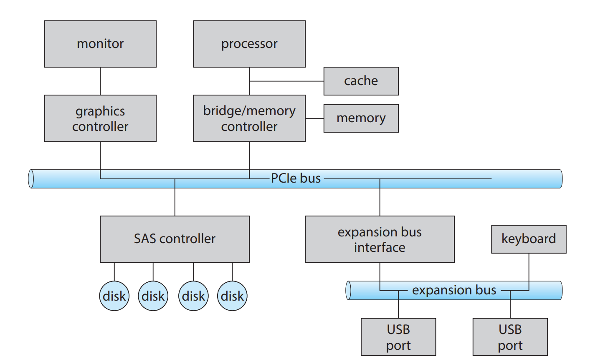
pc 버스 구조 예시

- port : 연결 점
- bus : 회선의 집합

## 12.2.1 memory mapped I/O

입출력 전송을 하기위해 처리기는 **레지스터**를 이용해 명령어와 데이터를 컨트롤러에게 전달.
프로세서는 컨트롤러의 레지스터를 읽음으로 입출력을 수행

통신을 수행하는 방법
1. 특별한 입출력 명령어 사용
2. **memory mapped** I/O : 장치 제어 레지스터를 프로세서의 주소 공간으로 사상
   1. 각 주변 장치 제어 레지스터들이 메모리 주소와 일대일 대응
   2. CPU는 표준 데이터 전송 명령을 사용함으로써 입출력 수행
   3. 단순함
   4. 메모리에 수백만 바이트를 기록하는것이 수백만 번 입출력 명령어를 이용하는 것보다 빠름

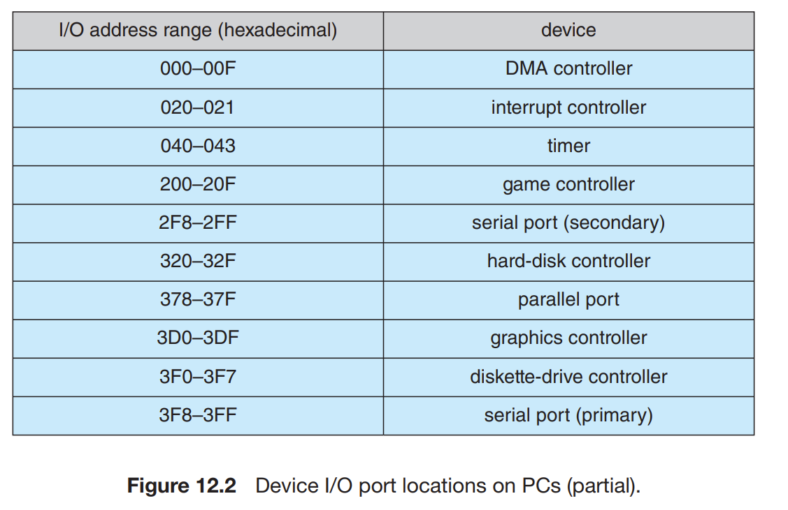

입출력 장치 컨트롤러가 가지는 네개의 레지스터

- 입력 레지스터
- 출력 레지스터
- 상태 레지스터
- 제어 레지스터 : 호스트가 주변 장치에 입출력 명령을 내리거나 장치의 모드를 변경하기위해 쓰기를 수행하는 대상

보통 1 ~ 4byte, 어떤 컨트롤러들은 FIFO칩 제공

## 12.2.2 Polling

호스트와 입출력 하드웨어 사이의 프로토콜 : 기본적으로 핸드셰이킹

1. The host repeatedly reads the busy bit until that bit becomes clear. => while
2. The host sets the write bit in the command register and writes a byte into the data-out register.
3. The host sets the command-ready bit.
4. When the controller notices that the command-ready bit is set, it sets the busy bit.
5. The controller reads the command register and sees the write command. It reads the data-out register to get the byte and does the I/O to the device.
6. The controller clears the command-ready bit, clears the error bit in the status register to indicate that the device I/O succeeded, and clears the busy bit to indicate that it is finished.

여기서 1의 busy waiting을 polling이라 한다.

## 12.2.3 interrupt

- interrupt : polling과 반대로 CPU에게 입출력 장치가 상태변화를 통보하는 하드웨어 기법

1. cpu는 interrupt request line이라고 부르는 선하나를 가지고 매 명령어마다 이 선을 검사함으로서 interrupt 체크를 한다.
2. interrupt 발생시 레지스터 값과 상태 정보 저장
3. 인터럽트 핸들러 루틴으로 점프
4. 필요한 작업 수행
5. return from interrupt

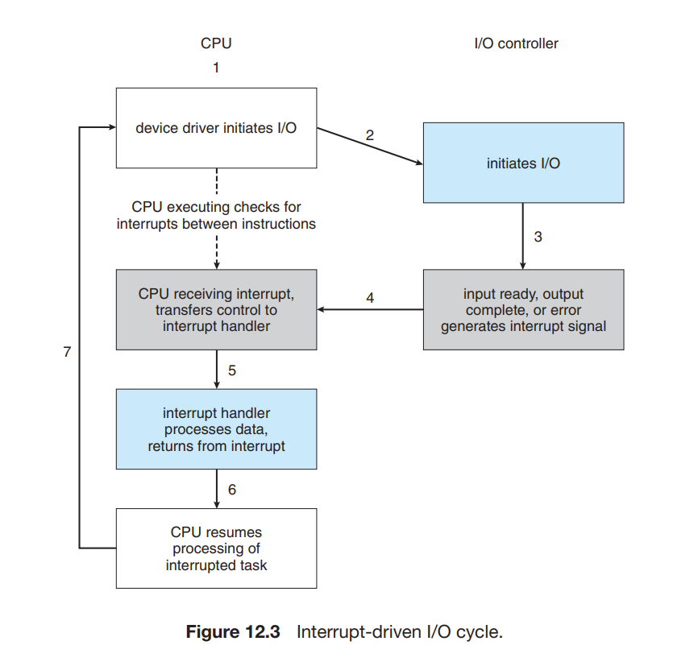

현대에 와서 지원하는 인터럽트 핸들링 방법 들

1. 인터럽트 발생 연기
2. 어떤 장치가 인터럽트를 일으켰는지 모든 장치르르 polling하지않고 알아내는 방법
3. 인터럽트별 우선순위
4. page fault, dived by 0 같은 운영체제 단의 처리

종류
- nonmaskable interrupt : 회복불가능
- maskable interrupt          
- interrupt vector : 특정 인터럽트 핸들링 루틴을 선택하기 위한 table, 우선순위 구현 가능
- interrupt chaining : interrupt vector의 각 원소가 핸들러의 리스트의 헤더를 가리키는 방법

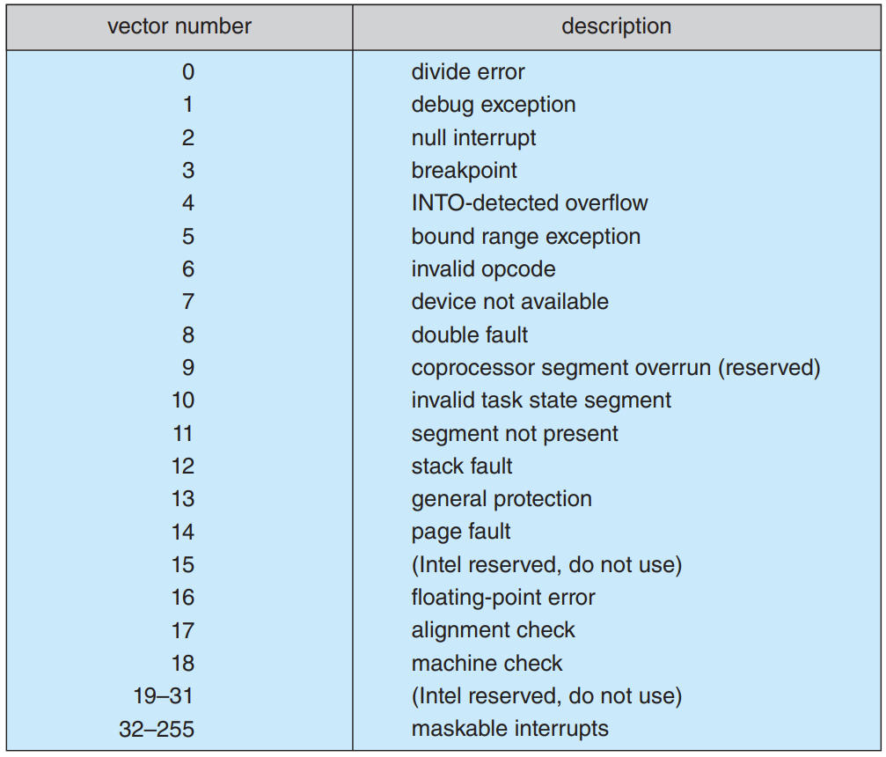

- 1차 인터럽트 처리기(FLIH) : 문맥 교환, 상태 저장, 처리작업을 큐에 삽입하는 작업 수행
- 2차 인터럽트 처리기(SLIH) : 별도로 스케줄 된 요청 처리

다른 용도로 운영체제가 인터럽트를 사용하는 방식

- 가상 메모리 페이징 : 
    1. page fault시 interrupt 발생
    2. 현 상태 저장
    3. 해당 프로세스 wait queue로 보내 재움
    4. 페이지 캐시 관리 수행
    5. 요청된 페이지의 입력 스케줄링
    6. 다른 프로세스가 수행을 시작하도록 스케줄링
    7. return from interrupt
    8. page가 모두 memory에 올라오면 다시 interrupt 발생
    9. wait queue에 있던 프로세스 ready queue로 보냄
    10. return from interrupt
- 시스템 콜 수행
  1. 사용자 코드의 상태 저장
  2. 커널 모드 전황
  3. 해당하는 커널 루틴 or 스레드 수행
  4. return from interrupt
- 커널 안 제어의 흐름 관리 
  - ex 디스크 읽기 다음을 두개의 인터럽트 핸들러로 나누어 처리
    - 커널 공간으로 부터 데이터를 사용자 버퍼로 복사 : 낮은 우선순위
    - 대기 입출력 시작 : 높은 우선순위

스레드를 구현한 커널은 아래를 구현하는 것보다 인터럽트 핸들링에 우선권을 부여하는 것이 적합
- 여러 단계의 우선순위를 가지는 인터럽트처리
- 커널 내의 백그라운드 처리 or 응용 루틴
multiprocessor에서 인터럽트 핸들러가 병렬로 수행 될 수 있음.

## 12.2.4 DMA Direct Memory Access

- PIO : CPU가 상태 비트를 반복적으로 검사하면서 1바이트씩 옮기는 입출력 방식

CPU는 성능을 위해 PIO 작업 일부를 DMA 컨트롤러(프로세서)에 위임

호스트는 메모리에 DMA 명령 블록을 쓴다.

명령 블록의 구조
- 전송할 데이터가 있는 포인터
- 전송할 장소 포인터
- 전송될 바이트 수

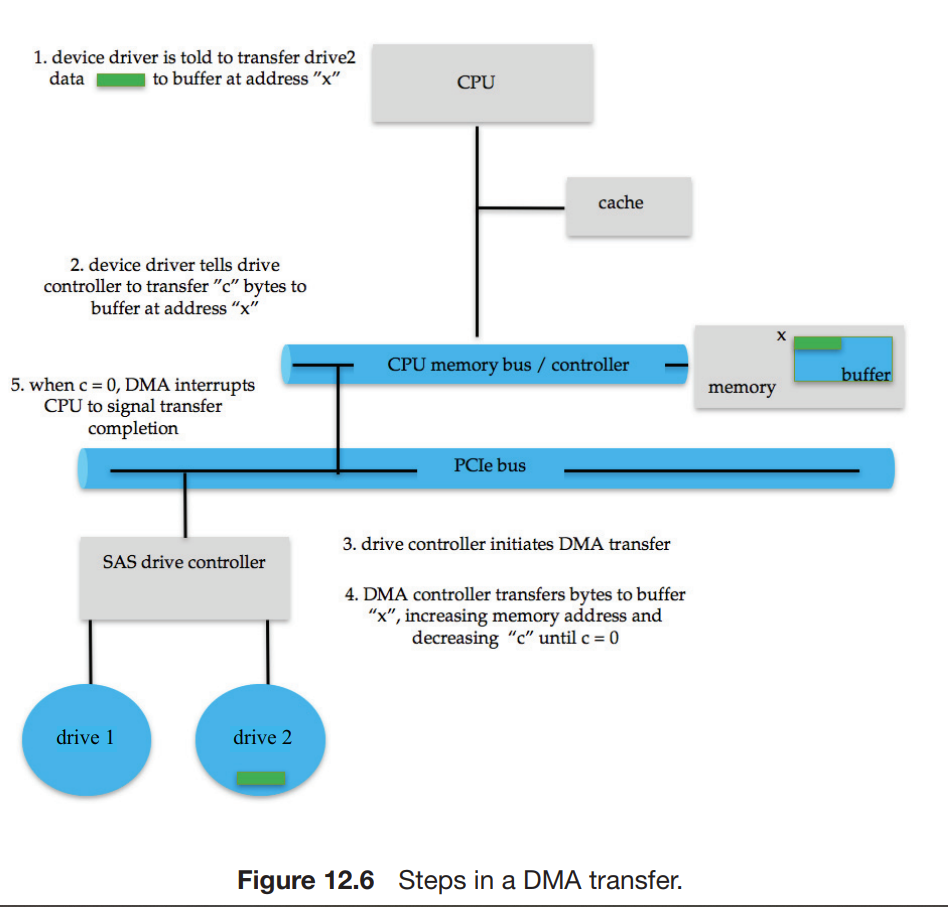

분산 수집(scatter-gather)방식을 이용해 하나의 DMA명령어로 여러개의 전송을 실행 가능

DMA 컨트롤러와 장치 컨트롤러 간의 핸드셰이킹은 두개의 선을 통해 수행
- DMA request
- DMA acknowledge

DMA가 메모리 버스를 점유시에 CPU는 메모리에 접근 하지 못한다. 전송이 끝날때 CPU에 인터럽트를 건다.

# 12.3 Application I/O Interface 500

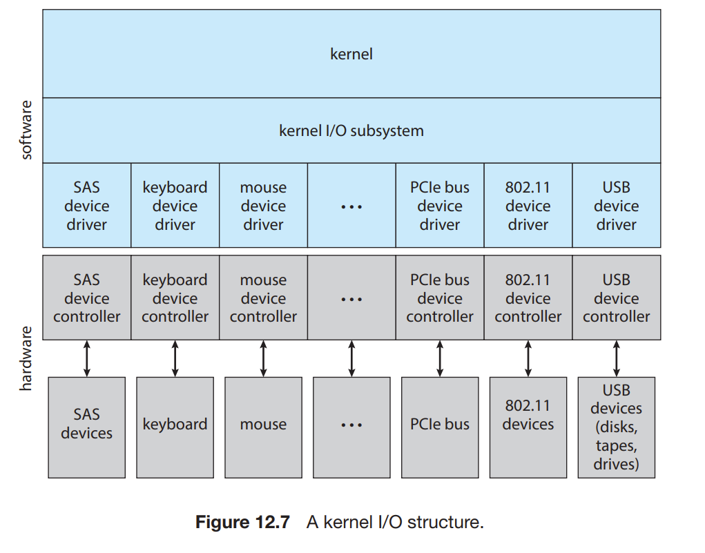

입출력 장치의 특성

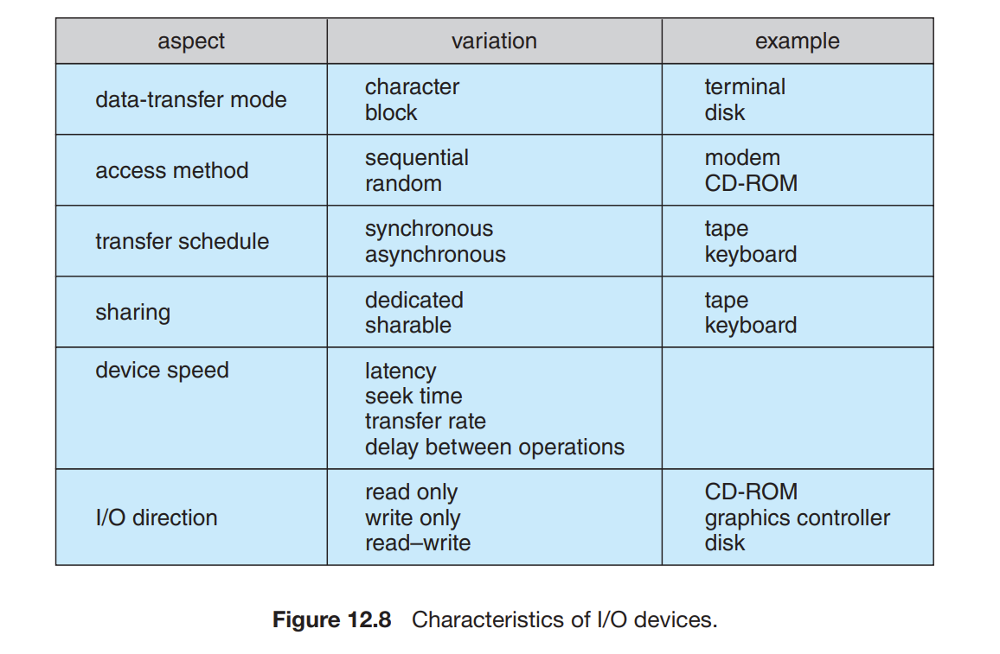

대부분의 운영체제는 입출력 장치로 임의의 명령을 전달하도록 하는 escape 시스템 콜을 가지고 있음
UNIX에서는 ioctl 시스템 콜이 존재

## 12.3.1 Block and Character Device

- raw I/O : 운영체제가 아무런 서비스도 하지않고 제어권을 응용에 일임하는 모드
- direct I/O : 운영체제가 IO에서 버퍼링과 잠금을 하지 않는 모드
- memory mapped 파일 접근: 디바이스를 읽거나 쓰는 명령을 메모리의 특정 번지를 읽거나 쓰는 명령으로 파일 입출력을 대신하는 방식

파일을 매모리 맵드 방식으로 사용하려고 할시파일을 가상 메모리로 사상한 다음 그 가상 메모리의 주소를 가지고 이 주소에 접근하며 파일을 사용

파일 입출력 인터페이스를 쓰지않고 요구 페이징을 사용하여 효율적이고 사용자도 메모리를 읽고 쓰는 것만큼 단순함

## 12.3.2 Network Devices

대부분의 운영체제에서 사용하는 인터페이스는 socket 인터페이스 사용

select 함수 제공 수신 대기 중인 패킷을 가진 소켓, 소켓들의 패킷을 받아들일 여유공간 등의 정보 반환.

이를 사용하면 상태를 polling할 필요와, 입출력을 위해 busy waiting 할 필요가 없어짐

## 12.3.3 Clocks and Timers
대부분 하드웨어 클록과 타이머를 가지고 세가지 기능을 제공
- 현재 시각 제공
- 지난 시간 제공
- T시각이 될시 X 오퍼레이션 실행 : interval timer

## 12.3.4 Blocking and Nonblocking I/O

- 봉쇄형(blocking) 시스템 콜 : 호출시 호출 스레드는 blocking 상태가 됨

입출력 작업은 일반적으로 비동기식으로 작동함. 운영체제는 봉쇄형 코드가 비봉쇄형 코드보다 작성하기 쉽기에 해당 시스템 콜을 제공.

- 비봉쇄형(nonblocking) 시스템 콜 : 호출즉시 입력을 받아들여 즉각적으로 복귀
- 비동기식(asynchronous) 시스템 콜: 호출즉시 즉각적으로 복귀, 입력이 완료될시 변수 설정, 시그널, 인터럽트, 콜백루틴을 수행하면서 알려줌. 입력이 완전히 끝난후 완전한 데이터를 전송 받음

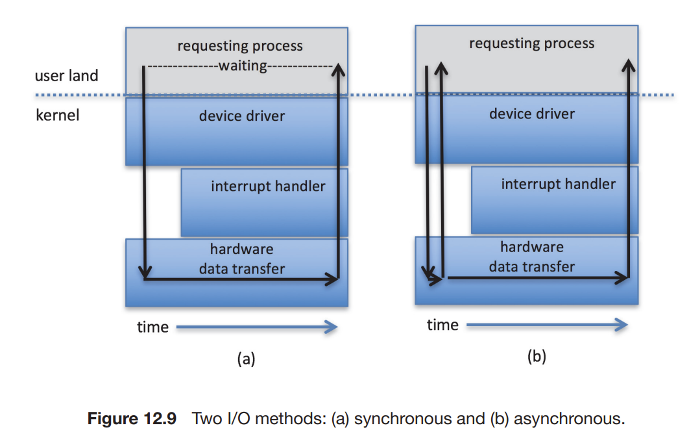

## 12.3.5 Vectored I/O

벡터형 입출력 : 하나의 시스템 콜을 호출하여 복수의 위치에 여러 입출력 연산을 수행

UNIX에 readv가 제공

컨텍스트 스위치와 시스템 콜 오버헤드를 줄일 수 있음

# 12.4 Kernel I/O Subsystem 508

## 12.4.1 I/O스케줄링

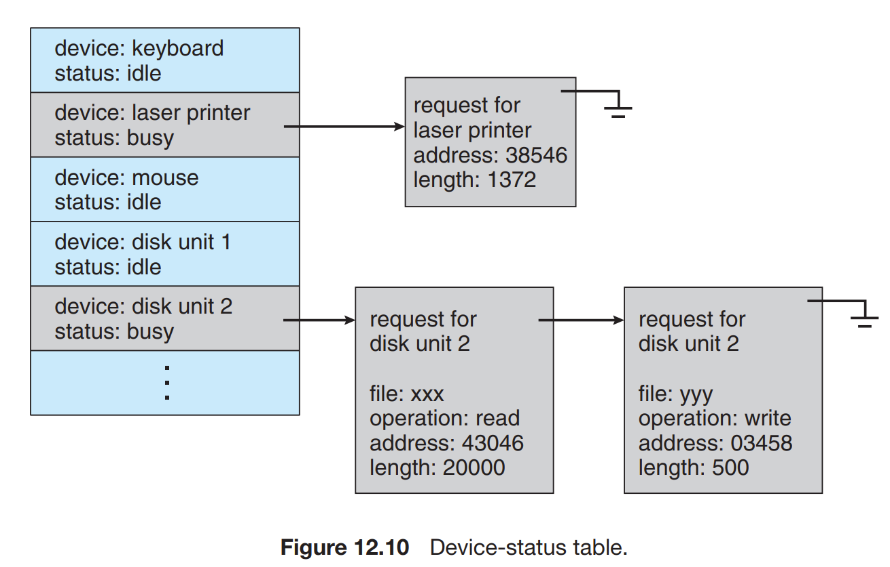

스케줄링 알고리즘 개선으로 전반적인 시스템 성능 향상과 평균대기 시간을 줄일 수 있음

## 12.4.2 Buffering

Buffer :  두 장치 사이 또는 장치와 응용 프로그램 사이에 데이터가 전송되는 동간 전송 데이터를 임시로 저장하는 메모리 영역

buffer가 필요한 이유
1. 데이터의 생산자와 소비자 사이의 속도가 다른 것을 대처
   - 이때 버퍼에 자료가 다 도착하면 드라이버에 쓰고 또한 네트워크에서 추가 수신데이터를 받기위해서 이중버퍼링을 사용 할 수 있음 
2. 데이터 전송 크기가 다른 장치들 사이의 완충 제공 : 원래의 자료 복원 등
3. 입출력 복제 시멘틱(copy semantics) 지원 

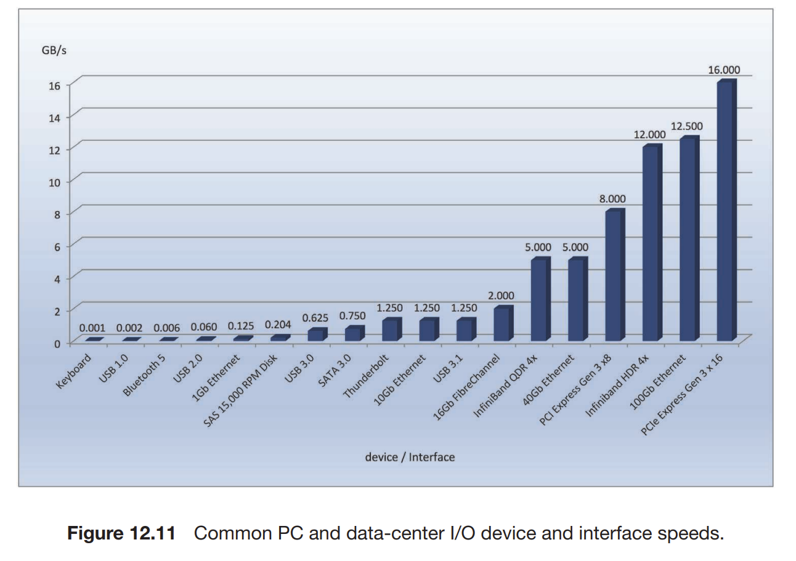

## 12.4.3 Caching 

메모리 영역을 buffering, caching 모두 사용 할 수도 있음

## 12.4.4 Spooling and Device Reservation

spool : interleave하게 작동할 수 없는 장치를 위해 출력 데이터를 보관하는 버퍼. 

무조건 한번에 하나의 동작을 끝까지 해야하는 장치에 사용. 출력을 보조저장장치 파일에 저장하고 모두 저장되면 이때 출력 대기열에 삽입

## 12.4.5 Error Handling

입출력 시스템 콜을 성공 실패를 나타내는 한 비트 정보를 반환 UNIX의 경우  errno이라 부르는 변수를 추가적으로 사용 

## 12.4.6 I/O Protection

모든 입출력 명령은 특권 명령으로 정의(privileged instruction) 이를 system call을 제공해 os가 수행하도록 함.
그럼에도 성능이 필요한 일부 분야(그래픽)에서는 메모리 매핑된 그래픽 컨트롤러 메모리를 직접 접근할 필요가 있음 이 때 커널이 한번에 한 ㅍ로세스에 할당되도록 잠금 기법을 제공해야한다.

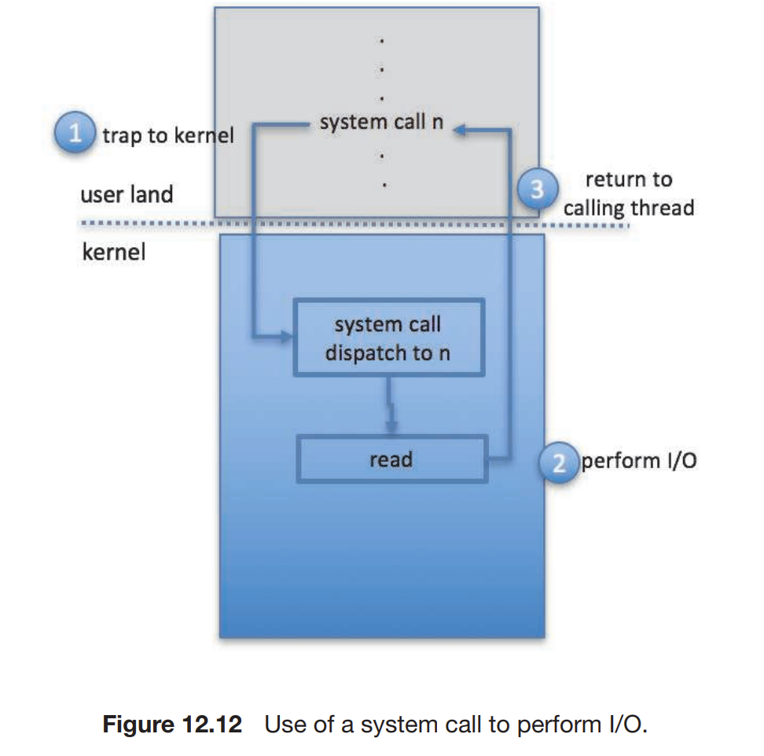

## 12.4.7 Kernel Data Structures

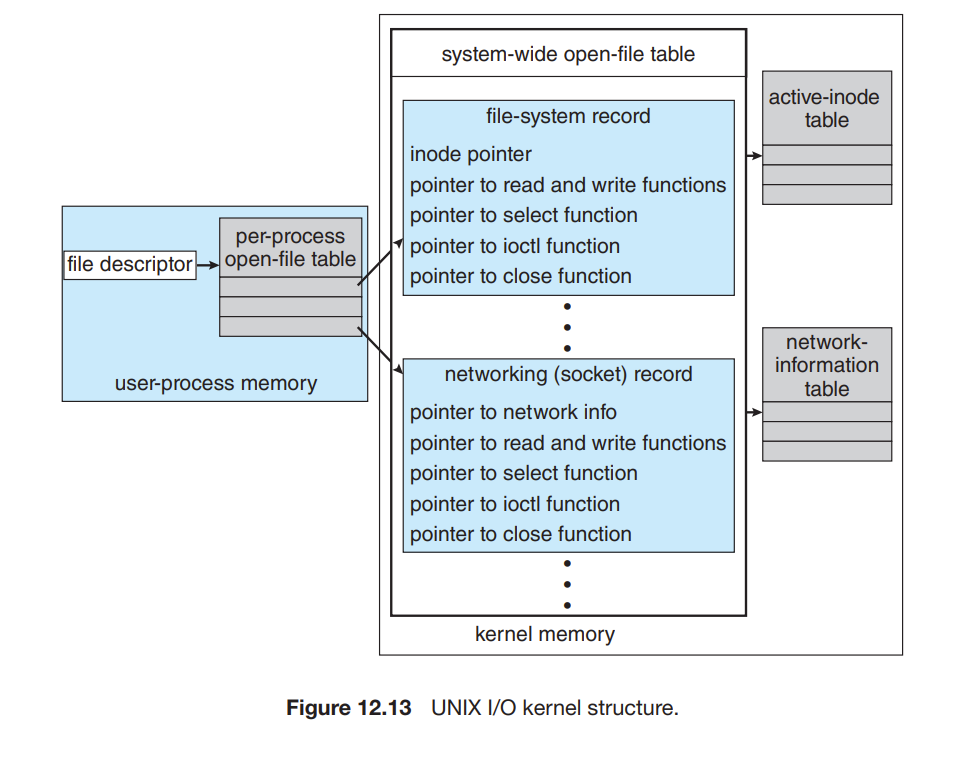

커널은 입출력 구성요소에 대한 상태 정보를 유지해야한다. 

Windows NT에서는 입출력 서비스를 커널이 직접 해주지 않고 커널 밖의 입출력  manager라는 프로그램에 넘겨준다.
1. 커널에 입출력 요청
2. mesage로 바꿔 manager에게 전달
3. 장치 드라이버에게 전달

## 12.4.8 전원 관리

OS는 적절히 관리해야한다.

Android 모바일 시스템의 주요 전원관리 세가지

1. 전원축소 (power collapse) : 장치를 매우 깊은 슬립 상태로 만드는 기능
2. 구성요소 수준 전원 관리 : 사용하지 않은 구성 요소를 끔. 모든 구성요소를 사용하지 않으면 전원축소
3. wakelock : 시스템이 전원 축소로 진입하는것을 커널이 막는 lock

- Management of the name space for files and devices
- Access control to files and devices
- Operation control (for example, a modem cannot seek())
- File-system space allocation
- Device allocation
- Buffering, caching, and spooling
- I/O scheduling
- Device-status monitoring, error handling, and failure recovery
- Device-driver configuration and initialization
- Power management of I/O devices

# 12.5 Transforming I/O Requests to Hardware Operations 516

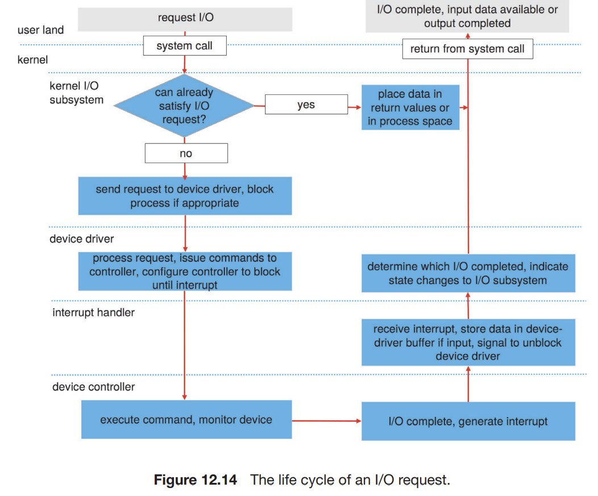

1. A process issues a blocking read() system call to a file descriptor of a file that has been opened previously.
2. The system-call code in the kernel checks the parameters for correctness. In the case of input, if the data are already available in the buffer cache, the data are returned to the process, and the I/O request is completed.
3. Otherwise, a physical I/O must be performed. The process is removed from the run queue and is placed on the wait queue for the device, and the I/O request is scheduled. Eventually, the I/O subsystem sends the request to the device driver. Depending on the operating system, the request is sent via a subroutine call or an in-kernel message.
4. The device driver allocates kernel buffer space to receive the data and schedules the I/O. Eventually, the driver sends commands to the device controller by writing into the device-control registers.
5. The device controller operates the device hardware to perform the data transfer.
6. The driver may poll for status and data, or it may have set up a DMA transfer into kernel memory. We assume that the transfer is managed by a DMA controller, which generates an interrupt when the transfer completes.
7. The correct interrupt handler receives the interrupt via the interruptvector table, stores any necessary data, signals the device driver, and returns from the interrupt.
8. The device driver receives the signal, determines which I/O request has completed, determines the request’s status, and signals the kernel I/O subsystem that the request has been completed.
9. The kernel transfers data or return codes to the address space of the requesting process and moves the process from the wait queue back to the ready queue.
10. Moving the process to the ready queue unblocks the process. When the scheduler assigns the process to the CPU, the process resumes execution at the completion of the system call

# 12.6 STREAMS 519

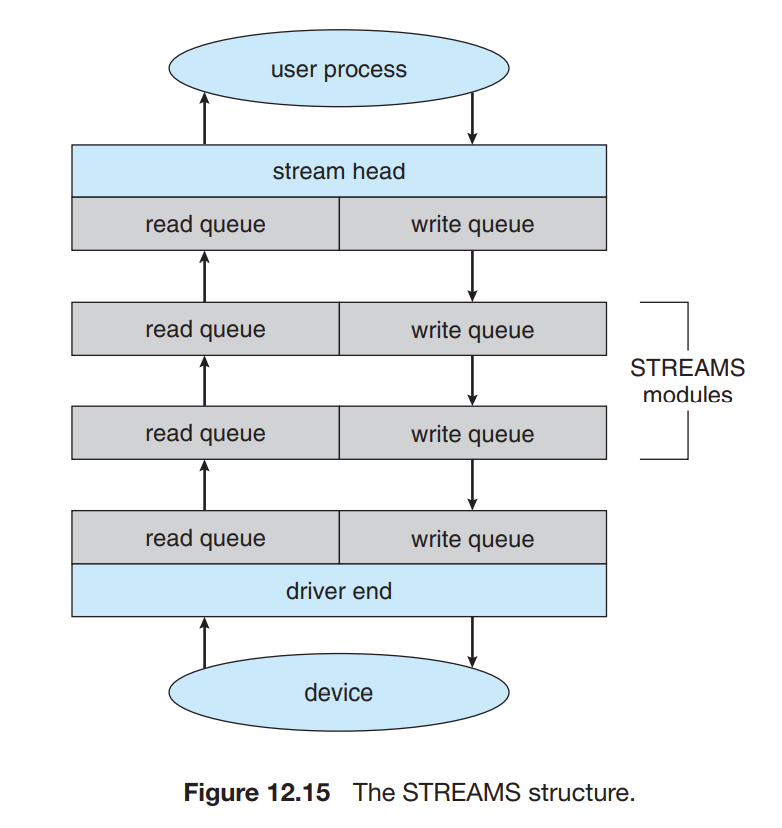

응용프로그램이 동적으로 드라이버 코드의 파이프라인을 조립할 수 있게 해주는 UNIX 시스템 V의 기법

스트림 : 디바이스 드라이버 와 사용자 레벨 프로세스 사이의 완전 양방향 연결
- 스트림 헤드 : 사용자 프로세스와 상호 연동
- 드라이버 엔드 : 디아비스 제어
- 스트림 모듈

ioctl 시스템 콜을 사용하여 스트림에 푸시

장점 : 모듈식, 프레임 워크 제공

대부분의 UNIX 변종이 지원하며 프로토콜과 디바이스 드라이버를 작성할 때 가장 선호되는 방법.

# 12.7 Performance 521

입출력시의 시스템 성능에 미치는 영향

- cpu와 하드웨어 캐시: 장치 드라이버 코드를 실행, 프로세스 봉쇄, 해제 됨에 따른 cpu 스케줄링, context switch 오버헤드
- 메모리 버스 : 컨트롤러와 메모리, 커널 버퍼와 응용 프로그램 데이터 공간 사이의 데이터 복사

입출력은 인터럽트 시에 context switch 오버헤드가 굉장히 큼 

- busy wait에서의 사이클 횟수만 적다면 programmed I/O가 인터럽트보다 효율적일 수 있음. 이 때 인터럽트는 cpu 스케줄링 상의 프로세스 봉쇄와 해제를 의미 이때 context switch 오버헤드가 발생 
- 네트워크의 트래픽에서의 context switch

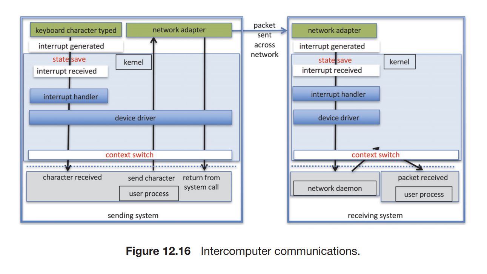

일부 시스템들은 터미널 입출력을 전담하는 프론트 엔드 처리기를 사용하여 CPU로부터 인터럽트 부담을 줄임

입출력의 효율을 높이기 위한 원칙들
- Reduce the number of context switches.
- Reduce the number of times that data must be copied in memory while passing between device and application.
- Reduce the frequency of interrupts by using large transfers, smart controllers, and polling (if busy waiting can be minimized).
- Increase concurrency by using DMA-knowledgeable controllers or channels to offload simple data copying from the CPU.
- Move processing primitives into hardware, to allow their operation in device controllers to be concurrent with CPU and bus operation.
- Balance CPU, memory subsystem, bus, and I/O performance, because an overload in any one area will cause idleness in others.

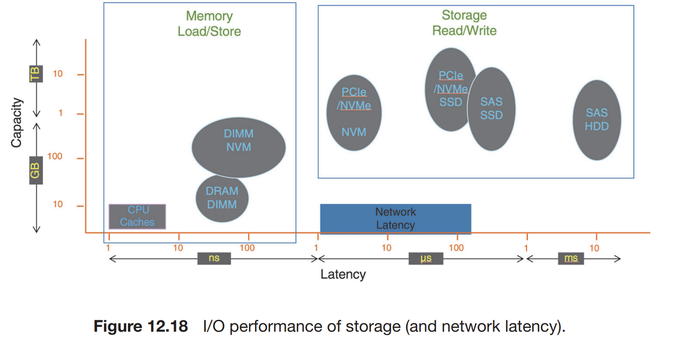

# 12.8 Summary 524

- The basic hardware elements involved in I/O are buses, device controllers, and the devices themselves.
- The work of moving data between devices and main memory is performed by the CPU as programmed I/O or is offloaded to a DMA controller.
- The kernel module that controls a device is a device driver. The systemcall interface provided to applications is designed to handle several basic categories of hardware, including block devices, character-stream devices, memory-mapped files, network sockets, and programmed interval timers. The system calls usually block the processes that issue them, but nonblocking and asynchronous calls are used by the kernel itself and by applications that must not sleep while waiting for an I/O operation to complete
- The kernel’s I/O subsystem provides numerous services. Among these are I/O scheduling, buffering, caching, spooling, device reservation, error handling. Another service, name translation, makes the connections between hardware devices and the symbolic file names used by applications. It involves several levels of mapping that translate from character-string names, to specific device drivers and device addresses, and then to physical addresses of I/O ports or bus controllers. This mapping may occur within the file-system name space, as it does in UNIX, or in a separate device name space, as it does in MS-DOS.
- STREAMS is an implementation and methodology that provides a framework for a modular and incremental approach to writing device drivers and network protocols. Through STREAMS, drivers can be stacked, with data passing through them sequentially and bidirectionally for processing. 
- I/O system calls are costly in terms of CPU consumption because of the many layers of software between a physical device and an application. These layers imply overhead from several sources: context switching to cross the kernel’s protection boundary, signal and interrupt handling to service the I/O devices, and the load on the CPU and memory system to copy data between kernel buffers and application space.

# Practice Exercises 525

# Further Reading 526