# Chapter 13 File System

Reviewed: No

# Chapter 13 File System Interface

파일 시스템은 관련된 자료를 저장하는 실제적 파일의 집합과 시스템 내의 모든 파일에 관한 모든 정보를 저장하는 디렉터리 구조로 구성

- 파일 시스템의 기능을 설명한다.
- 파일 시스템 인터페이스의 특징을 기술한다.
- 접근방법,파일공유,파일락,디렉터리구조를포함하는 파일시스템설계
- 파일 시스템 보호에 대해서 고려해본다.

# 13.1 파일 개념 File Concept

운영체제는 컴퓨터 시스템을 편리하게 사용하기 위해 저장된 정보에 관한 논리적 정보를 제공, 저장장치의 물리적 특성을 추상화하여 논리적 저장단위 파일을 정의

- 비휘발성으로 시스템이 재부팅 되어도 저장된 내용은 영구히 존속 (저장장치)
- 파일은 논리적 저장장치의 가장 작은 요소

## 13.1.1 파일 속성 File Attributes

`파일이 만들어지는 순간 파일을 생성한 프로세스, 사용자, 심지어 시스템으로부터도 독립`

- 이름  : 사람이 읽을 수 있는 형태로 유지된 유일한 정보
    - 사용자 편의를 위해 이름 부여, 이름으로 파일 참조
- 식별자 (identifier) : 파일 시스템 내에서 파일을 확인하는 고유 번호
    - 우리가 읽을 수 없는 파일의 이름
- 유형 : 여러 유형을 제공하는 시스템을 위해 필요
- 위치 : 파일이 존재하는 장치 및 해당 장치 내 위치에 대한 포인터
- 크기 : 파일의 현재 크기(바이트, 워드 혹은 블록)와 최대 허용 가능한 크기
- 보호 : 접근 제어 정보
    - 누가 읽고 쓰고 실행할 수 있는지 통제
- 타임스탬프와 사용자 식별: 생성, 최근 변경, 최근 사용 등을 유지
    - 보호, 보안 및 사용자 감시를 위해 사용됨

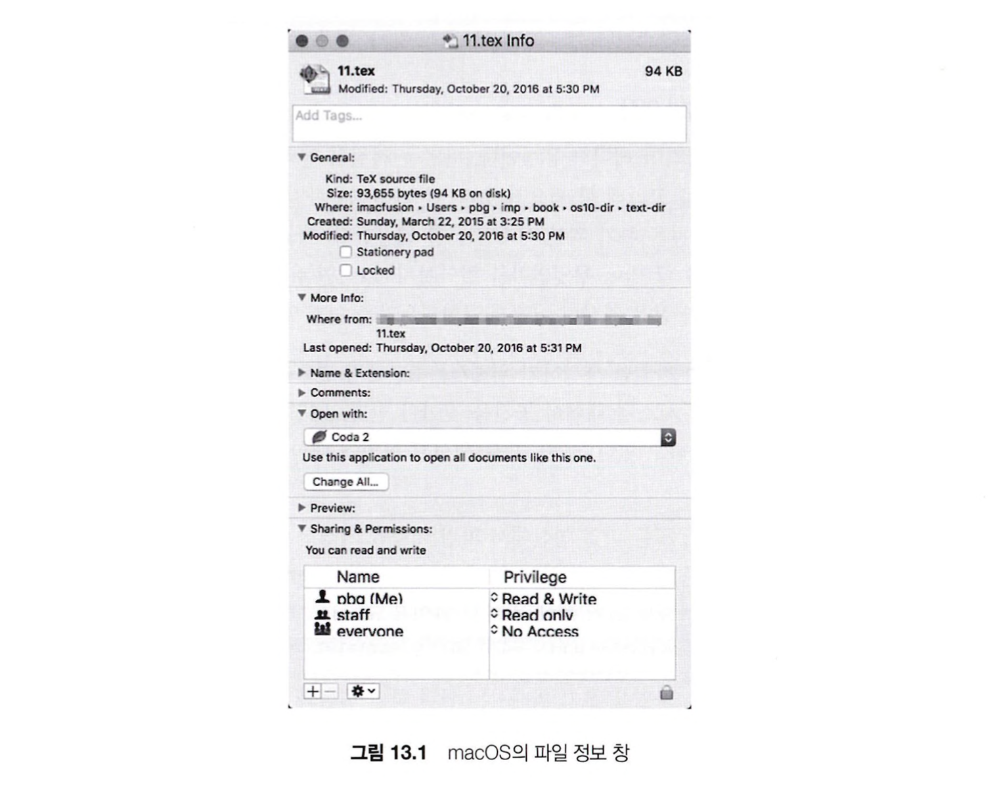

## 13.1.2 파일 연산 File Operation

운영체제는 파일 생성, 읽기, 쓰기, 위치 재설정, 삭제, 절단 등을 위한 시스템 콜 제공

- 파일 생성
    - 파일을 저장할 수 있도록 시스템 내 공간 찾음 (공간 할당 방법은 14장에서)
    - 새로 생성된 파일에 대한 항목이 디렉터리에 만들어져야 함
- 파일 열기
    - 생성과 삭제를 제외한 모든 연산을 하기 전에는 반드시 파일 open()
        - 성공시 open 콜은 다른 콜의 인자로 사용되는 핸들을 반환
- 파일 쓰기
    - 열린 파일 핸들과 파일에 기록될 정보를 명시한 시스템 콜 실행
    - 시스템은 파일 내의 다음 쓰기가 일어날 위치를 가리키는 쓰기 포인터를 유지하고 있어야 함
        - 쓰기 포인터는 쓰기가 일어날 때마다 갱신
- 파일 읽기
    - 파일 핸들과 파일이 읽혀야 할 메모리 내 블록의 위치를 기술하는 시스템 콜 사용
    - 시스템은 다음 순차적 읽기가 일어나 파일 안의 위치를 가리키는 읽기 포인터(read pointer)를 유지할 필요가 있음
    - 읽기포인터는 읽기가 발생하는 순간 갱신 됨
    - 프로세스는 일반적으로 파일 읽기나 파일 쓰기 중 하나를 하고있음 → 대부분의 시스템은 하나의 현재 파일 위치 포인터를 가짐

→ 읽기, 쓰기 연산 모두 해당 포인터를 사용함으로써 공간 절약 및 시스템의 복잡성 감소

- 파일 내에서의 위치 재 설정
    - 열린 파일의 현재 위치를 주어진 값으로 설정
    - 파일 내 위치 재설정을 위해 실제 입출력할 필요는 없음
    - 파일 탐색(seek)으로도 알려져 있음
- 파일 삭제 :
    - 파일 삭제를 위해 지정된 파일을 디렉터리에서 탐색
    - 해당 디렉터리 항목을 찾으면 다른 파일에서 재사용 할 수 있도록 모든 파일 공간을 해제사고 디렉터리 항목을 지우거나 사용 가능으로 표시
    - 일부 시스템은 동일한 파일에 대해 여러개의 이름이 존재할 수 있는 `하드링크` 허용 ⇒ 실제 파일 내용은 마지막 링크가 삭제될 때 까지 삭제되지 않음
- 파일 절단
    - 파일의 내용은 지우나, 그 파일의 속성은 그대로 남기를 원할 때 사용
    - 사용자가 파일을 삭제하고 파일을 재생성하게 하는 것이 아니라, 파일의 길이를 제외한 모든 속성은 그대로 유지
    - 파일의 길이가 0으로 재설정되며 파일이 가지고있던 모든 공간은 해제

일부 환경에서는 open()연산 구현은 훨씬 복잡 → 프로세스별 테이블, 범 테이블 사용

- 프로세스별 테이블 : 접근 권한, 파일 포인터
- 범 시스템 테이블: 파일 위치, 크기, 날짜 등 (프로세스로부터 독립적 정보)

### 오픈 파일 테이블

오픈 파일과 관련된 정보

- 파일 포인터
    - 가장 최근의 읽기/쓰기 위치를 추적함
    - 파일 오픈한 프로세스 당 하나 생성
- 파일 열린 계수
    - 파일의 총 열린 횟수 및 닫힌 횟수 기록
    - 계수값이 0인 경우 시스템은 해당 항목을 제거
- 파일의 위치
    - 시스템에 파일 내의 데이터를 읽거나 쓰도록 요구
    - 파일의 위치를 찾기 위한 정보는 연산마다 디스크에서 읽는 것을 피하고자 메모리에 저장
- 접근 권한
    - 한 파일의 하나의 접근 모드로 염
    - 프로세스별 테이블에 저장되며 운영체제는 이 정보를 후속요구 허용 및 불허에 사용 할 수 있음

### 파일 락킹 file locking

일부 운영체제는 열린 파일을 잠글 수 있는 기능 제공, 한 프로세스가 파일을 잠그는 경우 다른 프로세스는 접근 불가

- 두 개 이상의 프로세스가 파일 잠금을 얻으려 하다 교착 상태에 빠질 수 있음, 특별한 대책 필요

```c
int lockf(int fd, int cmd, off_t len);

int fcntl(int fd, int cmd, struct flock *lock);
```

## 13.1.3 파일 유형

운영체제 설계 시 중요한 사항 중 하나는 운영체제가 파일 유형들을 인식하고 지원할 것인지를 결정하는 것

- 파일 이름의 일부가 파일 유형을 나타내도록 함으로써 파일 유형 인식
- 이름, 확장자(extension) 두 부분으로 나뉘게 됨
    - extension은 필수적이지 않음
    - 확장자 없이 파일 지정 경우 응용 프로그램이 주어진 이름과 기대하는 확장자를 가진 파일을 찾음
    - 확장자는 운영체제가 지원하는 것 x ⇒ 응용 프로그램이 동작하는 파일들에 대한 힌트로 생각 ㅇ
    

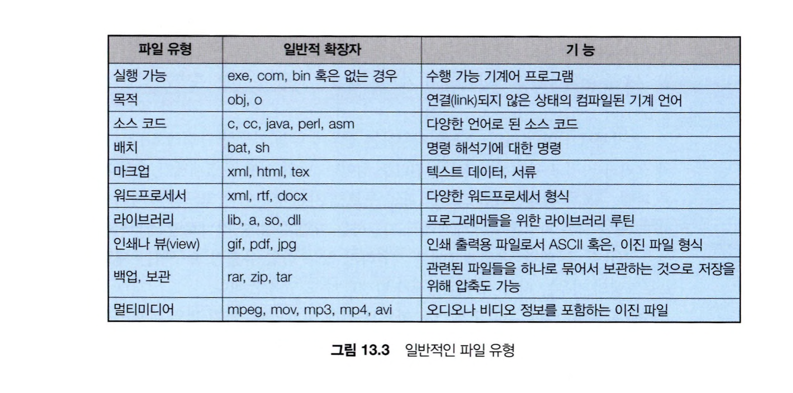

## 13.1.4 파일 구조

파일들은 파일을 다루는 프로그램에 의해 인식 가능한 내부 구조를 일정 형태로 가짐

- 일부 파일의 경우 운영체제가 인식할 수 있도록 미리 정해진 구조를 따라야 할 때도 있음
- 여러 파일 구조를 지원하는 경우 ⇒ 운영체제 크기가 커지고 관리가 힘들어진다는 단점 존재
- 모든 운영체제는 프로그램 로딩 및 실행할 수 있는 실행파일을 반드시 지원해야 함

# 13.2 접근 방법 Access Methods

파일 사용시에 파일에 접근하여 데이터를 읽는 방법

### 13.2.1 순차 접근

- 디스크에 있는 파일들을 저장되어잇는 레코드 순서로 접근
- 가장 일반적이며 편집기 및 컴파일러는 순차 접근으로 파일에 접근
- 파일에대한 기본적 연산인 읽기, 쓰기도 순차 접근 사용
    - 읽기 = 파일의 다음 부분부터 차례로 읽어나감, 파일포인터 (offset) 자동으로 증가
    - 쓰기 = 파일의 끝에 추가하며 새로운 파일의 끝으로 파일 포인터(offset) 이동
    - offset은 맨 앞, 맨 뒤로 옮길 수 있고 정수 n만큼 앞 뒤로 건너뛰기 가능
    
    `fgetc()`
    
    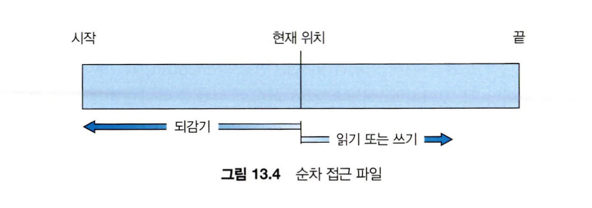
    

### 13.2.2 직접 접근 상대 접근

- 어떤 블록 이라도 특별한 순차 없이 바로 빠르게 레코드 읽고 쓸 수 있음
- 파일의 디스크 모델에 기반 ⇒ 디스크가 임의 파일 블록에 대한 임의적 접근 허용
    - 직접 접근을 위해 파일은 번호를 갖는 일련의 블록 또는 레코드로 간주, 직접 접근은 임의 블록 읽거나 쓰기 가능
- 대규모 정보를 즉각적으로 접근하는데 유용
    
    
- 파일 연산이 블록 번호 파라미터를 포함할 수 있도록 수정되어야함

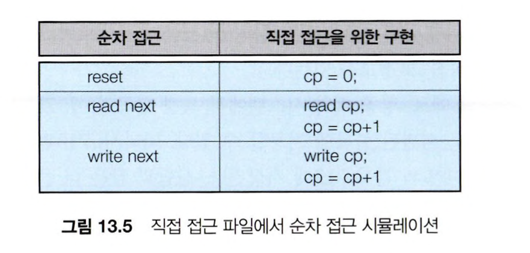

cp = 현재 위치를 가리키는 변수 

`lseek(), seek()`

### 13.2.3 기타 접근 방법

- 직접 접근 파일이 있는 경우, 직접 접근 파일을 기반으로 여러 다른 파일 접근을 제공할 수 있음
    - 직접 접근 파일을 기반으로한 index 사용

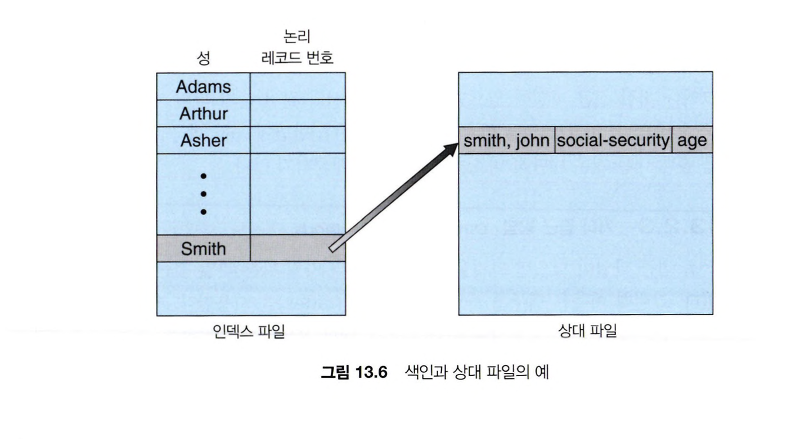

# 13.3 디렉터리 구조 Directory Structure

file들을 분류, 보관하기 위한 개념

### 디렉터리 연산

- 파일 찾기
    - 사용자는 특정 파일을 찾기 위해 디렉터리를 탐색이 가능해야 함
    - 특정 패턴과 일치하는 이름을 갖는 모든 파일을 찾을 수 있어야 함 (파일 이름은 심볼릭한 형태)
- 파일 생성
- 파일 삭제
- 디렉터리 나열
- 파일 재명명
    - 변경된 이름이 기존 이름보다 커져서 기존 디렉터리 항목에 반영 불가능 한 경우
        
         → 디렉터리 구조 내 항목의 위치가 변경되어야 하는 경우도 존재
        
- 파일 시스템 순회
    - 파일이 더이상 사용 되지 않는 경우, 파일은 백업 장치에 복사 후 디스크 공간이 해제되어 다른 파일에 의해 재사용 가능

### 13.3.1 1단계 디렉터리 Single Level Directory

가장 간단한 구조의 디렉터리로 모든 파일이 다 같이 한 개의 디렉터리 밑에 있음

- 파일이 많아지거나 다수의 사용자가 사용하는 시스템에서는 매우 비효율적이며 제약이 많음
    - 한 명의 사용자만 사용한다고 해도 파일이 증가하는 경우 비효율적.
- 하나의 디렉터리에 모든 파일이 다 같이 존재하므로, 각 파일들은 유일한 이름을 가져야 함

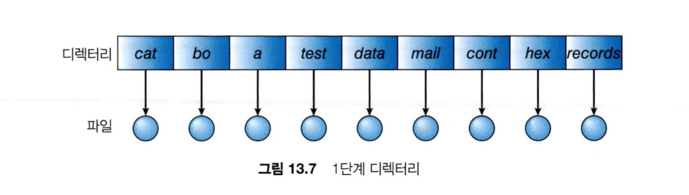

### 13.3.2 2단계 디렉터리 Two-Level Directory

각 사용자들에게 서로 다른 디렉터리를 만들어줌. 각 사용자는 자신만의 UFD를 갖게된다.

- UFD(User File Directory)
    - 사용자 본인만의 파일 디렉터리
    - 오직 한 사용자만의 파일을 저장함
- MFD (Master File Directory)
    - 사용자의 이름이나 계정번호로 인덱싱 되어있음
    - 각 엔트리는 각 사용자의 UFD를 가리킴

사용자가 시스템에 로그인 하면 시스템은 MFD 먼저 탐색, 이후 사용자가 특정 파일 시스템을 제시하면 UFD 디렉터리 아래에서만 탐색 진행

- 한 사용자의 UFD를 다른 사용자는 접근 불가 (서로 자신의 UFD허용)

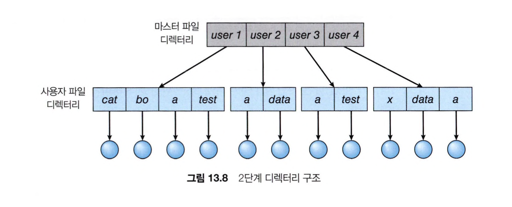

### 13.3.3 트리 구조 디렉터리 Tree-Structured Directories

2단계 디렉터리 구조를 확장하여 임의의 높이를 갖는 트리 구조를 생성.

- 각 사용자들에게 자신의 서브 디렉터리(subdirectory)를 원하는 만큼 만들 수 있게 함
- 최 상위에 root 디렉터리 존재
- 시스템 내 모든 파일은 고유한 경로명을 가짐
- 디렉터리 각 항목은 한 비트를 사용하여 해당 항목이 일반파일(0) 인지 디렉터리 파일(1)인지 구분
- 시스템에 따라 디렉터리 삭제 조건 다름
- 자신의 파일 뿐만 아니라 다른 사용자의 파일도 접근 할 수 있음

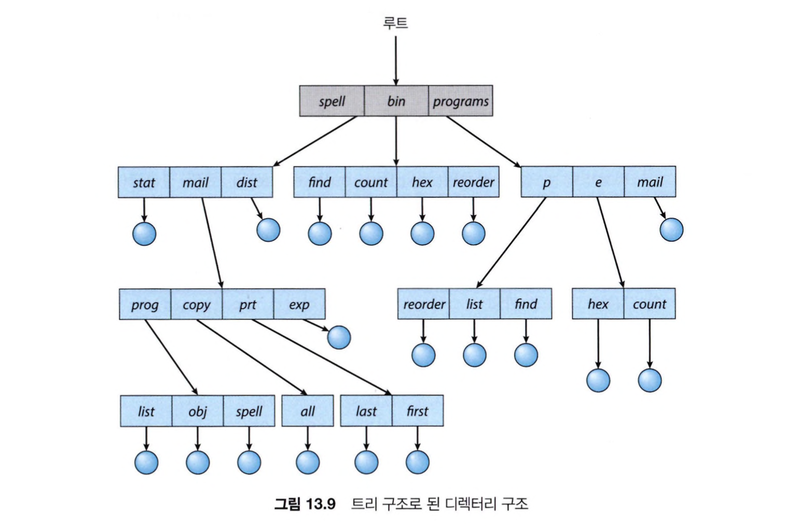

### 13.3.4 비순환 그래프 디렉터리 Acyclic-Graph Directories

트리구조는 파일, 디렉터리의 공유를 허용하지 않음, 비순환 그래프 디렉터리는 디렉터리들의 서브디렉터리와 파일공유를 허용하는 구조.

- 공유되고 있는 디렉터리에 파일 연산 실행시, 공유하는 서브 디렉터리에 자동으로 반영
- 공유 디렉터리 방법
1. 절대 경로명 혹은 상대경로명으로 구현된 `링크` (다른 파일, 서브디렉터리를 가리키는 포인터)라는 새 디렉터리 항목을 만들 수 있음
2. 디렉터리들이 동일한 항목 , 내용을 복사해 가지고 있음
- 트리구조보다 융통성이 있는 대신 복잡함
    - 파일이 여러개의 절대경로명을 가질 수 있음
    - 공유 파일 삭제시 문제 발생 가능 → 삭제시 존재하지 않는 파일을 가리키는 포인터(dangling pointer)를 만들어냄

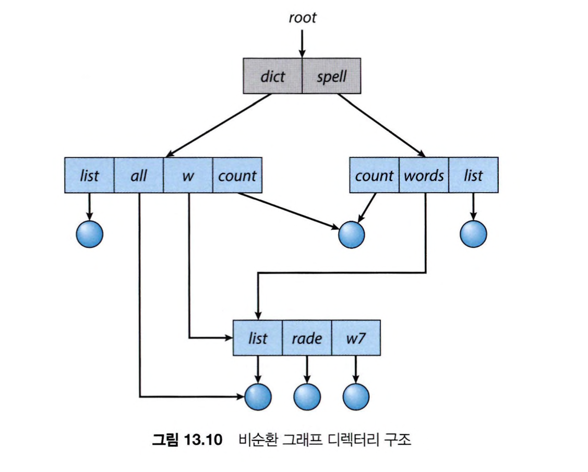

### 13.3.5 일반 그래프 디렉터리 General Graph Directory

사이클이 허용되는 구조. 

→ 디렉터리에서 순환이 허용될 경우, 한 요소를 두번 탐색하지 않을 것이며 잘못 설계된 알고리즘으로 인해 무한루프에 빠질 수도 있음. 

- 제거된 파일의 디스크 공간 확보를 위해 쓰레기 수집 필요
- 가비지 수집(garbage-collection)
    - 전체 파일 시스템을 검색하고 접근 가능한 것을 표시
    - 두번째 탐색에서 표시되지 않은 것들을 수집하고 사용가능한 공간 리스트에 추가함


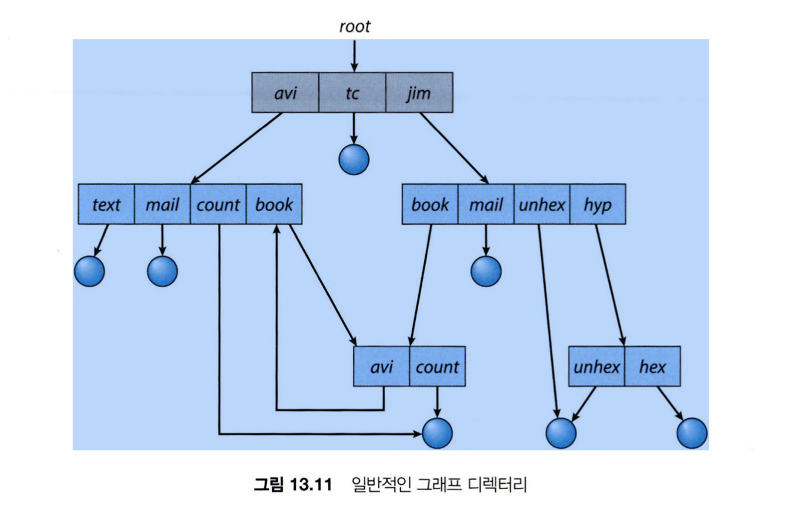

# 13.4 보호 Protection

## 13.4.1 접근의 유형 Type of Access

보호는 가능한 파일 접근 유형을 제한함으로써 제한된 접근을 제공. 여러 요인에 의해 접근 허용되거나 거부되는데 일부 유형의 연산들이 통제될 수 있음

- 읽기, 쓰기, 실행, 추가, 삭제, 리스트, 속성변경, 이름 변경, 파일 편집 복사 등

## 13.4.2 접근 제어  Access Control

신원에 따라 특정 파일에 대한 접근 허용 여부를 결정. 

- 접근제어리스트 (access-control list, ACL)
    - 파일을 누가, 어떤 연산을 위해 사용할 수 있는지를 기술
    - 파일의 접근 리스트 검사하여 허용 여부 결정

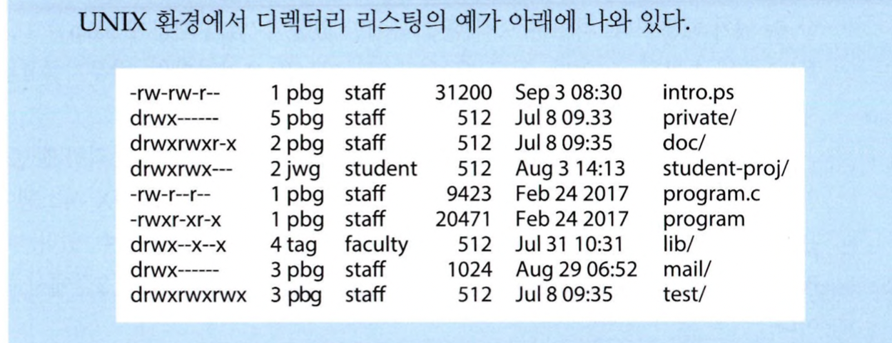

## 13.4.3 다른 보호 방법 Other-Protection Approaches

- 각 파일 접근시 암호 요구
- global table (시스템 전체 file에 대한 권한은 table로 유지)
- Capability list (메인에 대한 접근 권한 나열)

# 13.5 메모리 사상 파일 Memory Mapped Files

memory mapping은 프로세스의 가상 메모리 주소 공간 중 일부를 관련된 파일에 할애한 뒤 가상 메모리 주소에 직접 접근 하는 것으로 파일 읽기 및 쓰기를 대신함. (디스크 입출력을 메모리 참조 방식으로 대신한 것 )

## 13.5.1 기본 기법 Basic Mechanism

- 메모리 매핑은 프로세스 페이지 중 일부를 디스크에 있는 파일 블록에 매핑함으로써 이루어짐
- 메모리 매핑된 파일에 대한 쓰기는 반드시 보조저장장치의 파일에 즉각적으로 써지지 않음, 일반적으로 파일을 닫을 때만 메모리 변경사항에 따라 파일 업데이트
- 일부 운영체제는 특정 시스템 콜을 통해서만 메모리 매핑 파일 처리, 일반적으로는 표준파일 관련 시스템 콜 통해 파일에 접근하도록 함

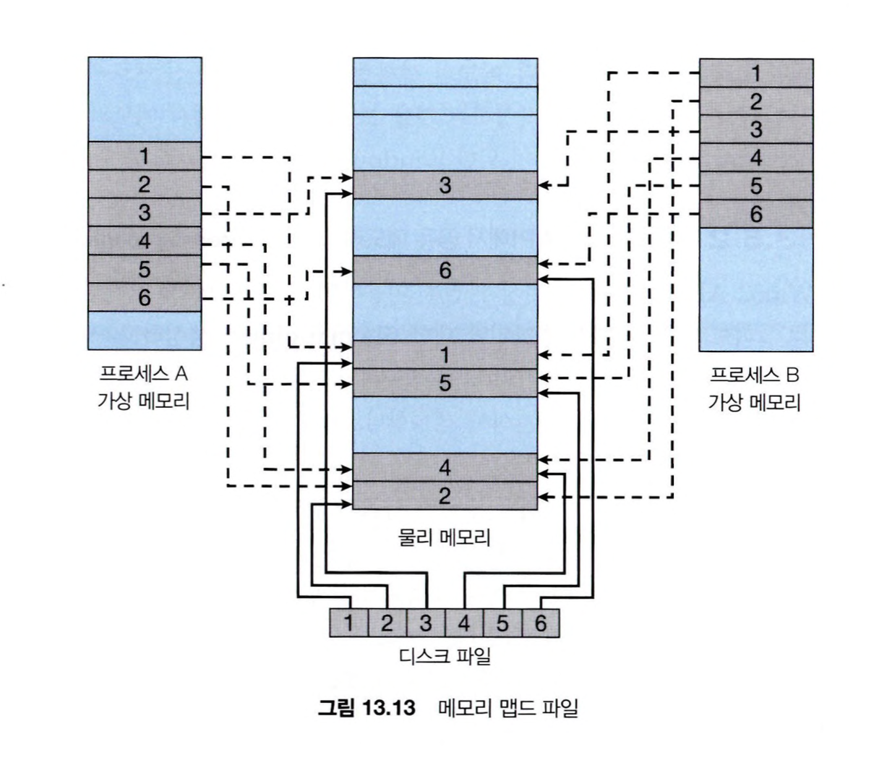

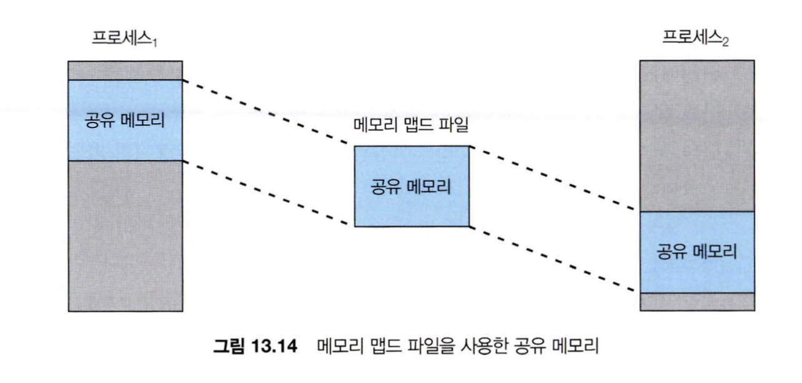

## 13.5.2 Windows API 공유 메모리

1. mapping될 파일에 대한 file mapping 생성
2. 해당 파일의 프로세스 가상 주소 공간상의 view를 만듬
3. 다른 프로세스는 파일을 오픈한 뒤 해당 파일의 뷰를 가상 주소 공간상에 생성