| 작성자  |   작성일   |
| :-----: | :--------: |
| jiwolee | 2022.06.24 |

# Chapter 14 파일 시스템 구현 Implementing File systems

파일 시스템 구조, 파일 시스템 구현, 디렉터리 구현, 할당 방법, 가용공간관리, 복구, WAFL파일 시스템

목표
- 지역 파일 시스템 및 디렉터리 구조 구현에 대한 세부 사항을 설명한다. 
- 블록 할당과 가용 블록 알고리즘 및 그의 절충에 대해 논의한다.
- 파일 시스템의 효율 및 성능 문제를 탐색한다.
- 파일 시스템 장애로부터의 복구를 살펴본다.
- 구체적인 예로서 WAFL 파일 시스템을 설명한다.

&nbsp;

# 14.1 파일 시스템 구조 File-System Structure

파일 시스템을 유지하기 위한 보조저장장치로 디스크가 대부분 사용된다. 

디스크의 특성 (보조 저장장치로 사용되는 이유)
* 재기록이 가능하다. (덮어쓰기가 가능하다. NVM은 재기록이 불가하다.)
* 임의의 블록에 직접 접근할 수 있다.

&nbsp;

효율성 향상을 위해 메모리와 스토리지 간의 I/O 전송은 블록단위로 수행된다.

파일시스템 설계 시 고려해야할 점
1. 파일 시스템이 사용자에게 어떻게 보여야 할 것인가?  
(파일 유형, 속성, 디렉토리 구조 및 파일에 허용되는 연산 등을 포함한다.)  

2. 논리 파일 시스템을 물리적인 2차 저장장치로 사상하는 알고리즘과 데이터 구조를 만드는 것?  

ex) 계층적 파일 시스템

&nbsp;

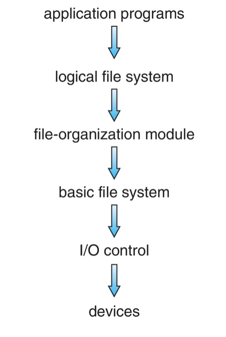 그림 14.1 계층적 파일시스템

계층적 파일 시스템 : 계층적 파일 시스템의 각 층은 낮은 층의 기능을 사용하여
새로운 기능을 만들어 상위층에 제공한다.

&nbsp;

- 입/출력 제어 층 (I/O control)  
 장치 드라이버 루틴들과 인터럽트 핸들러로 이루어져 있어 메모리와 디스크 시스템 간의 정보 전송을 담당한다.

- 기본 파일 시스템 층 (basic file system)  
 논리 블록 주소를 기반으로 저장장치상의 블록을 읽고 쓰도록 I/O 제어 층에 기본 명령을 내리는 층이다.

- 파일 구성 모듈 층 (file-organization module)  
 파일과 상응하는 논리 블록을 알고 있으며 디스크 가용 공간 관리자를 포함하고 있다. <!--(특정 블록의 주소 산출을 담당한다.)-->

- 논리 파일 시스템 층 (logical file system)  
 메타데이터 정보를 관리한다. <!--(파일 명으로 디렉토리를 참조하여 파일 구성 모듈 층에게 파일 속성을 제공한다.) -->
metadata : 메타데이터는 파일의 내용 자체인 데이터를 제외한 모든 파일 시스템 구조를 말한다.  
(파일 구조는 FCB(파일제어블록)을 통해 유지된다. UNIX 파일 시스템에서는 inode로 구현된다.)

계층화는 코드의 중복을 최소화하지만. 더 많은 운영체제 오버헤드를 야기하며 성능을 저하한다.

&nbsp;

다양한 파일 시스템
- FFS (Berkely Fast File System)
- UFS (FFS를 기반으로 한 UNIX file system)
- extended file system (Linux 표준 파일 시스템)
- FUSE 파일 시스템

&nbsp;
# 14.2 파일 시스템 구현 File-System Implementation

파일 시스템 연산을 구현하는데 사용되는 구조와 연산에 대해 살펴본다.

&nbsp;
## 14.2.1 개요 Overview  

여러 저정장치상의 구조와 메모리 내 구조가 파일 시스템을 구현하는 데 사용된다. 

디스크 상의 구조 예시
- 부트 제어 블록  
 시스템이 그 파티션으로부터 운영체제를 부트시키는데 필요한 정보를 가지고 있다. 일반적으로 한 파티션의 첫 번째 블록이다.  

- 볼륨 제어 블록  
 볼륨의 블록의 수, 블록의 크기, 가용 블록의 수와 포인터, 그리고 가용 FCB 수와 포인터 같은 볼륨 정보를 포함

- 디렉터리 구조  
 파일을 조직화 하는데 사용 

- 파일별 파일 제어 블록(FCB) 

&nbsp;

메모리 내의 정보 - 파일 시스템 관리와 캐싱을 통한 성능 향상을 위해 사용된다. 
- 파티션 테이블   
	 마운트된 모든 파티션 정보를 포함한다.

- 디렉터리 구조  
	 최근 접근된 디렉터리의 디렉터리 정보를 가진다.

- 범 시스템 오픈 파일 테이블 (system wide open file table)  
	 오픈된 각 파일의 FCB의 복사본을 가진다.  

- 프로세스별 오픈 파일 테이블 (per-process oopen file table)  
	 프로세스가 연 모든 파일에 대한 정보와 이 테이블 내의 해당 항목에 대한 포인터를 포함한다.

- 버퍼  
	 파일 시스템으로부터 읽히거나 써질 때 파일 시스템 블록을 저장한다.

&nbsp;

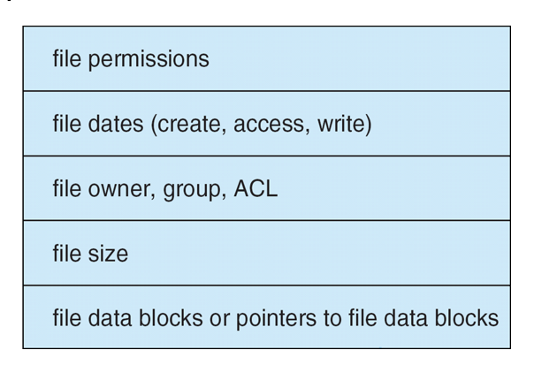 그림 14.2 전형적인 파일 제어 블록

새로운 파일을 생성시 운영체제는 새로운 FCB를 할당하고 FCB로 디렉터리를 갱신하여 파일시스템에 추가해야한다. 

&nbsp;
## 14.2.2 사용법 Usage  

파일 오픈 open()
- 논리적 파일 시스템에 파일 이름을 넘겨준다.
- 파일이 다른 프로세스에 의해 사용중인지 확인한다.  
- 사용 중 일 때  
 기존 범 시스템 오픈 파일 테이블을 가리키는 프로세스 별 오픈 파일 테이블 항목을 생성한다. -> 오버헤드를 줄일 수 있다.

- 오픈되지 않았을 때  
  디렉터리 구조에서 파일이름을 찾고, 범 시스템 오픈 파일 테이블에 FCB를 복사하며, 파일을 오픈한 프로세스의 수를 저장한다.  
- 프로세스별 오픈 파일 시스템 테이블 내의 해당 항목에 대한 포인터를 반환한다.

파일 디스크립터(UNIX), 파일 핸들(Windows)  
- 프로세스별 오픈 파일 테이블 안에 만들어지며, 파일 안의 현재 위치를 가리키는 포인터와 파일이 오픈된 접근 모드 등을 포함한다. (read()나 write() 연산 시 사용된다.)

파일 닫을 때
- 프로세스별 테이블 항이 삭제되며 범 시스템 항목의 오픈 계수는 감소한다. 
- 오픈했던 모든 사용자가 파일을 닫으면 디렉터리 구조에 업데이트된 파일 정보가 복사되고(FCB를 복사 저장) 범 시스템 오픈파일 테이블에서 그 항목이 삭제된다. 

메타데이터의 캐싱하는 기법을 사용함으로써 실제 데이터 블록을 제외한 오픈 파일에 대한 모든 정보는 메모리 내에 존재한다.  
-> 병목현상인 파일 시스템 상호작용으로 인한 지연현상을 줄인다. 

&nbsp;

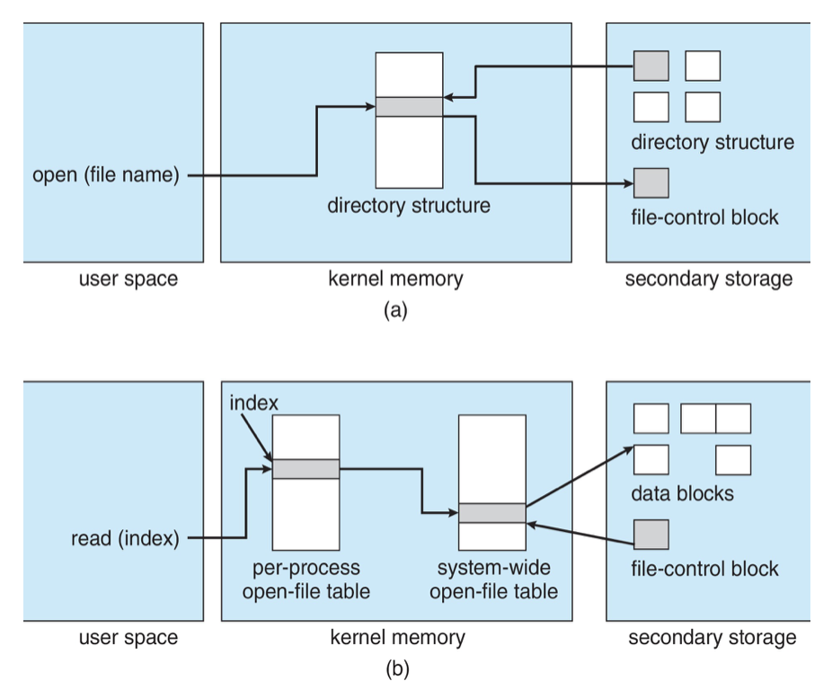 그림 14.3 메모리 내의 파일 시스템 구조. (a)파일 오픈 (b)파일 읽기

&nbsp;  

# 14.3 디렉터리 구현 Directory Implementation

디렉터리 공간을 어떻게 할당하고 관리하는 것에 따라 파일 시스템의 효율, 성능 및 신뢰성에 큰 영향을 미친다.

## 14.3.1 선형 리스트 Linear List

선형 리스트
- 장점 : 구현하기 쉽다.
- 단점 : 파일 생성, 삭제시 선형 탐색으로 인하여 속도가 느려진다.
- 보완
	*  정렬된 리스트를 이진 탐색 -> 정렬을 유지하기 위해 상당한 정보를 이동해야 할 수 있다.
	*  B-트리 (균형 트리의 한 종류)

## 14.3.2 해시 테이블 Hash Table

해시 테이블
- 파일 이름으로 해시값을 얻어 리스트(해시 테이블)에 직접 접근하여 파일을 찾는다.
- 장점 : 선형 리스트에 비해 디렉터리 탐색시간이 크게 개선된다.
- 단점 : 해시 테이블이 고정된 크기를 가지며, 충돌이 발생 할 수 있다. (충돌 : 둘 이상의 파일명이 같은 위치를 지정하는 경우)
- 보완  
	*  체인 오버 플로우 해시 테이블을 사용 (각 해시 항목이 연결리스트)

&nbsp;  

# 14.4  할당 방법 Allocation Methods

파일들을 어떻게 저장장치 공간에 배치해야 디스크 공간을 효율적으로 사용하고 빠르게 접근할 수 있는가.  
연속, 연결, 인덱스 기법이 널리 사용되며 장단점이 있다.

## 14.4.1  연속 할당 Contiguous Allocation

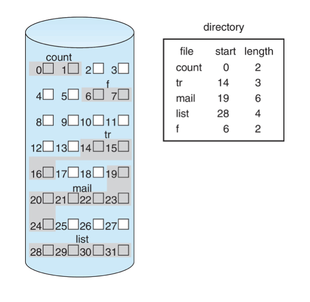 그림 14.4 디스크 공간의 연속 할당

연속 할당   
* 각 저장장치 내에서 연속적인 공간을 차지하며, 장치 주소들은 장치 상에서 선형 순서를 정의한다. 
* 디렉터리 항목(entry)   
	-> 파일의 디스크 내 시작 블록 주소(b), 파일의 크기(n)

장점
* 디스크의 헤드 이동이 잘 일어나지 않기 때문에 디스크 탐색(seek)의 횟수 최소화 (빠른 I/O)
* 순차 접근과 직접 접근 두 가지 모두 지원  

문제점
*  외부 단편화 발생으로 새로운 파일을 위한 가용 공간을 찾기 어렵다.  
	* 동적 공간 할당 문제 (9.2절)  최초 적합, 최적 적합 -> 외부 단편화 발생 (external fragmentation)   
&nbsp;  

* 만들어질 파일의 크기를 예측하고 적절한 공간을 할당하기 어렵다.  
	* 작은 공간을 할당 했을 때   
	-> 인접한 공간이 사용중이라면 공간 확장이 불가능할 수 있다.   
	* 큰 공간을 할당 했을 때 (공간의 크기를 미리 알고 할당 한다고 가정)  
	-> 공간이 내부 단편화로 낭비될 수 있다. 

&nbsp;

## 14.4.2  연결 할당 Linked Allocation

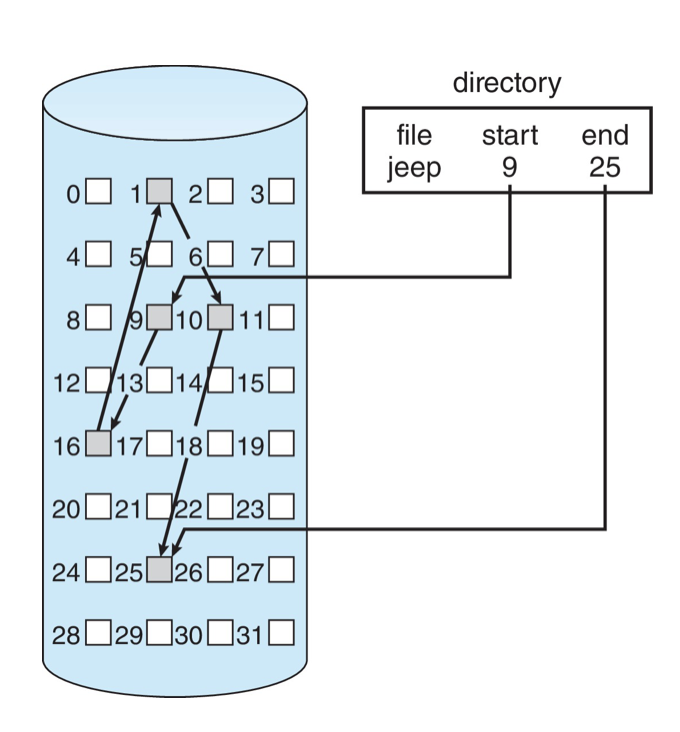 그림 14.5 디스크 공간의 연결 할당

연결 할당
* 파일은 저장장치 블록의 연결 리스트 형태로 저장된다.
* 디렉터리 항목  
	-> 파일의 첫번째와 마지막 블록에 대한 포인터

장점
* 연속 할당의 외부 단편화 문제와 파일 크기 선언 문제를 해결한다.

문제점 
* 직접 접근 방식에는 매우 비효율적이다.
* 포인터의 손상 시 피해가 크다. (신뢰성의 문제, bad sector)
* 각 블록마다 포인터들을 위한 공간이 필요하다. (공간의 손실)

&nbsp;

보완책  

클러스터(cluster) 할당
* 블록을 모아 클러스터(cluster) 단위로 만들고, 할당하는 방법 
* 장점
	* 포인터가 공간을 차지하는 비율이 훨씬 적어진다.
* 문제점
	* 클러스터가 부분적으로만 차는 경우 내부 단편화가 발생한다.

&nbsp;

파일 할당 테이블(file allocation table, FAT) 사용

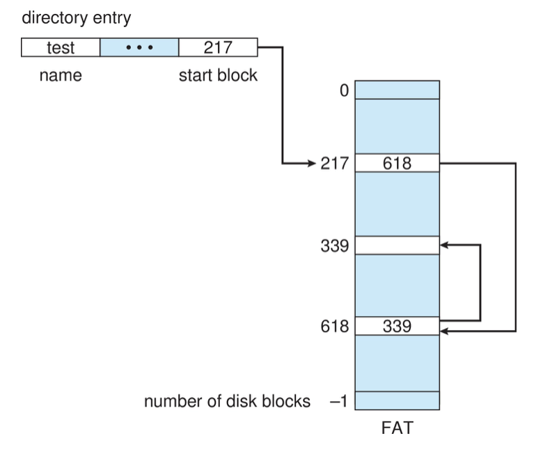 그림 14.6 파일 할당 테이블(FAT)

FAT 테이블  
* 각 파티션의 시작 부분이 FAT로 사용된다.  
* 각 블록마다 한개의 항목을 가지고 있고 이 항목은 디스크 블록 번호를 인덱스로 찾는다. 각 블록은 해당 블록의 다음 블록을 가리킨다. 마지막 블록은 파일을 끝을 나타내는 특수한 값을 가진다.

* 장점  
: 포인터가 상대적으로 가깝기 때문에 무작위 접근의 시간을 개선한다.  
 	FAT테이블의 복사본을 두어 신뢰성 문제를 해결할 수 있다. 

&nbsp;

## 14.4.3  색인 할당 Indexed Allocation

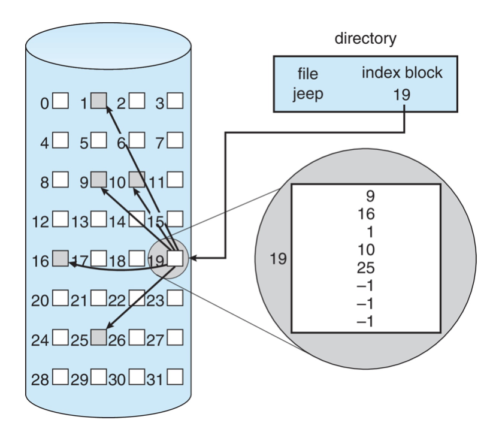 그림 14.7 디스크 공간에서의 색인 할당

색인 할당
* 모든 포인터들을 색인 블록으로 관리한다.  
* 디렉토리 항목  
	-> 색인 블록의 주소
* 색인 블록  
	-> 저장장치의 블록 주소를 모아 놓은 블록
* 파일의 i 번째 블록 = 색이 블록의 i 번째 항목

장점
* 외부 단편화가 발생하지 않는다.
* 직접 접근을 지원한다.

단점
* 작은 파일의 경우 공간이 낭비된다.
	-> 일반적으로 하나 또는 두 개의 블록으로 구성된 파일이 많다.
* 큰 파일의 경우 하나의 블록으로는 부족할 수 있다.

보완책

* 연결 기법 (linked scheme)  
	-> 파일이 클 경우 색인 블록의 마지막에 다음 색인블록의 주소를 수록하여 여러 개의 색인 블록을 연결한다. 
* 다중 수준 색인 기법 (multilevel index)  
	-> 연결 기법의 변형으로 최하위 수준의 색인 블록이 실제 파일 블록들을 가리키며, 상위 수준 색인 블록은 하위 수준의 색인 블록들의 주소, 집합을 가리킨다.  
	(두 번째 수준 색인 블록들의 집합을 가리키기 위하여 첫 번째 수준의 색인 블록을 사용한다. 두 번째 수준의 색인 블록들은 실제 파일 블록들을 가리킨다.)

* 결합 기법 (combined scheme)  
	-> Unix 기반 시스템에서 사용된다.  
	 파일의 inode에 색인 블록의 15개 포인터를 유지한다.  (inode : UNIX의 FCB 파일 제어 블록)  
	* 12개의 포인터 : 직접 블록(direct block)을 가리킨다. 
	* 3개의 포인터 : 간접(indirect block)을 가리킨다.  
		단일 간접 블록(single indirect block), 이중 간접블록(double indirect block), 삼중 간접블록(triple indirect block) 
	* 4바이트 파일 포인터가 가리킬 수 있는 블록보다 더 많은 블록을 할당할 수 있다.
	* 
	
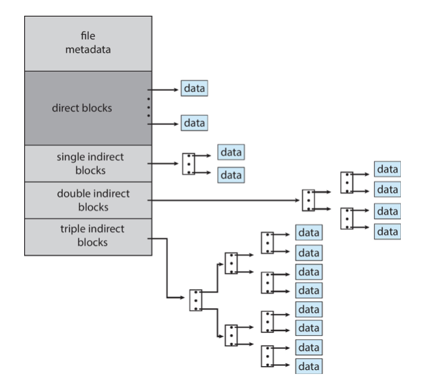 그림 14.8 UNIX의 inode

&nbsp;

## 14.4.3  성능 Performance

연속 할당
* 순차 접근과 직접 접근 모두를 지원한다.
* 외부 단편화가 발생한다.

연결 할당 
* 순차 접근에 적합하며 직접 접근에는 적합하지 못하다.

색인 할당
* 인덱스 구조, 파일의 크기 및 원하는 블록의 위치 등에 의해 성능이 좌우된다. 

여러 할당 방법의 결합
* 연속 할당과 색인 할당의 결합으로 파일의 크기에 따라 할당 방식을 전환하여 평균 성능을 높이기도 한다.  

NVM (비휘발성 메모리)
* NVM의 경우 디스크 헤드 탐색이 없으므로 헤드 이동을 피하고자 하는 알고리즘이 아닌 다른 방식의 알고리즘과 최적화가 필요하다.

&nbsp;  

# 14.5 가용 공간의 관리 Free-Space Management

가용 공간 리스트 
* 장치의 모든 가용 블록들을 등록하여 리스트로 유지하고 관리한다. (리스트의 형태로만 구현될 필요는 없다.)
* 가용 공간 리스트를 탐색하여 새로운 파일을 위한 공간을 할당받고, 삭제되는 파일의 공간은 리스트에 등록하여 재사용 할 수 있어야 한다. 

&nbsp;

## 14.5.1  비트 백터 Bit Vector

- 비트 맵(bit map) 또는 비트 백터(bit vector)로 구현
- 각 블록은 1비트로 표현되며 비트의 값은 블록이 비어 있다면 1 , 할당되어 있다면 0을 기진다.
- 첫번째 가용 블록 또는 연속된 가용 블록들을 찾을 때 간편하고 효율적이다.
- 비트 백터 전체가 메인 메모리 내에 캐시되지 않으면 비효율적이다. 

&nbsp;

## 14.5.2  연결리스트 Liked List

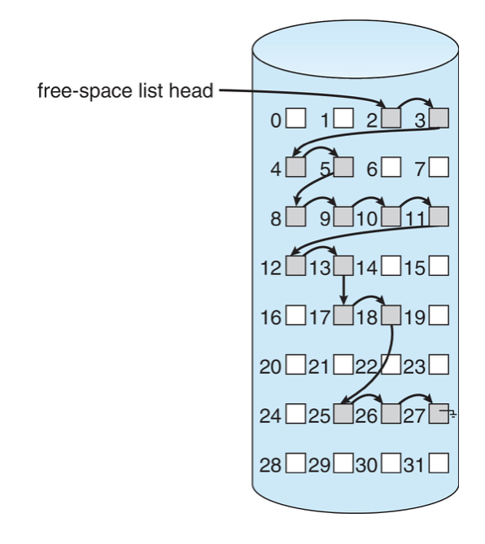 그림 14.9 디스크상의 연결된 가용 공간e

- 모든 가용 블록들을 함께 연결하는 방식으로 가용 블록은 다음 가용 블록을 가리키는 포인터를 가진다. 
- 추가적인 공간 낭비가 없다.
- 연속적인 가용공간을 찾기 어렵다.

&nbsp;

## 14.5.3 그룹핑 Grouping

* 가용 리스트 방식의 변형으로 첫 번째 가용 블록 내에 n개의 블록 주소를 저장하는 방법이다. (색인 할당의 연결기법과 흡사)
* 다수 개의 가용 블록 주소들을 쉽게 찾을 수 있다. 

&nbsp;

## 14.5.4 계수 Counting

* 가용 공간 리스트의 각 항은 연속된 가용 블록의 첫 번째 블록의 주소와 연속된 블록의 개수(count)로 구성된다.
* 효율적인 검색, 삽입, 삭제를 위해 균형 트리 형태로 저장될 수 있다.

&nbsp;

## 14.5.5 공간맵 Space Maps

* ZFS 파일 시스템  (Solaris와 다른 운영체제에서 볼 수 있는 Oracle의 파일 시스템)
* 대규모의 파일, 디렉터리, 파일 시스템을 저장 할 수 있도록 설계되었다.
* 로그와 균형트리를 합쳐 가용 리스트의 역할을 한다.
* 장치의 공간을 관리 가능한 크기의 덩어리로 나누기 위한 메타슬랩(metaslabs)를 생성한다. 

&nbsp;

## 14.5.6 사용하지 않는 블록 트림 TRIMing Unused Blocks

* NVM 플래시 기반 저장장치는 덮어쓰기를 허용하지 않는다. 이러한 저장장치는 다시 쓰기전에 삭제해야 하여 읽기 또는 쓰기와 비교할 때 상대적으로 오랜시간이 걸린다.
* 페이지와 페이지를 포함하는 블록이 완전히 비어 있을 때 삭제될 수 있다는 것을 파일시스템이 장치에 알릴 수 있는 기법이 필요한다.  
 저장장치 컨트롤러 에 따라 ATV-연결 드라이브는 TRIM, NVMe 기반 저장장치의 경우 unallocate 명령이 있다. 

 &nbsp;  

# 14.6 효율과 성능 Efficiency and Performance

디스크의 성능과 효율을 향상하기 위해 사용되는 다양한 기법들을 논의한다.

## 14.6.1 효율 Efficiency

저장장치 공간의 효율적인 사용을 위해 고려해야할 것.

1. 할당 및 디렉터리 알고리즘   
	ex)
	* inode를 미리 할당하고 inode들을 파티션 전체에 분산 할당하여 파일 시스템의 성능을 향상할 수 있다. inode들을 가급적 데이터 블록 부근에 위치하도록 하여 디스크 탐색 시간을 줄인다.

	* 클러스터링 기법(14.4절). 내부 단편화는 허용하지만 파일 탐색과 파일 전송 성능을 향상시킨다.  
		내부 단편화를 최소화하기 위하여 파일의 크기가 증가함에 따라 클러스터의 크기를 변화시키는 시스템도 존재한다. (부록 C에 기술)

2. 파일과 연관된 모든 데이터 항  
	ex)
	* 포인터의 크기가 공간의 효율성에 미치는 영향

 &nbsp;  

## 14.6.2 성능 Performace

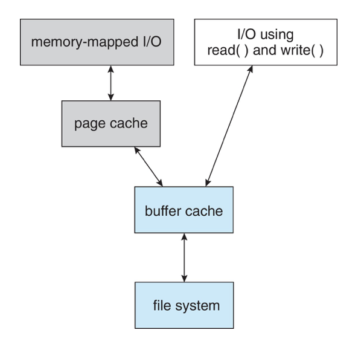 그림 14.10 통합 버퍼 캐시를 사용하지 않는 입출력

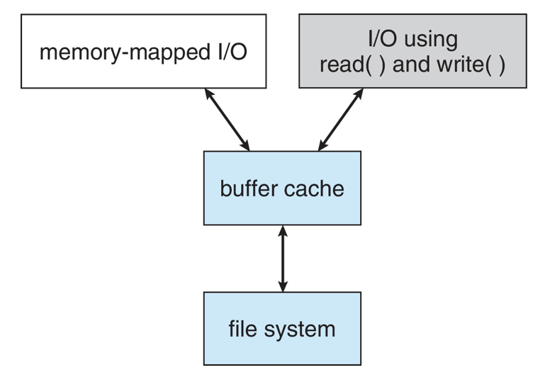 그림 14.11 통합 버퍼 캐시를 사용하는 입출력

통합 버퍼 캐시 (unified buffer cahche)
* 이중 캐싱을 방지하여 비일관성을 막고 CPU와 I/O 사이클 낭비를 막을 수 있다. 

프로세스가 파일 캐싱에 필요한 프레임을 적절히 할당하고 있도록 해야한다. 

페이지 캐시 최적화 → 파일 접근 유형에 따라 다른 교체 알고리즘을 사용

파일시스템에 쓰기 연산이 동기식 또는 비동기식으로 수행되는지에 따라 입출력의 성능에 영향을 미친다.

순차접근의 페이지 캐시 최적화
* Free-behind  : 다음 페이지가 요청되자마자 버퍼에서 페이지를 제거 하는 것
* Read-ahead : 요구된 페이지와 몇 개의 뒤이은 페이지를 읽어 캐싱하는 것

 &nbsp;  

# 14.7 복구 Recovery
    
파일들과 디렉터리는 때에 따라 메인 메모리와 저장장치 볼륨 두 곳에 존재하게 된다.   
이 때 시스템에 문제가 생길 경우 두 곳의 내용은 일관성을 가져야 하며, 자료를 잃어버리지 않도록 보장해야한다.

크래시, 파일 시스템 구현의 버그, 디스크 컨트롤러, 및 사용자 응용이 파일 시스템의 오염을 초래할 수 있다.

## 14.7.1 일관성 검사 Consistency Checking
  
* UNIX 시스템의 fsck와 같은 일관성 검사기(consistency checker)를 사용하여 일관성 검사를 하고 복구를 시도 할 수 있다.

* 디렉터리 구조의 데이터와 메타데이터 상태를 비교하고 불일치가 발견되면 복구를 시도한다.

* 할당 및 가용 공간 관리 알고리즘에 따라 검출할 수 있는 문제와 얼마나 성공적으로 회복할 수 있는지를 결정한다.  
	ex) 디렉터리 항목을 잃었을 때 
	* 연결 할당   
	→ 블록간의 링크가 잘 설정 되어 있으면, 데이터 블록으로부터 전체파일을 재구축 할 수 있고 디렉터리 구조를 다시 만들 수 있다.
	* 색인 할당 시스템   
	→ 데이터 블록간의 서로간의 정보가 없어서 복구하기 어렵다. (그래서 UNIX에서는 데이터 쓰기는 써지기 전에 동기식으로 수행한다.)

## 14.7.2 로그 구조 파일 시스템 Log-Structured File System

* 로그 기반 트랜잭션 지향(저널링)  
	트랜잭션 :특정 테스크를 수행하는 연산의 집합. 쪼갤 수 없는 업무 처리의 최소 단위.
* 메타데이터의 변경 사항을 로그에 순차적으로 기록하고, 실제 파일 시스템 메타데이터 구조에 로그를 수행하는 것이다. 
* 시스템 충돌 시에도 로그를 사용하여 복구 단계에서 불일치를 해결할 수 있다.  

## 14.7.3 다른 해결 방안들 Other Solutions

* WAFL 파일 시스템, ZFS 파일 시스템

* 이 두 파일 시스템은 옛 데이터를 새 데이터로 절대로 덮어쓰지 않는다.

* 모든 데이터와 메타데이터 변경을 새로운 블록에 기록하고, 포인터는 새로운 블록들을 가리키도록 갱신한다.

* 이전 포인터와 블록이 유지되면 스냅숏이 생성된다.  
	스냅숏 : 특정 시점(해당 시점 이후의 업데이트가 적용되기 전)의 파일 시스템 상태이다. 

<!--
* 이 해결 방안은 포인터 갱신이 자동으로 일어난다면 일관성 검사는 필요 없게 된다.  

	but WAFL은 일관성 검사를 가지고 있어서 메타 데이터 오염을 초래할 수 있다.  
	ZFS 는 메타 데이터와 데이터 블록의 검사-총합(check-sum)을 제공한다. RAID와 결합될 때 데이터가 항상 올바르다는 것을 보장한다. 따라서 일관성 검사기가 없다. (11.8.6 절) -->

## 14.7.4 백업과 복구 Backup and Restore

* 저장장치 고장은 데이터를 잃어버리게 할 수 있으므로 자료가 영원히 손실되지 않도록 보장해줄 필요가 있다.

* 다른 저장장치에 주기적으로 백업해야 한다. 

<!-- * 복원을 위하여 읽어야 하는 디스크의 수를 줄이기 위하여, 전체 백업을 적절히 중간 시점에 수행할 수 있다. 그러나 전체 백업을 수행하면 더 많은 공간이 필요할 것이다. -->

* 오랜 후에 문제가 생겼을 경우를 대비하여 영구 백업을 해두거나, 데이터가 중요한 경우 여러 백업 사이트를 두는 것도 좋은 방법이다.

 &nbsp;  

# 14.8 WAFL 파일 시스템 Example: The WAFL File System

WAFL (write-anywhere file layout)
* NetApp 에서 제작되었으며 랜덤 쓰기 연산에 대해 최적화된 성능이 뛰어난 파일 시스템이다.

* 제작된 분산 파일 시스템의 하나인 네트워크 파일 서버들을 위하여 사용되었다. 

* WAFL의 스냅숏 기능

<!--
* 클론 : 읽기-쓰기 스냅숏

* 복제 : 네트워크를 통한 다른 시스템으로의 데이터의 중복과 동기화 기능이다. 스넵숏이 다른 시스템으로 중복된다 -->

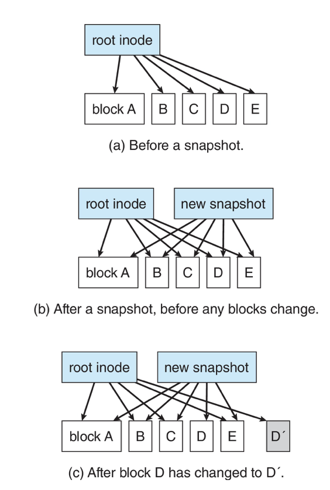 그림 14.13 WAFL의 스냅숏

 

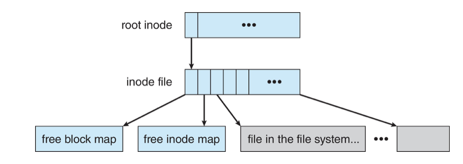 그림 14.12 WAFL 파일 배치(layout)

# 14.9 요약 Summary
