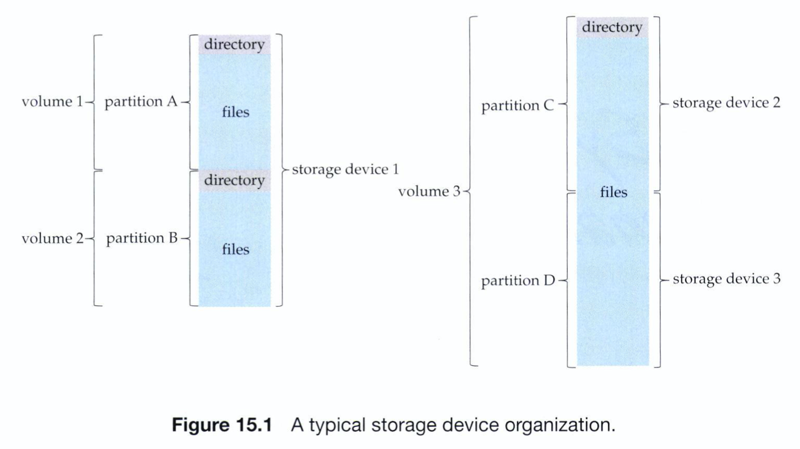
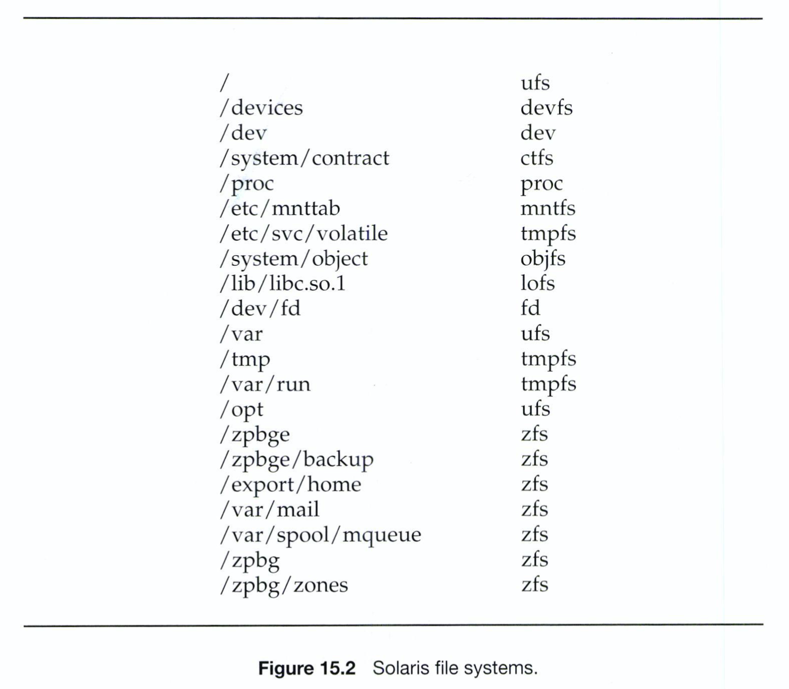
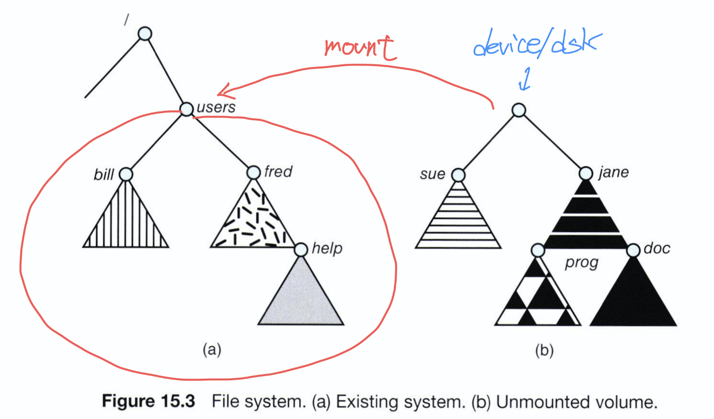
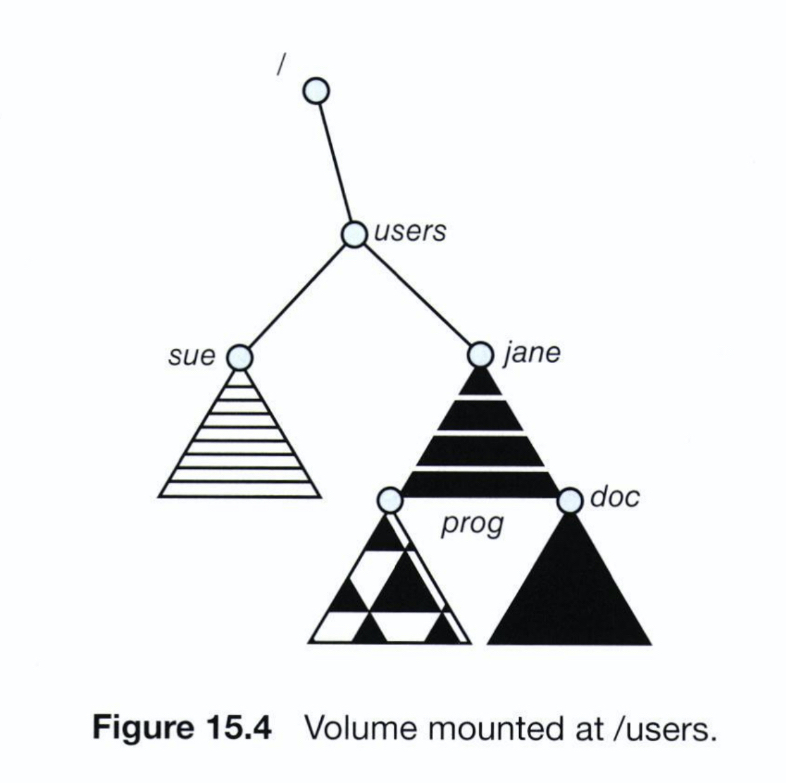
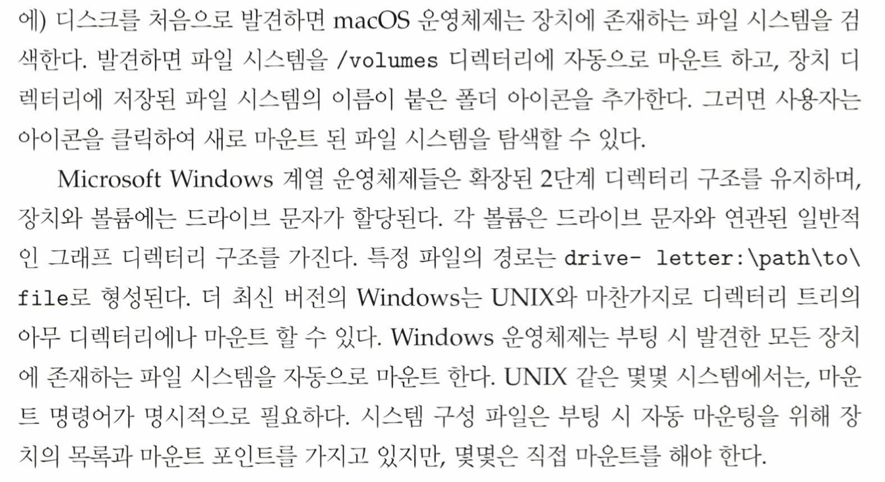
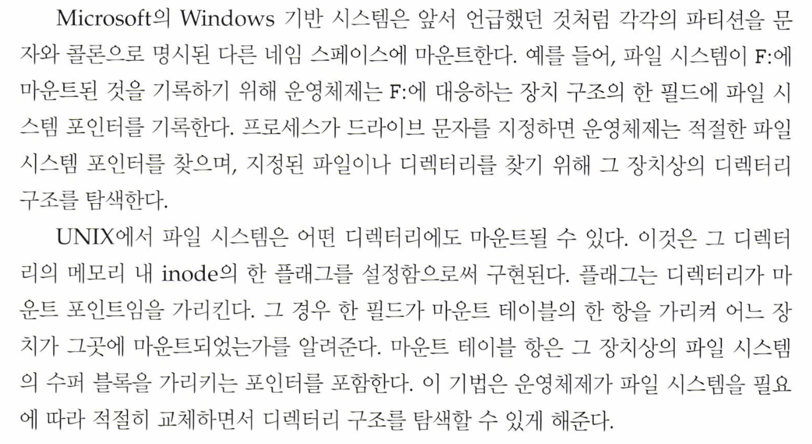
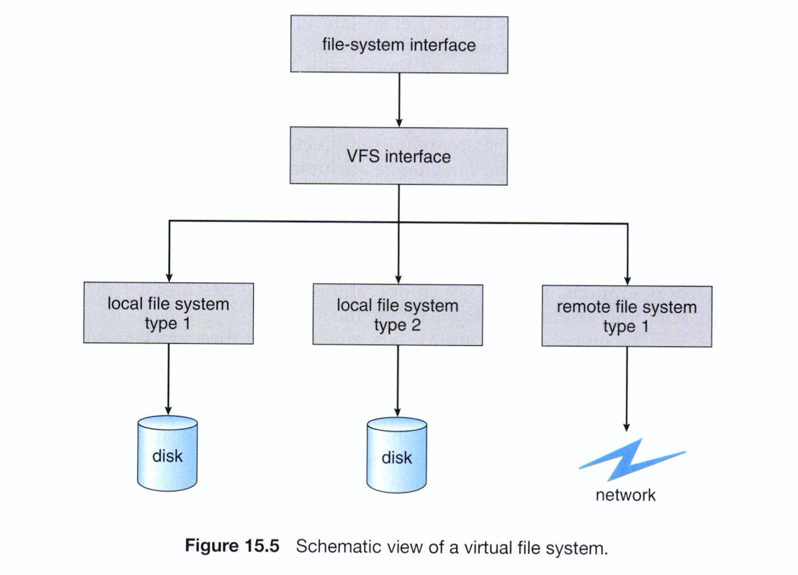
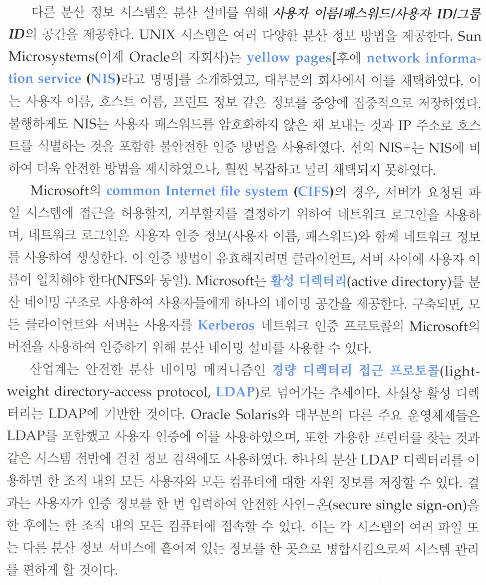
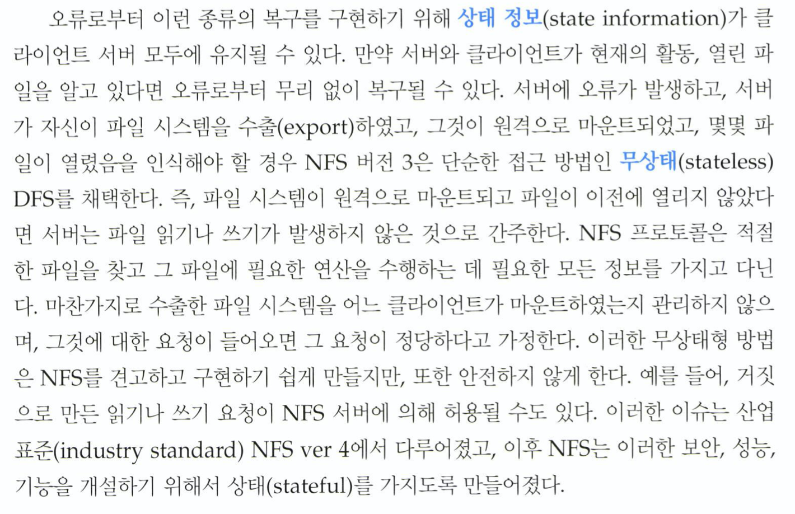

| 작성자  |   작성일   |
| :----: | :--------: |
|  jchoi  | 2022.07.01 |
# **Chapter 15 File-System Internals**

## **Chapter 15 File-System Internals 파일 시스템 내부구조**

- Delve into the details of file systems and their implementation.
파일 시스템과 구현의 세부 사항에 대해 자세히 설명한다.
- Explore booting and fire sharing.
부팅 및 파일 공유에 대해 탐구한다.
- Describe remote file systems, using NFS as an example.
NFS를 예로 들어 원격 파일 시스템을 설명한다.

## **15.1 File Systems 597 [파일 시스템 655]**
범용 컴퓨터 시스템에는 여러 저장장치가 있으며 각 저장장치들은 볼륨 및 파티션으로 구성된다.
뿐만 아니라  다양한 개수의, 서로 다른 종류의 파일 시스템을 가질 수 있다.

밑에서 이러한 파일시스템의 내부구조와 그 관리를 살펴볼 것이다.

- tmpfs — 휘발성 메인 메모리에 생성되고 시스템이 재부팅되거나 고장 났을 때 파일 시스템의 내용이 지워지는 “임시" 파일 시스템
- objfs — 디버거가 커널 심볼을 접근할 수 있게 하는 “가상” 파일 시스템
- ctfs — 시스템이 부트될 때 시작하여 운영체제가 실행되는 동안 실행되어야 하는 프로세스를 관리하기 위한 “contract” 정보를 저장하기 위한 가상 파일 시스템
- lofs — 한 파일 시스템 대신에 다른 파일 시스템에 접근할 수 있게 하는 “loop back” 파일 시스템
- procfs — 모든 프로세스에 관한 정보를 파일 시스템 형태로 보여주는 가상 파일 시스템
- ufs, zfs — 범용 파일 시스템

---

## **15.2 File-System Mounting 598 [파일 시스템 마운팅 657]**

파일 시스템의 네임 스페이스 안에서 이용 가능하려면 각 파티션이 마운트 되어야 한다.

### **마운트 과정**

1. 장치 이름과 파일 시스템을 부착 가능한 파일 구조 내의 위치(= 마운트 포인트, 일반적으로 비어있는 디렉터리)를 준다. 운영체제에 따라 파일 시스템의 유형이 제공되어야 하거나, 장치의 구조를 검사하여 파일 시스템의 유형을 결정한다. (UNIX 시스템에서,  파일 시스템은 유저의 홈 디렉터리를 /home으로 마운트되도록 한다.) 그러면 파일 시스템 내에서 디렉터리의 이름 /home을 앞에다 씀으로써 디렉터리 구조에 접근할 수 있다.

2. 장치가 유효한 파일 시스템을 포함하는지 확인 [장치 드라이버가 a. 장치 디렉터리를 읽고, b. 디렉터리가 유효한 포맷을 가지고 있는지 확인하도록 요청]

3. 파일 시스템이 지정된 마운트 포인트에 마운트 되었음을 디렉터리 구조에 기록

위 과정을 통해 운영체제는 다양한 파일 시스템 사이를 오가며 디렉터리 구조를 순회할 수  있게 된다.

오른쪽의 device/dsk가 /users에 마운트되면, 기존에 /users 내에 있던 모든 파일들은 (b)의 파일시스템이 언마운트 되기 전까지 접근이 불가능하게 된다.

따라서 마운트 이후에는 다음과 같은 상태가 되었다가. 마운트가 해제되면 기존(a)의 상태로 복원된다.

파일 시스템은 기능을 명확하게 나타내기 위해 semantic을 부여하는데, 이를 통해 예를 들면, 
(1) 위의 삽화 예시처럼 마운트된 볼륨에 대해서만 접근을 허가하고 기존 파일에는 접근을 허가하지 않거나 
(2) 파일을 포함하는 디렉터리는 마운트 지점으로 사용될 수 없도록 할 수 있다.

또 다른 예시로는, 
(1) 서로 다른 마운트 지점에 동일한 파일 시스템을 반복적으로 마운트 하는것을 허용하거나 
(2)하나의 파일 시스템마다 오직 한번 만 마운트를 허용할 수 있다.

**교재에서는 MacOS와 UNIX, Windows 운영체제의 마운트 방식을 예시로 들었는데, 다음과 같다.**

---

## **15.3 Partitions and Mounting 601 [파티션과 마운팅 659]**

### **파티션**

디스크 배치는 ‘운영체제와 볼륨 관리자 소프트웨어(VMS)에 따라 달라 질 수 있다.

1. 디스크는 다수의 파티션으로 분할 될 수 있고
2. 한 파티션이 여러 디스크로 구성될 수도 있다.
 → 이는 RAID 방식 (Redundant Array of Inexpensive/Independent Disk)에 속한다. (11.8)

[RAID - 위키백과, 우리 모두의 백과사전](https://ko.wikipedia.org/wiki/RAID)

이 절에서는 1. 다수의 파티션이 디스크를 분할하는 경우를 다룰 것이다. 
각 파티션은 미가공 파티션과, 가공 파티션으로 나뉘는데 다음과 같다.

#### **미가공 (raw) 파티션 : 파일 시스템을 미포함하는 파티션  ↔ 가공 (cooked) 파티션 : 파일 시스템을 포함하는 파티션**

Raw 디스크는 파일 시스템이 사용되지 않는 UNIX 스왑 공간 혹은 몇몇 데이터베이스에서 데이터를 요구에 맞춰 포맷하는데 사용된다.

[디스크 미러링 - 위키백과, 우리 모두의 백과사전](https://ko.wikipedia.org/wiki/%EB%94%94%EC%8A%A4%ED%81%AC_%EB%AF%B8%EB%9F%AC%EB%A7%81)

[[Linux] Swap 이란? (CPU, RAM, 하드 디스크)](https://it-serial.tistory.com/entry/Linux-Swap-%ED%8C%8C%ED%8B%B0%EC%85%98%EC%9D%B4%EB%9E%80-CPU-RAM-%ED%95%98%EB%93%9C-%EB%94%94%EC%8A%A4%ED%81%AC-%E2%91%A0)

### **부팅 과정에서의 마운팅**

파티션 내에 **‘부팅 가능한 파일 시스템’**이 포함되어 있으면 **부팅 정보(=부트스트랩 로더)**가 필요하다.
부팅중인 시스템은 적재된 파일 시스템 코드가 없어 파일 시스템 형식을 해석할 수 없기에, 이때 필요한 부트스트랩은 자체 형식을 가져야 한다. 이 정보는 미리 정해진 위치에서 시작하는 연속된 블록이어야 한다.

#### **시스템은 어떤 운영체제로 부트할지를 어떻게 알 수 있나?**

⇒ 여러 파일 시스템과 여러 운영체제를 인식하는 부트 로더가 부트 공간을 점유할 수 있고, 일단 적재되면, 그 드라이브에서 이용 가능한 운영체제 중 하나를 부트할 수 있다.

드라이브는 여러 파티션을 가질 수 있는데, 각 파티션이 다른 파일 시스템과 운영체제를 포함할 수 있다.
또, 부트로더가 특정 파일 시스템 형식을 이해하지 못하면 해당 파일 시스템에 저장된 운영체제는 부트 가능하지 않다. 이것이 일부 운영체제에서 일부 파일 시스템만 루트 파일 시스템으로 사용되는 이유중 하나이다.

⇒ 부트로더가 그 파일 시스템을 이해해야 부트 가능하니까 부트로더가 이해하기 용이한 일부만 쓰는것.

#### **루트 파티션**

**‘부트로더에 의해 선택된 운영체제 커널 및 다른 시스템 파일을 포함하고 있는 파티션’** 은 부팅 시 마운트되는데, 루트 파티션이 아닌 다른 파티션들은 a. 이때 같이 마운트되거나, b. 운영체제에 따라 수동으로 나중에 마운트 된다.

마운트 과정 중 운영체제는 시스템이 유효한 파일 시스템을 가지고 있는지를 확인한다.
: 장치 드라이버에게 장치 디렉터리를 읽도록 요청하고, 디렉터리가 유효한 포맷을 가졌는지 확인 
⇒ 포맷이 유효하지 않다면, 파티션의 일관성을 검사하고, 가능한 바로잡으려 할 것이다.

마지막으로, 운영체제는 메모리에 존재하는 마운트 테이블에 ‘파일 시스템이 마운트 되었다는 사실’과 ‘파일 시스템의 유형’을 기록한다. 이 기능의 디테일은 운영체제에 의해 결정된다.

**다음은 Windows와 UNIX에서의 마운팅 예시이다.**

---

## **15.4 File Sharing 602 [파일 공유 660]**

공동 작업 수행을 통한 컴퓨팅 목표 달성을 위해서는 파일 공유 기능이 반드시 필요하다. 하지만 파일 공유를 허용하게 되면 관리 상의 많은 어려움들이 발생하게 된다. 

1. 다수의 사용자와 가능한 공유 방법
⇒ a. 다수의 사용자가 파일을 공유하도록 허용 
⇒ b. 원격 파일 시스템을 포함한 여러 파일 시스템을 공유하도록 확장
2. 공유 파일에 대해 발생하는 상반된 행위 
(다수의 사용자로부터의 쓰기 수행을 허용할것인가? 상호 보호할 것인가?)

#### **다수의 사용자 Multiple Users**

운영체제가 여러 사용자를 수용하게 되면, 파일 공유, 네이밍, 보호가 더욱 중요해진다.

파일 공유와 보호를 구현하기 위해서는 시스템이 단일 사용자보다 더 많은 속성을 가져야 한다. 또한, 사용자 별로 서로다른 수준의 파일 사용 권한을 관리하기 위해 대부분의 시스템에서는 이를 위하여 소유자 및 그룹이라는 개념을 발전시켜왔다. 이러한 방법의 논의는, **교재의 13.4절 (영문판 : 550p, 번역본 : 604p)**에 잘 나타나 있다.

또 다른 문제로, 많은 시스템은 하나 이상의 디스크에 많은 볼륨을 포함하는 다수의 로컬 파일 시스템을 갖는다. 따라서 시스템 간에 장치를 이동 할 때 ID가 일치해야 하거나, 소유권이 리셋되도록 보장해야한다.

---

## **15.5 Virtual File Systems 603 [가상 파일 시스템 662]**

최신 운영체제는 병렬로 여러 유형의 파일 시스템을 지원해야 함. 어떻게? (운영체제가 다수의 서로다른 파일 시스템을 하나의 디렉터리 구조로 통합할 수 있을까? 그리고 유저들이 어떻게 원활하게 다른 파일 시스템 타입 사이를 오갈 수 있을까?)

유형별로 디렉터리와 파일 루틴을 작성하는 것도 방법이 될 순 있겠지만, UNIX를 포함한 많은 운영체제들은 구현을 단순화하기위해 객체지향 방법을 사용함.

파일 시스템 구현은 세가지 계층으로 구성된다.

### **1. file-system interface**

열기 open(), 읽기 read(), 쓰기 write(), 닫기 close() 등의 시스템 콜 과 파일 디스크립터에 기반을 둔 인터페이스

### **2. VFS(virtual file system, 가상 파일 시스템) interface**

### **3. various local file system types**

1. VFS 인터페이스를 명확하게 정의하여 일반적 연산을 구현과 분리 ⇒ 서로 다른 형태의 파일 시스템을 지역적으로 마운트하여 투명한 접근 가능
2. vnode라고 하는 파일 표현 구조에 기반하여 네트워크에 속한 모든 파일을 동일한 형태의 파일 객체로 표현 가능(UNIX의 inode가 한 파일 시스템 내에서만 유일한 것에 반해, 네트워크 전체에서 파일에 대해 유일한 수치 지정자(designator)를 갖는다.)

VFS는 로컬 파일과 원격 파일을 구분하는데, 로컬 파일은 또 다시 각각의 파일 시스템 타입에 따라서 구분된다. 우선, 로컬 요청을 처리하기 위해서는 해당 파일 시스템 유형마다 존재하는 구체적인 절차를 활성화시킨다. 이와 달리 원격 요청에 대해서는 NFS 프로토콜 프로시저(혹은 다른 네트워크 파일시스템의 프로토콜 프로시저)를 호출함으로써 처리한다.

예시로 리눅스 내의 VFS 아키텍쳐에 대해 살펴보자면, 네 가지 메인 오브젝트 타입은 다음과 같다.

- inode object : 개별 파일
- file object : 오픈 파일
- superblock object : 전체 파일 시스템
- dentry object : 각 디렉터리 엔트리

각각의 객체 유형에 대하여 VFS의 구현 가능한 연산 집합이 존재하며, 해당하는 모든 오브젝트들은 대응되는 함수 테이블을 가지며, VFS 소프트웨어 레이어는 파일 객체에 대한 연산을 수행해야 할 경우 이를 함수 테이블에서 찾아서 실행한다.

int open (…) - 파일을 연다.
int close(…) - 열린 파일을 닫는다.
ssize_t read(…) 파일로부터 읽는다.
ssize_t write(…) 파일에 쓴다.
int mmap(…) 파일을 메모리와 매핑(대응)한다.

특정 종류의 파일 오브젝트 각각에 대한 상기 함수들의 구현은 파일 오브젝트의 정의 내에 명시되어야 한다.
→ (파일 오브젝트의 정의는 Linux 시스템 상의 /usr/include/linux/fs.h 파일 내의 struct file_operations로 명시되어있다.)

⇒ 이러한 방식을 통해, VFS 소프트웨어 계층은 그것이 다루는 오브젝트가 어떤 종류의 것인지 직접 알지 않고도 오브젝트의 함수 테이블을 통해 적절한 함수를 호출함으로써 다수의 파일시스템을 관리할 수 있게 된다.

---

## **15.6 Remote File Systems 605 [원격 파일 시스템 664]**

- 익명 접근(annonymous access) : 원격 시스템에 계정이 없어도 사용자가 파일을 전송할 수 있음

### **원격 파일 공유 방식**

1. 기계 간에 파일 직접 전송 (ftp) : 익명 또는 인증형 접근 모두에 사용 가능
2. DFS(Distributed File System) : 원격 디렉터리가 로컬 머신에서도 가시성을 가지며, 원격 파일 접근 기계와 파일 제공 기계 사이에 훨씬 더 긴밀한 통합 존재
3. WWW(World Wide Web) [익명 파일 교환 - 브라우저가 필요하고 ftp 에 대한 wrapper) 연산이 사용됨]
    
    [File Transfer Protocol - Wikipedia](https://en.wikipedia.org/wiki/File_Transfer_Protocol)
    

ftp는 익명 접근, 인증형 접근 모두에 사용될 수 있는데, 익명 접근의 경우 원격 시스템에 계정이 없어도 사용자가 파일을 전송할 수 있으며, WWW는 거의 전적으로 익명 파일 교환을 사용한다.

### **클라이언트 서버 모델 The Client-Server Model**

원격 파일 시스템에서는, 컴퓨터가 원격 시스템들로부터 파일 시스템들을 마운트 하도록 허용하는데,
파일을 가지고 있는 컴퓨터를 서버, 파일에 접근하기를 원하는 컴퓨터를 클라이언트 라고 한다.

일반적으로 서버는 어떤 파일을 공유할 것인지, 어떤 클라이언트와 공유할 것인지를 명시한다.
서버에 비해 클라이언트의 신원 확인은 위조와 보안상의 이유로 좀 더 어렵다. 이러한 문제들은 완전히 해결되지는 못하기 때문에 대부분의 경우 안전하지 못한 인증 방법이 사용된다.

UNIX와 UNIX 네트워크 파일 시스템(NFS)의 경우, 클라이언트 네트워킹 정보를 통해 인증한다.  서버가 파일에 대한 접근을 결정할 수가 없기 때문에, 클라이언트와 서버에서의 유저 아이디는 반드시 일치해야한다. 그렇지 않으면 잘못된 정보에 기반한 접근 허용 혹은 거부가 일어나게 된다. 또한, NFS 프로토콜은 다대다 관계를 허용하고 있기 때문에, 다수의 서버가 다수의 클라이언트에 파일을 제공하며, 한 시스템이 다른 NFS 클라이언트에게는 서버로, 다른 NFS 서버에게는 클라이언트로서 상호작용할 수 있다.

원격 파일 시스템이 마운트 이후에, 파일에 대한 연산 요청이 DFS프로토콜을 통해, 요청한 사용자의 ID등과 함께 서버로 전달되며. 이후 서버에 의해 표준 접근 검사가 이뤄지고 해당 요청이 허용 혹은 거부된다. 

### **분산 정보 시스템 Distributed Information Systems**

원격 컴퓨팅을 위해 필요한 정보에 대해 단일화된 접근을 제공하여 클라이언트 - 서버 서비스를 쉽게 관리할 수 있도록 
분산 정보 시스템 혹은 분산 네이밍 서비스 개념이 출현하게 되었다.

DNS(도메인 네임 시스템)은 그 한 예로, 교재의 19.3.1절에서 다룬다. 

[도메인 네임 시스템 - 위키백과, 우리 모두의 백과사전](https://ko.wikipedia.org/wiki/%EB%8F%84%EB%A9%94%EC%9D%B8_%EB%84%A4%EC%9E%84_%EC%8B%9C%EC%8A%A4%ED%85%9C)

이외에도 다양한 분산 정보 시스템의 예시가 소개되어있는데 다음과 같다.

### **고장 모드 Failure Modes**

로컬 파일 시스템에서는, 디스크의 고장, 디렉터리 구조, 메타데이터(디스크 관리 정보)의 오류나, 사용자 또는 관리자의 실수 등 여러가지 이유로 고장이 발생할 수 있는데, 원격 파일 시스템에서는 (하드웨어 문제 뿐 아니라 네트워크 오류까지 더하여)이보다 더 많은 오류 가능성을 가지고 있다. 특히 네트워크에 파티션이 발생(마운트 및 파일 오픈 이후 서버의 고장 또는 시스템 종료로 인해 클라이언트가 더 이상 이용할 수 없음)한 경우, 시스템은 원격 파일 시스템 프로토콜의 한 부분으로서 오류 시맨틱의 정의와 구현을 통해 서버에 대한 작업을 종료하거나 연기시킬 수 있다. 이러한 오류로부터 복구되기 위해서는 상태 정보(state information)를 클라이언트와 서버 양쪽 모두에 유지할 수 있다.

[Stateless protocol - Wikipedia](https://en.wikipedia.org/wiki/Stateless_protocol)

---

## **15.7 Consistency Semantics 608 [일관성 의미 668]**

시스템은, 동시에 공유 파일에 접근하는 여러 사용자의 시맨틱을 명시한다.
⇒ 명시된 시맨틱은, 한 사용자에 의한 데이터 변경이 언제 다른 사용자에 의해 관찰될지를 지정

원격 디스크에 원자적 트랜잭션을 수행하기에는 오버헤드가 너무 크다. 여러번의 네트워크 통신이나 디스크의 읽기, 쓰기를 포함하기 때문에
파일 접근은 항상 열기open()와 닫기 close() 연산에 둘러싸여 있다고 가정한다. 

### **15.7.1 UNIX 시맨틱**

- 열린 파일에 대한 한 사용자의 쓰기는, 동일 파일을 연 다른 사용자들에게 즉시 보일 수 있음
- 사용자들은 파일에 대한 위치 포인터를 공유하는 모드가 있고, 한 사용자에 의한 (읽기 등으로 인한) 포인터의 전진 모든 사용자에게 영향을 미친다. 
⇒ UNIX 시맨틱에서 한 파일에는 하나의 물리 이미지가 연관되며 배타적 자원으로 접근되기 때문에 이 단일 이미지에 대한 경쟁은 사용자 프로세스들이 시간적으로 지연되는 결과를 낳는다. (동시에 접근할 수가 없기 때문에)

### **15.7.2  세션 시맨틱 [Andrew 파일 시스템 (OpenAFS)]**

- 열린 파일에 대한 한 사용자의 쓰기는 같은 시간에 동일 파일을 열고 있는 다른 사용자들에 바로 보이지 않음
- 파일이 닫히면, 파일에 대한 변경사항들은 그 후에 시작되는 세션에서만 보인다. 이미 열린 파일의 인스턴스들은 이러한 변경을 반영하지 않는다.

지연 없이 파일 이미지에 대해 병행적으로 읽기와 쓰기 접근을 모두 실행할 수 있다.

**⇒ 이러면 여러개의 파일 결과가 남게 되는데 어떻게 처리되는걸까?**

### **15.7.3 Immutable 공유 파일 시맨틱**

하나의 파일이 파일 생성자에 의하여 공유된다고 선언되면, 더이상 변경 불가능(Read Only)해짐 - 구현이 매우 간단함.

---

## **15.8 NFS (network file systems) 610 [669]**
