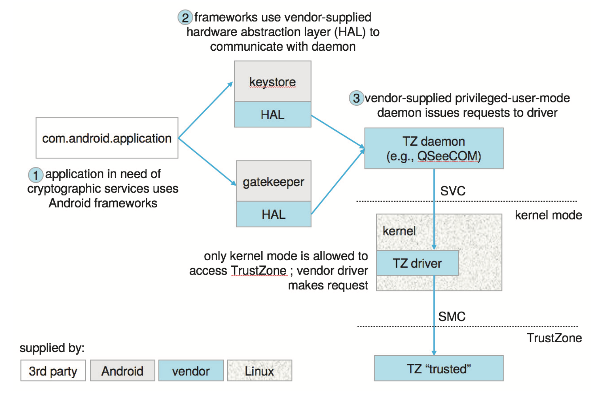

| 작성자  |   작성일   |
| :-----: | :--------: |
| chulee | 2022.07.13 |

# 운영체제 17 보호

# 17.0 챕터 목표

- 현대 컴퓨터 시스템에서 보호의 목적과 원칙에 대해 논의한다.
- 접근 행렬과 결합한 보호 도메인이 프로세스가 접근 할 수 있는 자원을 지정하는 데 어떻게 사용되는지 설명
- 자격 및 언어 기반의 보호 시스템을 설명한다.
- 보호 기법이 시스템 공격을 완화할 방법을 설명한다.

# 17.1 보호의 목표

- 보호를 통해 사용자 또는 프로그램에 의한 시스템의 악의적인 오용을 방지함.
- 각 공유 리소스가 시스템 설계자 또는 시스템 관리자가 설정할 수 있는 시스템 정책에 따라서만 사용되게 함.
- 잘못된 프로그램이 가능한 최소한의 손상을 일으키도록 합니다.
- 보호 시스템은 정책을 시행하고 안정적인 시스템을 보장하기 위한 기법을 제공합니다. 이러한 기법을 효과적으로 구현하는 것은 관리자와 사용자의 몫입니다.

기법 vs 정책

- 기법 : **어떻게** 할지를 결정
예) 필요한 기능을 구현하는 low-level 메서드나 프로토콜
보호에서는 최소 권한의 원칙을 이용한 여러 방법론
- 정책 : **무엇을** 할지를 결정
예) 기법 위에 존재하는 정책으로 어떤 종류의 결정을 내리는 알고리즘
보호에서는 인가받은 공유 리소스를 필요한 시간에만 사용 (Need-to-know)

# 17.2 보호의 원칙

- 최소 권한의 원칙
→ 프로그램, 사용자, 시스템이 작업을 수행하는 데 필요한 만큼의 권한만 부여하는 법칙
- 최소 권한의 원칙을 사용하면, 시스템의 피해를 최소화 할 수 있다.
- 예를 들어, 프로그램이 작업을 수행하다 문제가 발생하였을 때, 사용할 수 있는 권한이 한정되어 있다면, 발생할 수 있는 피해의 양이 제한될것이다. 그러므로 root 권한의 프로그램보다는 다른 그룹이 소유권을 가지고 있는 프로그램을 만드는것이 좋다.
- 루트 계정은 일상적인 활동에 사용해서는 안 됩니다. 시스템 관리자도 일반 계정을 가지고 있어야 하며 루트 권한이 필요한 작업에만 루트 계정 사용을 예약해야 합니다.

# 17.3 보호 링

- 커널은 사용자 프로세스보다 높은 수준의 권한을 가지고 실행해야 하고, 이러한 방식을 **권한 분리**라고 한다.
- **권한 분리**는 하드웨어의 지원이 필요한데, 최신 하드웨어는 별도의 실행 수준이라는 개념을 지원

*Figure 17.1: 보호-링 구조*

- 트랩 또는 인터럽트가 발생시켜 높은 권한의 링으로 전환할 수 있고, 커널의 기능을 사용할때 주소값을 조작하지 않고, 인수값만 전달하여 커널의 무결성을 보장한다.

*Figure 17.2: Android의 TrustZone 사용*

- Android의 TrustZone은 커널 자체에서도 직접 접근할 수 없고 커널에서 Secure Monitor Call(SMC)을 호출해 TrustZone에 서비스를 요청한다.
- 이를 통해 커널이 손상되어도 공격자는 단순히 커널 메모리에서 key를 검색할 수 없다.

*Figure 17.3: ARM 아키텍쳐*

- ARM 아키텍쳐의 경우 하이퍼 바이저를 중간 권한에 예약되어서 작동한다.

# 17.4 보호의 영역

영역(Domain)의 종류

- 사용자
- 프로세스
- 프로시저(함수)

객체(Object)의 종류

- 하드웨어 객체
    - CPU, 메모리 세그먼트, 프린터, 디스크 등
- 소프트웨어 객체
    - 파일, 프로그램, 세마포 등

need-to-know(알 필요가 있는) 원칙

- 프로세스가 작업을 수행하는 데 필요한 개체에만 접근 할 수 있어야 하며, 필요한 상황에만 접근해야 한다.

## 17.4.1 영역 구조

*Figure 17.4: 3개의 보호 영역을 갖는 시스템*

- 각 영역은 객체 집합과 각 객체에서 작업할 수 있는 권한 유형을 정의합니다.
- 일부 영역은 분리되어 있거나 다른 영역과 겹칠 수 있습니다.
- 프로세스와 영역간의 연결은 정적 또는 동적일 수 있습니다.
    - 연결이 정적인 경우 알아야 할 사항 원칙(Need-to-know)은 영역을 동적으로 변경하는 방법을 요구함.
    - 연결이 동적이면 영역 전환을 위한 메커니즘이 필요합니다.

## 17.4.2 예: UNIX

- UNIX는 영역을 사용자와 연결합니다.
- setuid 비트를 이용하여 프로그램을 실행할 때, 사용자는 소유자의 신분을 일시적으로 넘겨받게 된다.
- setuid 바이너리는 악용의 가능성이 있습니다.

관련 링크

[SetUID를 이용한 권한상승의 위험성](http://www.igloosec.co.kr/BLOG_SetUID%EB%A5%BC%20%EC%9D%B4%EC%9A%A9%ED%95%9C%20%EA%B6%8C%ED%95%9C%EC%83%81%EC%8A%B9%EC%9D%98%20%EC%9C%84%ED%97%98%EC%84%B1?searchItem=&searchWord=&bbsCateId=49&gotoPage=1)

## 17.4.3 예: Android 응용 프로그램 ID

- Android는 영역을 응용 프로그램별로 연결합니다.
- 응용 프로그램별로 UID, GID가 부여됩니다.
- 특정 UID를 격리하여 최소한의 서비스만 사용하게끔 할 수 있음

# 17.5 접근 행렬

*Figure 17.5: 접근 행렬*

- 접근 행렬에서 행은 영역을 나타내고, 열은 객체를 나타낸다.
- 영역 4개와, 객체는 파일 3개(F1, F2, F3)와 프린터 1개를 의미한다.

*Figure 17.6: 영역을 객체로 가진 Figure 17.5의 접근 행렬*

- 이 모델에서는 다른 영역에 대한 “전환” 기능을 제공하기만 하면 영역 전환을 쉽게 지원할 수 있습니다.

*Figure 17.7: 복사 권한을 갖는 접근 행렬*

- 권한 복사 기능은 별표(*)로 표시되어 접근 권한을 다른 영역에 복사할 수 있음을 나타냅니다.
- 복사 기능에는 두 가지 종류가 있습니다.
    - 권한을 이동하는 방식
    - 복사 기능을 제거한 권한을 복사시키는 방식
    

*Figure 17.8: owner 권한을 갖는 접근 행렬*

- 소유자 권한은 새 권한을 추가하거나 기존 권한을 제거하는 권한을 추가합니다.

*Figure 17.9: figure 17.6의 변경된 접근 행렬*

- 영역에 대한 제어 권한을 추가하여 해당 영역에 대해 권한을 수정할 수 있다.

### 제한(confinement) 문제 (p.745 마지막 두번째 문단)

- 초기에 한 객체가 보유했던 정보를 외부로 옮기는것을 보장하는것을 제한(confinement)라고 하는데, 이 문제는 해결 불가능
- 예) 클라이언트/서버 환경에서 클라이언트가 서버에 데이터 요청을 보냅니다. 서버는 데이터를 사용하고 일부 기능을 수행하고 결과(데이터)를 클라이언트로 다시 보냅니다. 이 경우 제한 문제는 서버가 해당 서비스의 사용자가 기밀로 간주하는 정보를 누출하는 것을 방지하는 것입니다.

# 17.6 접근 행렬의 구현

## 17.6.1 전역 테이블

- 가장 간단한 접근 방식은 < domain, object, rights > 항목이 있는 하나의 큰 전역 테이블입니다.
- 이 테이블은 매우 커서 메모리에 보관할 수 없습니다(가상 메모리 기술을 호출하지 않고는).
- 그룹화를 지정하는 좋은 방법도 없습니다. 모든 사람이 자료에 접근 할 수 있는 경우에도 모든 영역에 대해 별도의 항목이 필요합니다.

## 17.6.2 객체를 위한 접근 리스트

- 테이블의 각 열은 해당 특정 개체에 대한 접근 권한 목록으로 유지되어 빈 항목을 버릴 수 있습니다.
- 효율성을 위해 기본 접근 권한(default)의 별도 목록을 보관하고 먼저 확인할 수도 있습니다.

## 17.6.3 영역를 위한 자격 리스트

- 비슷한 방식으로 테이블의 각 행은 해당 영역의 자격 리스트를 보관할 수 있습니다.
- 자격 리스트는 각 영역과 연결되지만 영역이나 사용자 프로세스에서 직접 접근 할 수는 없습니다.
⇒ 운영체제에서 관리하고, 프로세스에 의해 직접 접근될 수 없게 하여 무결성을 보장
- 자격 리스트는 다음 두 가지 방법 중 하나로 다른 데이터와 구별한다.
    - 해당 객체를 구분하기 위해 tag(꼬리표) 비트를 설정
    - 프로그램의 주소 공간를 분할하여 자격 리스트를 보관하고 해당 공간을 운영체제만 접근할 수 있게 한다.

## 17.6.4 락-키 기법

- 각 객체에는 락(lock)이라고 하는 고유한 비트 패턴이 있습니다.
- 각 영역에는 키(key)라고 하는 고유한 비트 패턴 목록이 있습니다.
- 영역이 가지고 있는 키가 객체의 락과 맞는 경우에 객체에 접근할 수 있음
- 영역에서는 키의 리스트를 조사하거나 변경할 수 없습니다.

## 17.6.5 비교

- 위에서 설명한 각 방법에는 특정 상황과 작업에 따라 장단점이 있습니다.
- 전역 테이블은 탐색에 많은 시간이 소비하는 단점이 있다.
- 자격 리스트는 권한의 취소가 비효율적일 수 있다.
⇒ 자격의 경우 프로세스에 부착되어서 작동하는 방식이기 때문에 권한의 취소 방법이 어렵다?
- 락-키 기법은 객체의 연관된 키를 바꿈으로써, 권한 취소가 효율적이다.
- 대부분의 시스템은 접근 리스트와 자격의 조합을 사용합니다.

# 17.7 접근 권한의 취소

- 접근 권한을 동적으로 취소해야 하는 경우 몇 가지 질문이 제기됩니다.
    - 즉시 대 지연 
    → 즉시 취소 되는가, 지연 되는가, 지연되면 언제 발생할 것인가?
    - 선택적 대 일반적
    → 접근 권한 취소는 해당 권한이 있는 모든 사용자에게 영향을 미치나요? 아니면 일부 사용자에게만 영향을 미치나요?
    - 부분적 대 전체적
    → 특정 권한을 선택적으로 취소할 수 있습니까? 아니면 모든 권한을 한 번에 취소해야 합니까?
    - 일시적 대 영구적
    → 접근이 영구적으로 취소되는가? 또는 취소 되었다가 다시 얻을 수 있는가?
- **객체를 위한 접근 리스트 기법**을 사용하면 취소가 쉽고 즉각적이다.
- **영역을 위한 자격 리스트 기법**의 경우 취소가 어렵다. 자격이 시스템 전체에 걸쳐 분포되어 있기 때문이다.
이를 위해 개발된 방법이 여러개 있다.
    - 재획득 - 자격은 각 영역에서 주기적으로 취소된 다음 다시 획득해야 합니다.
    - 후방 포인터 - 객체마다 그 객체와 연관된 자격 포인터 리스트를 유지한다.
    - 간접 참조 - 자격은 객체가 아닌 전역 테이블의 항목을 가리킵니다. 접근 권한은 테이블 항목을 변경하거나 무효화하여 취소할 수 있으며, 이는 여러 프로세스에 영향을 미칠 수 있으며 계속하려면 접근 권한을 다시 획득해야 합니다.
    → File Descriptor Table이 이 예시가 아닐지 생각해봄
    - 키 - 고유한 비트 패턴은 생성 시 각 자격과 연결되며 프로세스에서 검사하거나 수정할 수 없습니다.
        - 마스터 키는 각 객체와 연결된다.
        - 자격이 생성되면 자격의 키는 개체의 마스터 키로 설정됩니다.
        - 자격의 키가 객체의 키와 일치하는 한 자격은 계속 유효합니다.
        - 객체 마스터 키는 set-key 명령으로 변경할 수 있으므로 현재 모든 기능이 무효화됩니다.
        ⇒ 선택적 취소가 안됨, 선택적 취소를 위해서는 객체의 마스터 키를 리스트로 만들면 구현 가능
        - 가능하면 전역 테이블에서 각 객체의 키 목록을 구현하여 이 체계에 더 많은 유연성을 추가할 수 있습니다.

# 17.8 역할 기반 액세스 제어

*Figure 17.10: Solaris 10에서의 역할 기반 접근 제어*

- 정의: 사용자 대신 역할에 따라 자원에 대한 접근을 통제하는 방법
- 역할을 생성하고 그에 맞는 권한을 명시적으로 추가하여 운영체제에서 사용하게끔 하는 보호 기능이다.
- 예) Cluster Mac - 학생(role) : root 접근 불가
     Cluster Mac - 관리자(role) : root 접근 가능

# 17.9 강제적 접근 제어 (MAC)

퍼미션 설정

- 간단하게 우리가 잘 알고 있는 파일과 폴더의 Permission은 DAC(임의 접근 제어) 이다.

SELinux 권한 설정 예시

- MAC 방식은 미리 정해진 **정책**과 **보안 등급**에 의거하여 사용자에게 허용된 접근 권한과 객체에게 부여된 허용 등급을 비교하여 접근을 통제하는 모델입니다.
- 이 모델은 root 권한을 획득해도 허용되어 있지 않은 객체에 접근할 수 없음.
⇒ 하지만, root에서 MAC 설정을 바꾸고 재부팅한다음 다시 root 권한 획득하면 접근 가능

# 17.10  자격-기반 시스템

## 17.10.1 Linux 자격

*Figure 17.11: POSIX.1e의 자격*

- root의 권한을 쪼갠 다음, 영역마다 해당 비트 마스크를 on-off하여 권한을 설정한다.
- 프로세스 또는 스레드별로 비트마스크를 적용하여 권한을 설정할 수 있다.

## 17.10.1 Darwin 자격

*Figure 17.12: Apple Darwin 자격*

- Apple은 프로그램별로 필요한 사용 권한을 XML 속성 목록으로 작성해놓고, 이를 검증하는 식으로 권한을 허용한다.
- 메모리 범위별로 해시값을 저장한뒤에 나중에 이를 비교하는 식으로 변조된 프로그램인지 확인한다.

*Figure : 코드 서명 인증 방법*

관련 링크

[iOS 코드 서명에 대해서](https://engineering.linecorp.com/ko/blog/ios-code-signing/)

# 17.11 기타 보호 개선 방법

- 운영체제 설계자는 더 많은 수준에서 더 많은 유형의 보호 기법을 구현하고 있다.

## 17.11.1 시스템 무결성 보호 (SIP)

- 루트 사용자조차도 조작할 수 없는 방식으로의 시스템 파일 및 자원에 대한 접근을 제한한다.
- 루트 사용자여도 운영체제의 구성요소를 바꾸거나 수정할 수는 없다.

## 17.11.2 시스템 콜 필터링

- 시스템 무결성을 훼손하려는 시도는 시스템 콜을 통해 사용자 모드에서 이루질 것으로 추정한다.
- 허가 되지 않은 시스템 콜을 호출하는 사용자에 대해서도 필터링이 필요하다.
- 개별 프로세스에 대해 특정 시스템 콜 프로필을 구성할 수 있다.
- 필터 구현을 커널 자체에서 분리하여 외부 모듈형 필터를 사용하면 보다 유연하게 사용할 수 있다.

## 17.11.3 샌드박싱

- 할 수 있는 것을 제한하는 환경에서 프로세스를 실행하는 것을 말한다.
- 이전에 말한 강제적 접근 제어(MAC)을 통해서 샌드박싱을 시행할 수 있다.
- Apple의 경우 모든 프로세스의 프로필에 작성된 기능만 사용하게끔 한다.

*Figure 17.13: 대부분의 작업을 거부하는 MacOS 디먼의 샌드박스 프로필*

## 17.11.4 코드 서명

- 코드 서명을 통해 프로그램이 이후에 변경되지 않았음을 확인한다.
- 코드 서명 확인이 실패한 프로그램은 실행을 거부한다.

# 17.12 언어 기반의 보호

- 운영체제가 점점 복잡해지고, 기능이 확장됨에 따라 보호가 더 이상 운영체제 설계만의 문제일 순 없게 되었다
- 보호를 더욱 정교하게 하려면 보호 기능을 개별 프로그래머의 손에 맡겨야 하므로 보호 정책이 응용 프로그램 수준에서 구현될 수 있습니다.

## 17.12.1 컴파일러 기반 시행

- 기본 OS가 고급 보호 메커니즘을 제공하지 않더라도 컴파일러는 코드와 데이터 세그먼트에서 메모리 액세스를 다르게 처리하는 등 일부 보호 기능을 제공할 수 있습니다.
(예: 코드 세그먼트는 수정할 수 없으며 데이터 세그먼트는 실행할 수 없습니다. )
- 컴파일러 기반 보호를 커널에서의 보호와 비교할 수 있는 몇 가지 영역이 있습니다.
    - 보안
        - 커널이 제공하는 보안은 컴파일러가 제공하는 것보다 더 나은 보호를 제공합니다. 컴파일러 기반 시행의 보안은 컴파일러 자체의 무결성과 파일이 컴파일된 후 수정되지 않도록 요구하는 것에 달려 있습니다. 커널은 수정으로부터 자신을 보호하고 특정 파일에 대한 액세스를 보호하기에 더 좋은 위치에 있습니다. 개별 메모리 액세스에 대한 하드웨어 지원을 사용할 수 있는 경우 보호가 더욱 강력합니다.
    - 융통성
        - 커널 기반 보호 시스템은 프로그래머가 사용할 수 있는 지원을 제공할 수 있지만 개별 프로그래머가 필요로 하는 특정 보호를 제공하는 만큼 유연하지 않습니다. 컴파일러는 제공되는 보호 서비스 또는 구현을 변경하기 위해 필요할 때 더 쉽게 변경 및 업데이트됩니다.
    - 효율성
        - 가장 효율적인 보호 메커니즘은 하드웨어와 마이크로코드가 지원하는 메커니즘입니다. 소프트웨어 기반 보호에 관한 한 컴파일러 기반 시스템은 실행 중이 아니라 컴파일 시 오프라인으로 많은 검사를 수행할 수 있다는 이점이 있습니다.
- 보호 메커니즘을 프로그래밍 언어에 통합하는 개념은 초기 단계이며 여전히 완전히 개발되어야 합니다. 그러나 일반적인 목표는 세 가지 기능에 대한 메커니즘을 제공하는 것입니다.
    1. 고객 프로세스 간에 자격을 안전하고 효율적으로 분배합니다. 특히 사용자 프로세스는 권한이 부여된 리소스에만 액세스할 수 있어야 합니다.
    2. 읽기 또는 쓰기와 같이 프로세스가 리소스에서 실행할 수 있는 작업 유형을 지정합니다.
    3. 읽기 전 열기와 같이 리소스에서 작업이 수행되는 순서를 지정합니다.

## 17.12.2 런타임 기반 시행-자바의 보호

- Java는 처음부터 다양한 신뢰할 수 있는 소스와 신뢰할 수 없는 소스에서 코드가 실행되는 분산 환경에서 작동하도록 설계되었습니다. 결과적으로 Java Virtual Machine, JVM은 많은 보호 메커니즘을 통합합니다.
- Java 프로그램이 실행될 때 특정 유형의 개체를 인스턴스화하라는 요청에 대한 응답으로 클래스를 동적으로 로드합니다. 이러한 클래스는 신뢰할 수 있는 소스와 그렇지 않은 소스 등 다양한 소스에서 제공될 수 있습니다. 따라서 기본 운영 체제에서 지원하지 않는 개별 클래스의 확인에서 보호 메커니즘을 구현해야 합니다.
- 각 클래스가 로드되면 별도의 보호 도메인에 배치됩니다. 각 도메인의 기능은 소스 URL이 신뢰할 수 있는지 여부, 클래스에 디지털 서명이 있는지 여부(15장), 특정 사용자가 신뢰하는 서버를 나타내는 구성 가능한 정책 파일 등에 따라 다릅니다.
- Java에서 제한된 리소스에 대한 액세스 요청이 만들어지면(예: 로컬 파일 열기) 현재 호출 스택의 일부 프로세스는 작업을 수행하기 위한 권한을 구체적으로 주장해야 합니다. 본질적으로 이 방법은 제한된 액세스에 대한 책임을 집니다. 당연히 메서드는 요청된 작업에 대한 기능을 포함하는 보호 도메인에 있는 클래스의 일부여야 합니다. 이 접근 방식을 스택 검사라고 하며 다음과 같이 작동합니다.
    - 호출자를 신뢰할 수 없는 경우 메서드는 호출 스택에 기록된 doPrivileged() 블록 내에서 액세스 요청을 실행합니다.
    - 보호된 리소스에 대한 액세스가 요청되면 checkPermissions()는 호출 스택을 검사하여 메서드가 보호된 리소스에 액세스할 수 있는 권한을 주장했는지 확인합니다.
        - 권한이 허용되지 않는 도메인 이전의 스택에서 적절한 doPriveleged 블록이 발견되면 요청이 승인됩니다.
        - 요청이 허용되지 않은 도메인이 먼저 발생하면 액세스가 거부되고 AccessControlException이 발생합니다.
        - 둘 다 발생하지 않으면 응답은 구현에 따라 다릅니다.
- 아래 예에서 신뢰할 수 없는 애플릿의 get( ) 호출이 성공했습니다. 신뢰할 수 있는 URL 로더가 특정 URL lucent.com을 여는 권한을 주장하기 때문입니다. 그러나 애플릿이 open( )을 직접 호출하려고 하면 소켓에 액세스할 수 있는 권한이 없기 때문에 실패합니다.

 *Figure 17.14: 스택 검사*

참고 자료

- [https://engineering.linecorp.com/ko/blog/ios-code-signing/](https://engineering.linecorp.com/ko/blog/ios-code-signing/)
- [http://www.cs.unc.edu/~dewan/242/f96/notes/prot/node16.html](http://www.cs.unc.edu/~dewan/242/f96/notes/prot/node16.html)
- [https://www.cs.uic.edu/~jbell/CourseNotes/OperatingSystems/14_Protection.html#:~:text=In a compiler-based approach,complex series of procedure calls](https://www.cs.uic.edu/~jbell/CourseNotes/OperatingSystems/14_Protection.html#:~:text=In%20a%20compiler%2Dbased%20approach,complex%20series%20of%20procedure%20calls).
- [https://m.blog.naver.com/PostView.naver?isHttpsRedirect=true&blogId=clean820818&logNo=10037310757](https://m.blog.naver.com/PostView.naver?isHttpsRedirect=true&blogId=clean820818&logNo=10037310757)
- [https://stackoverflow.com/questions/2233761/when-should-accesscontroller-doprivileged-be-used/2234080#2234080](https://stackoverflow.com/questions/2233761/when-should-accesscontroller-doprivileged-be-used/2234080#2234080)
- [http://www.igloosec.co.kr/BLOG_SetUID를 이용한 권한상승의 위험성?searchItem=&searchWord=&bbsCateId=49&gotoPage=1](http://www.igloosec.co.kr/BLOG_SetUID%EB%A5%BC%20%EC%9D%B4%EC%9A%A9%ED%95%9C%20%EA%B6%8C%ED%95%9C%EC%83%81%EC%8A%B9%EC%9D%98%20%EC%9C%84%ED%97%98%EC%84%B1?searchItem=&searchWord=&bbsCateId=49&gotoPage=1)
- [https://www.notion.so/80000coding/9938532da86a49eeaf70967c3ea5f89e](https://www.notion.so/9938532da86a49eeaf70967c3ea5f89e)