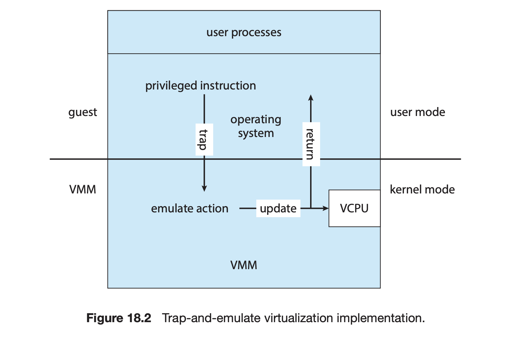
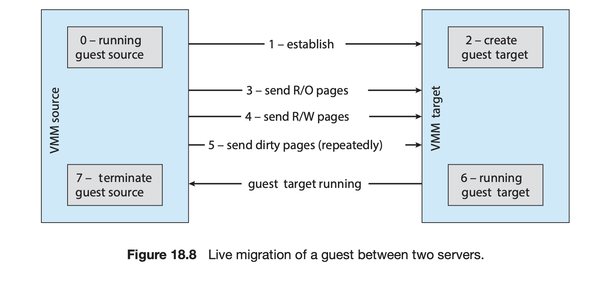

| 작성자  |   작성일   |
| :-----: | :--------: |
| yunselee | 2022.07.15 |

# Chapter 18 Virtual Machines

CHAPTER OBJECTIVES
• Explore the history and benefits of virtual machines.
• Discuss the various virtual machine technologies.
• Describe the methods used to implement virtualization.
• Identify the most common hardware features that support virtualization and explain how they are used by operating-system modules.
• Discuss current virtualization research areas.

# 18.1 Overview 701

가상머신 : 다일 컴퓨터의 하드웨어를 여러 가지 실행 환경으로 추상화 하여 개별 환경이 자신의 개인용 컴퓨터에서 실행되고 있다는 착각을 불러일으키는 것.

- **Host** : 가상머신을 실행하는 기본 하드웨어 시스템
- **virtual machine manager (VMM) (=hypervisor)** : 가상환경을 제공하는 구성요소, 호스트와 동일한 인터페이스를 제공함으로서 가상 머신을 생성하고 실행함
- **Guest process** : host의 가상 복사본 제공 = 운영체제

VMM의 구현 

- type 0 hypervisors : 펌웨어를 통한 하드웨어 기반 솔루션  IBM LPARs, Oracle LDOMs
- type 1 hypervisors : os와 유사한 소프트웨어  VMware ESX (mentioned above), Joyent SmartOS, and Citrix XenServer
    - VMM기능도 제공하는 운영체제들 : Microsoft Windows Server with HyperV, and Red Hat Linux with the KVM feature
- type 2 hypervisors : 운영체제에서 실행되는 응용 프로그램 : VMware Workstation and Fusion, Parallels Desktop, and Oracle VirtualBox
- Paravirtualization : 성능을 최적화
- Programming-environment virtualization : 최적화된 가상 시스템  Oracle Java and [Microsoft.Net](http://microsoft.net/).
- Application containment : Oracle Solaris Zones, BSD Jails, and IBM AIX WPARs

# 18.2 History 703

- IBM 메인프레임

1972년 IBM 메인프레임 에서 처음으로 상용화 

IBM BM운영체제에서 가상화 제공

메인프레임을 여러개의 가상머신으로 나누어 각각의 운영체제를 실행 각 디스크 시스템에 가상머신을 할당을 하지못하는걸 방지하기위해 minidisk라는 가상 디스크 제공

가상화 요구사항

- fidelity : 본질적으로 컴퓨터와 동일한 환경 제공
- performance
- safety : 완벽한 시스템 자원 관리

# 18.3 Benefits and Features 704

가상머신의 장점

- 동일한 하드웨어를 공유하면서 여러가지 실행환경을 동시에 실행할 수 있음
- 호스트 시스템이 가상 머신으로부터 보호받음

격리 상태의 자원공유 문제를 해결하는 방식

1. 파일 시스템 볼륨을 공유하여 파일 공유
2. 가상 머신 네트워크 정의 : 가상 머신 네트워크를 통해 정보 전송
- 가상화 구현에서 공통적으로 제공하는 기능
    - 가상머신 중단, 다시시작
    - 스냅숏
    - 클론
- 운영체제를 연구, 개발하기 용이
- 여러 운영체제가 동시에 실행될 수 있음 : 개발하기 용이
- 시스템 통합: 둘 이상의 개별 시스템을 한 시스템의 가상 머신에서 실행
- 실시간 마이그레이션 : 실행중인 게스트를 한 물리적 서버에서 다른 물리적 서버로 이동
- 클라우드 컴퓨팅
    
    

# 18.4 Building Blocks 707

유형 0 하이퍼바이저는 필요치 않음

가상화 옵션에서 VCPU의  구현이 중요한개념 

- 코드를 실행하지 않음
- 게스트 컴퓨터가 믿고있는 CPU의 상태. VMM에 의해 CPU로 문맥교환될때 VCPU의 정보로 올바른 문맥을 적재하는데 사용

## 18.4.1 Trap-and-Emulate

물리적 사용자 모드에서 실행되는 가상 사용자 모드와 가상 커널모드를 제공

[https://blog.codinghorror.com/understanding-user-and-kernel-mode/](https://blog.codinghorror.com/understanding-user-and-kernel-mode/)

1. 게스트의 커널(게스트 내부는 커널모드 상태)이 권한 있는 명령을 실행
2. 오류 발생 → 실제시스템의 VMM에 트랩을 발생
3. VMM이 제어를 얻어 게스트 커널이 시도한 작업을 실행 (에뮬레이트)
4. 제어를 가상머신(게스트)으로 반환

하드웨어가 발전함에 따라 트랩 앤 에뮬레이션 기능의 성능이 향상되고 사용해야하는 경우가 감소

많은 CPU들이 표준 이중 모드 작동에 추가 모드가 생김

## 18.4.2 Binary Translation

Intel x86의 경우 특권, 비 권한 명령이 분리되지않음.

사용자 모드에서 이런 명령이 실행된다해도 트랩이 발생하지 않으므로 트랩 앤 에뮬레이트 방식이 작동하지않는다 

1. 게스트 VCPU가 사용자 모드인 경우 물리적 CPU에서 명령어를 그대로 실행
2. 커널모드인경우 VMM이 게스트의 PC를 기반으로 실행할 명령어를 읽어 특수 명령어 이외의 명령어는 그대로 실행하고 특수 명령어는 새로운 명령어 집합으로 변환

⇒ 커널모드시에 오버헤드가 굉장히 큼 ⇒ 캐싱으로 어느정도 완화가능

## 메모리관리, 페이지 테이블

그림 need

Guest : 자신이 page table을 관리한다고 생각 

VMM  : **nested page tables(NPTs)** 관리 (트랩 앤 에뮬레이트, 이진 변환 모두 사용) 

**NPTs** : 게스트 페이지의 상태를 나타냄

Guest 가 자신의 page table을 변경하는 시점에 NPTs를 동일하게 변경

CPU가 guest를 실행할때 VMM은 적절한 NPT 포인터를 CPU 레지스터로 넣어 table을 활성화함

TLB miss가 증가 할 수 있음

## 18.4.3 Hardware Assistance

하드웨어상 지원

- Intel x86
    - VT-x 명령어(2005) 추가, 루트 및 비 루트 모드 추가 ⇒  이진변환 필요없게 됨
    - VCPU상태 데이터 구조 제공
    - VMCS(virtual machine control structures) 제공
    - EPT 메모리 관리 기능 향상
- AMD
    - AMDV(2006).  host, guest 새로운 작동 모드  추가
    - RVI 메모리 관리 기능 향상

하드웨어에서 중첩 페이지 테이블을 구현하여 VMM이 페이징을 완전히 제어할 수 있도록함

→ 이진변환, NPT를 유지할 필요가 없어짐

### IO : DMA

하드웨어 지원 DMA를 제공하는 CPU에서 간접 참조 단계를 거침

1.  VMM은 보호 도메인을 설정하여 각 게스트에 속하는 물리적 메모리를 CPU에 알려줌
2. IO장치를 보호 도메인에 할당하여 해당 메모리영역만 직접 엑세스 할 수 있도록 함

### 인터럽트

가상화 하드웨어 지원 기능이 있는 CPU는 인터럽트 재매핑 기능을 제공하여 알맞는 게스트에게 전달 

VMM개입이 따로 없어도 가능

ARM 아키텍처는 EL1보다 더 높은 특권 수준인 완전한 예외 수준 EL2를 제공

⇒ MMU 엑세스 및 인터럽트 트래핑을 가진 격리된 하이퍼바이저 실행 가능 

### 얇은 하이퍼 바이저의 생성 가능

ex macOS의 HyperVisor.framework

운영체제 제공 라이브러리로

몇줄의 코드로 가상 머신 생성 가능

실제 작업은 시스템 콜을 통해 이루어짐. 커널이 특권 가상화 CPU명령을 호출 

# 18.5 Types of VMs and Their Implementations 713

## 18.5.1 The Virtual Machine Life Cycle

가상머신 생성자 매개변수

- CPU 수
- 메모리 양
- 네트워킹 세부 정보
- 저장장치 세부 정보

## 18.5.2 Type 0 Hypervisor

파티션, 도메인 등의 이름으로 존재해옴

VMM : 펌웨어에 인코딩 되어 부트할 떄 적재 됨

각 파티션에서 실행할 게스트 이미지를 적재

하이퍼바이저의 기능들은 하드웨어에서 구현 

전용 하드웨어로 구분

I/O : 공유 엑세스를 관리 or 제어파티션에 부여

raw 하드웨어 실행에 매우 가까움

**게스트 운영체제는 하드웨어 부분 집합을 가진 네이티브 운영체제**

## 18.5.3 Type 1 Hypervisor

데이터 센터 운영체제

게스트 운영체제를 생성, 실행, 관리

하드웨어 보호 기능을 이용해 커널모드에서 실행됨

RedHat Enterprise Linux, Windows, or Oracle Solaris 등은 일반적인 os에 다른 운영체제를 게스트로 실행할 수 있는 VMM제공 게스트 운영체제를 그저 다른 프로세스로 취급

## 18.5.4 Type 2 Hypervisor

호스트 운영체제를 변경할 필요가 없음

## 18.5.5 Paravirtualization

## 18.5.6 Programming-Environment Virtualization

프로그래밍 환경의 가상화

JVM

.NET

## 18.5.7 Emulation

시스템이 다른 아키텍처로 컴파일이 된 경우  전체 CPU를 소프트웨어로 작성

옛날 게임을 실행하려는 경우에 많이 응용

## 18.5.8 Application Containment

container zone

하나의 커널만 설치

하드웨어는 가상화 되지않는다

각 컨테이너는 

- 자체응용 프로그램
- 네트워크 스택
- 네트워크 주소 및 포트
- 사용자 계정

을 가질 수 있음

시스템 자원을 적게 사용하고 인스턴화 및 파기 속도가 더 빠름

클라우드 컴퓨팅에서 많이 사용

자동화 및 관리가 용이

docker Kubernetes로 이어짐 

# 18.6 Virtualization and Operating-System Components 719

VMM이 핵심 운영체제 기능을 제공하는 방법

## 18.6.1 CPU Scheduling

가상머신간에 물리 CPU사용을 스케줄

- 일반적인 VMM스케줄링 상황 : 물리 CPU가 여유로운 경우

스레드는 VMM 스레드와 게스트 스레드가 존재

가상머신 생성시 CPU 갯수가 정해지는데 물리 CPU가 처리하기에 충분하면 VMM은 CPU를 전용으로 처리하고 해당 게스트의  CPU에 지정된 게스트의 스레드만 스케줄링 할 수 있음

**해당 상황에서 게스트는 네이티브 운영체제와 매우 유사하게 작동**

- CPU가 충분하지 않은 경우

VMM : 게스트 관리, IO관리를 위한 CPU 주기가 필요

⇒ 이를 위해 게스트로 부터 주기를 steal할 수 있지만 영향은 미비함

- 게스트가 물리 CPU보다 더 많이 생성된 초과 할당의 경우

VMM은 표준 스케줄링 알고리즘을 사용하여 스레드를 진행 할 수 있음

여기에 공정성 측면을 추가 할 수 있음

⇒ 6개의 하드웨어 CPU와 게스트에 할당된 CPU가 12개인 경우 VMM이 CPU를 비례적으로 할당하여 게스트가 믿고 있는 CPU자원의 절반(6)을 할당 

VMM이 스케줄링을 이용하여 적절하게 배포

스케줄러에 공정성을 추가했을때 생기는 문제

게스트 OS에서 재는 타임 슬라이스가 밀림으로서 응답시간이 길어질 수 있음

## 18.6.2 Memory Management

세가지 게스트로부터 메모리를 회수하는 방법

1. NPTs 이용해 이중 페이징 제공 : 게스트가 물리메모리라고 생각하는 백업 저장장치에 페이지를 적재

선호되는 방법은 아님
[https://deinoscloud.wordpress.com/2010/09/30/ballooning-and-hypervisor-swapping-common-misunderstandings/#:~:text=Double paging problems%3A Another known,is also under memory pressure](https://deinoscloud.wordpress.com/2010/09/30/ballooning-and-hypervisor-swapping-common-misunderstandings/#:~:text=Double%20paging%20problems%3A%20Another%20known,is%20also%20under%20memory%20pressure).

1. 일반적인 방법 VMM이 각 게스트에 VMM이 제어하는 의사장치 드라이버(balloon memory manager) 또는 커널 모듈 설치 이를 이용해 VMM과 통신하며 헤모리를 할당하거나 할당 해제 지시를 받음
2. VMM이 동일한 페이지가 두 번이상 적재되었는지 학인

페이지에 대해서 해시를 만들고 해시테이블에 저장된 다른 해시와 비교 실제로 동일한지 확인

여러 게스트가 동일한 운영체제를 실행하는 경우 활성 운영체제 페이지의 사본 하나만 메모리에 있으면 됨

## 18.6.3 I/O

VMM이 게스트에게 I/O를 제공하는 방법

- I/O장치가 게스트 전용
- VMM이 게스트 I/O를 매핑하는 장치드라이버를 가짐   게스트<> VMM <> 물리I/O
- 장치를 게스트 전용으로 사용하고 직접 엑세스 할 수 있는 방식 : I/O성능 향상
    - 유형 0 하이퍼바이저의 경우 직접 장치 엑세스를 제공 게스트가 네이티브 운영체제와 동일한 속도로 실행할 수 있음
    - 유형 1,2 하이퍼바이저에서 특정 하드웨어 지원이 있는 상태에 직접 장치 엑세스를 사용할 시 네이티브 운영체제와 성능이 유사할 수 있음  → 이때 하드웨어는 DMA패스스루, 직접 인터럽트 전달 기능(게스트에 직접적으로 전달)을 제공해야함
- 공유엑세스 제공

네트워크

- 게스트 당 IP주소를 가짐. 이때 VMM은 가상 라우팅 역할을 함
- 네트워크 직접연결(브릿징)을 제공 할 수 있음
- NAT 주소를 제공 할 수 있음
- 방화벽 제공

## 18.6.4 Storage Management

여러 운영체제가 설치된 경우 부팅 디스크는 무엇이며 어디에있는가?

- 유형 0 하이퍼바이저 :
    - 루트 디스크 파이셔닝을 허용하는 경우가 많음
    - 디스크 관리자가 제어 파티션의 일부 일 수 있음 다른 파티션에 디스크 공간(부트 디스크 포함) 제공
- 유형 1 하이퍼바이저 : 게스트 루트 디스크를  VMM이 제공하는 파일 시스템의 파일에 저장
- 유형 2 하이퍼 바이저 : 호스트 운영체제의 파일 시스템에 동일한 정보 저장

물리 - 가상 변환(P-to-V) 현재 구성된 물리적 시스템을 캡쳐하여  VMM이 관리하고 실행하수 있는 게스트로 변환하는 기법

상-물리(V-to-P)도 존재

## 18.6.5 Live Migration

유형 0,1 하이퍼바이저에 있는 기능 

한 시스템에서 실행중인 게스트를  동일한 VMM을 싱행하는 다른 시스템으로 복사. 복사 중에 서비스 중단이 발생하지않아 사용자에게 영향을 주지않음

1. The source VMM establishes a connection with the target VMM and confirms that it is allowed to send a guest.
2. The target creates a new guest by creating a new VCPU, new nested page table, and other state storage.
3. The source sends all read-only memory pages to the target.
4. The source sends all read–write pages to the target, marking them as
clean.
5. The source repeats step 4, because during that step some pages were probably modified by the guest and are now dirty. These pages need to be sent again and marked again as clean.
6. When the cycle of steps 4 and 5 becomes very short, the source VMM freezes the guest, sends the VCPU’s final state, other state details, and the final dirty pages, and tells the target to start running the guest. Once the target acknowledges that the guest is running, the source terminates the guest.

네트워크 연결이 중단되지 않고 유지되기 위해선 네트워크 인프라에서 MAC주소(하드웨어 네트워킹 주소)가 시스템 간에 이동 할 수 있다

실시간 마이그레이션의 한계  디스크 상태가 전송 되지않음

실시간 마이그레이션이 가능한 이유로 게스트의 상태(열린 파일 테이블, 시스템 콜 상태, 커널 상태 등)가 게스트내에서 유지되기 때문 

그런데 디스크는 느리다못해 원격에 위치하여 네트워크를 통해 엑세스함 이 경우 디스크 엑세스 상태가 게스트 내에서 유지됨 VMM에서 네트워크 연결만 중요해지고 네트워크 연결이 유지되기에 원격 디스크 엑세스가 유지됨 

# 18.7 Examples 726

## 18.7.1 VMware

유형2 하이퍼바이저의 대표적인 예

## 18.7.2 The Java Virtual Machine

java 컴파일러는 모든 JVM에서 실행될 .class파일 생성

# 18.8 Virtualization Research 728

# 18.9 Summary 729

- Virtualization is a method for providing a guest with a duplicate of a system’s underlying hardware. Multiple guests can run on a given system, each believing that it is the native operating system and is in full control.
- Virtualization started as a method to allow IBM to segregate users and provide them with their own execution environments on IBM mainframes. Since then, thanks to improvements in system and CPU performance and innovative software techniques, virtualization has become a common feature in data centers and even on personal computers. Because of its popularity, CPU designers have added features to support virtualization. This snowball effect is likely to continue, with virtualization and its hardware support increasing over time.
- The virtual machine manager, or hypervisor, creates and runs the virtual machine. Type 0 hypervisors are implemented in the hardware and require modifications to the operating system to ensure proper operation. Some 730 Chapter 18 Virtual Machines type 0 hypervisors offer an example of paravirtualization, in which the operating system is aware of virtualization and assists in its execution.
- Type 1 hypervisors provide the environment and features needed to create, run, and manage guest virtual machines. Each guest includes all of the software typically associated with a full native system, including the operating system, device drivers, applications, user accounts, and so on.
- Type 2 hypervisors are simply applications that run on other operating systems, which do not know that virtualization is taking place. These hypervisors do not have hardware or host support so must perform all virtualization activities in the context of a process.
- Programming-environment virtualization is part of the design of a programming language. The language specifies a containing application in which programs run, and this application provides services to the programs.
- Emulation is used when a host system has one architecture and the guest was compiled for a different architecture. Every instruction the guest wants to execute must be translated from its instruction set to that of the native hardware. Although this method involves some performance penalty, it is balanced by the usefulness of being able to run old programs
on newer, incompatible hardware or run games designed for old consoles on modern hardware.
- Implementing virtualization is challenging, especially when hardware support is minimal. The more features provided by the system, the easier virtualization is to implement and the better the performance of the guests.  VMMs take advantage of whatever hardware support is available when optimizing CPU scheduling, memory management, and I/O modules to provide guests with optimum resource use while protecting the VMM from
the guests and the guests from one another.
- Current research is extending the uses of virtualization. Unikernels aim to increase efficiency and decrease security attack surface by compiling an application, its libraries, and the kernel resources the application needs into one binary with one address space that runs within a virtual machine. Partitioning hypervisors provide secure execution, real-time operation, and other features traditionally only available to applications running on dedicated hardware.
