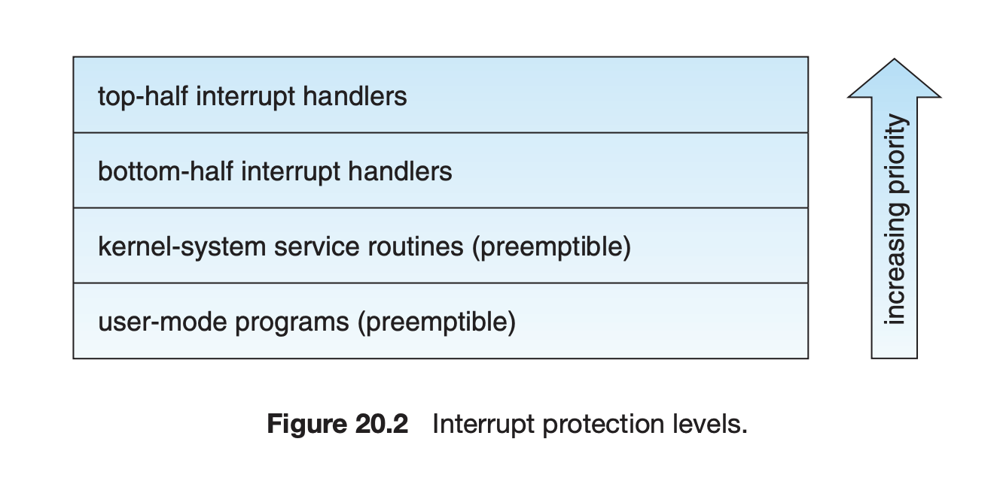
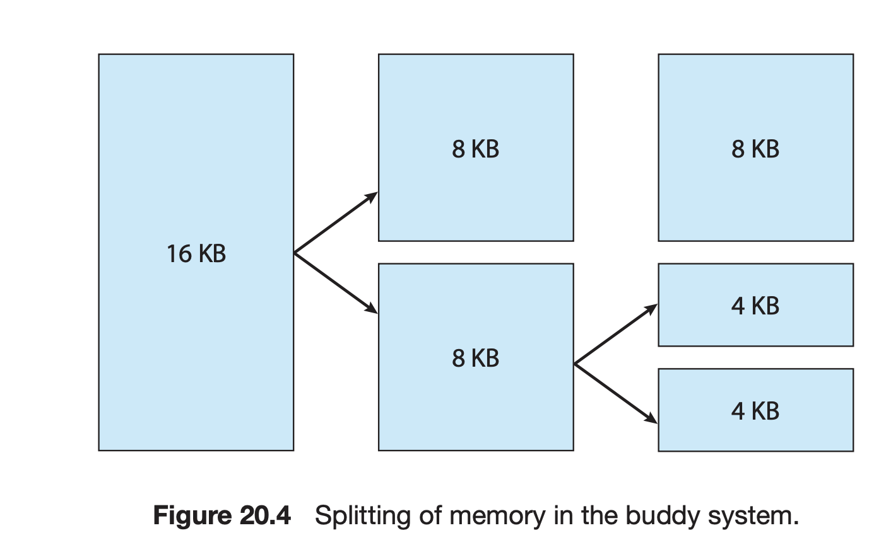

| 작성자  |   작성일   |
| :-----: | :--------: |
| yunselee | 2022.07.29 |

# 20 linux system

내용이 많이 미숙합니다.

- Explore the history of the UNIX operating system from which Linux is derived and the principles upon which Linux’s design is based.
- Examine the Linux process and thread models and illustrate how Linux schedules threads and provides interprocess communication.
- Look at memory management in Linux.
- Explore how Linux implements file systems and manages I/O devices.

# 20.1 Linux History 775

# 20.2 Design Principles 780

- 다중 사용자 multiuser
- 다중 태스킹 multitasking
- Unix와 호환되는 툴을 전부가지고 있음
- 파일시스템 : 전통적인 Unix 시맨틱
- 네트워킹 : 표준적인 Unix 네트워킹 모델

주요목표

1. 빠른 속력
2. 높은 효율
3. 표준화

POSIX표준을 준수하도록 디자인 

## 20.2.1 Components of a Linux System

커널 코드의 주요 부분 : 전통적인 Unix구현과 일치함

1. 커널
2. 시스템 라이브러리
3. 시스템 유틸리티

커널모드 : 모든 커널 코드가 수행되며, 컴퓨터의 모든 자원에 접근 권한을 갖는 모드

운영체제가 지원하나 커널모드에서 지원할 필요가 없는 코드들은 커널 밖의 시스템 라이브러리에 위치하여 사용자 모드로 수행.

시스템 자원 중 일부분만 접근 가능

아키텍처 : 성능 향상을 이유로 커널이 단일화된 실행 파일로 생성되는 형태 

- 모든 커널 코드와 자료구조가 하나의 주소공간에 유지
- 시스템콜을 호출하거나 하드웨어 인터럽트 발생시 context switch가 필요하지 않음
- 커널간 IPC가 아닌 C함수 호출을 통해 서브 시스템간 데이터를 전달하거나 요구가능

모듈화도 지원하여 필요한 모듈을 실행 중에 동적으로 적재하고 메모리에서 제거 가능

# 20.3 Kernel Modules 783

커널은 커널코드의 일부분을 모듈단위로 메모리에 적재하고 제거 가능함

이 모듈들은 커널모드에서 수행됨

모듈화의 장점

- 드라이버 별로 컴파일해서 적재하기 편함
- GPL라이센스의 공개조건을 피할 수 있음

모듈을 지원하는 컴포넌트

1. The **module-management system** allows modules to be loaded into
memory and to communicate with the rest of the kernel.
2. The **module loader and unloader**, which are user-mode utilities, work
with the module-management system to load a module into memory\
3. The **driver-registration system** allows modules to tell the rest of the
kernel that a new driver has become available.
4. A **conflict-resolutio mechanism** allows different device drivers
to reserve hardware resources and to protect those resources from
accidental use by another driver.

## 20.3.1 Module Management

요구사항 : 단순히 실행 파일을 커널 메모리 영역에 올려놓는 게아닌 모듈이 참조하는 커널 심볼이나 진입 지점이 커널 주소 영역의 정확한 위치를 가리킬 수 있도록 설정해야한다.

작업

1. 커널 메모리 내에서 모듈 코드를 관리
2. 모듈이 참조하는 심볼 관리

모듈을 메모리에 적재시키는 일

1. 모듈을 적재시키는 로더가 모듈을 위한 공간을 할당하도록 커널에 요청
    1. 커널은 할당된 공간의 주소를 로더에게 넘겨줌
    2. 주소를 이용해 로더는 모듈의 기계어 코드를 올바른 적재주소로 재배치
2. 시스템 콜은 모듈이 커널에 수출하고자 하는 심볼 테이블을 묘둘과 함께 커널에 전달
    1. 다른 모듈들이 새로운 심볼을 사용할 수 있도록 커널의 심볼테이블이 갱신

모듈 요청자 : 프로세스가 메모리에 올라와있지않은 장치 드라이버, 파일 시스템, 네트워크 서비스 요청시 커널이 모듈 관리 프로세스에 요청해 적재시키도록 한다.

메모리에 적재와 제거까지 담당

## 20.3.2 Driver Registration

커널은 모든 장치 드라이버를 등록하는 동적테이블을 유지하면서 장치 드라이버가 추가, 삭제하는 루틴을 제공

모듈은 여러 유형의 기능들 등록가능 

등록테이블의 속성

- Device drivers. These drivers include character devices (such as printers, terminals, and mice), block devices (including all disk drives), and network interface devices.
- File systems. The file system may be anything that implements Linux’s virtual file system calling routines. It might implement a format for storing files on a disk, but it might equally well be a network file system, such as NFS, or a virtual file system whose contents are generated on demand, such as Linux’s /proc file system.
- Network protocols. Amodule may implement an entire networking protocol, such as TCP, or simply a new set of packet-filtering rules for a network firewall.
- Binary format. This format specifies a way of recognizing, loading, and executing a new type of executable file.

새로운 항목 추가적으로 등록할 수도 있다.

## 20.3.3 Conflict Resolution

하드웨어 자원에 대한 중앙 집중식 충돌 해결의 목표

- To prevent modules from clashing over access to hardware resources
- To prevent autoprobes—device-driver probes that auto-detect device configuration— from interfering with existing device drivers
- To resolve conflicts among multiple drivers trying to access the same hardware—as, for example, when both the parallel printer driver and the parallel line IP (PLIP) network driver try to talk to the parallel port
    
    
    커널은 하드웨어 자원에 대한 목록을 유지하고 해당 자원에 접근하려고 할때는 예약을 먼저한다.
    

# 20.4 Process Management 786

## 20.4.1 The fork() and exec() Process Model

기본원칙 : 프로세스의 생성(fork)과 새로운 프로그램의 실행(exec)을 분리 

프로세스의 속성 그룹

- identity
- environment
- context

### 20.4.1.1 Process Identity

프로세스 식별을 위해 제공되는 요소

- Process ID (PID).
- Credentials. : 하나의 사용자 ID와 하나이상의 그룹ID를 가지고 있어야함  (user groups are discussed in Section 13.4.2)
- Personality.  특정 시스템 콜의 시멘틱을 변경할 수 있음
- Namespace. 고유한 파일시스템 체계, 디렉터리, 마운트된 파일 시스템 집합

### 20.4.1.2 Process Environment

프로세스의 환경은 부모 프로세스로부터 상속 받음 

- argument vector(argv)
- environment vector(env)

프로세스의 환경은 커널 메모리에 올라와 있지 않고 사용자 주소 공간에 저장된다.

프로세스 스택 상부의 가장 첫 번째 데이터가 인자들

### 20.4.1.3 Process Context

- Scheduling context.
    - 프로세스의 상태를 정하는 정보 들
    - 프로세스에 관련된 모든 레지스터
    - priority
    - 커널 스택
- Accounting : 커널은 프로세스가 현재 사용하고 있는 자원과 소비한 전체 자원의 정보를 가지고 있다.
- File table.  오픈 파일을 나타내는 커널 파일 구조를 가리키는 포인터 배열  FD는 이 테이블의 인덱스
- File-system context. 새로운 파일을 열려는 요청에 적용
- Signal-handler table  시그널에 따른 루틴을 호출
- Virtual memory context. 프로세스 메모리

## 20.4.2 Processes and Threads

linux는 프로세스와 스레드를 구분하지 않음

프로그램 제어 흐름에 task를 사용 clone과 fork에는 플래그의 차이가 있음 

프로세스와 스레드의 구분이 모호한 이유 : 프로세스의 모든 문맥을 하나의 프로세스 자료구조에 모아 두지 않고 독립된 하위 문맥에 저장함.

프로세스 자료구조는 구조를 가르키는 포인터만을 포함하고 있고, 여러 프로세스가 참조 계수만 증가 시키면서 하위 문맥을 쉽게 공유 함 

# 20.5 Scheduling 790

선점 가능 다중 태스킹 지원

### 20.5.1 Thread Scheduling

시분할 알고리즘  CFS(Completely Fair Scheduler) (section 5.7.1)

- 실시간 값
- nice 값

타임슬라이스 대신 처리기 시간의 비율을 할당 

- 목표 지연 : 모든 태스크가 최소 한 번 수행되어야 하는 간격.
- 최소 입도 : 스레드가 받는 최소 시간 할당량

### 20.5.2 Real-Time Scheduling

실시간 작업을 위해 고안된 알고리즘(우선순위가 중요) : FCFS(비선점) round-robin(선점) (section 5.3.1 5.3.3) 

연성 실시간 방식 (최소지연을 보장하지 않음) ↔ 경성

### 20.5.3 Kernel Synchronization

커널 모드 실행의 요청

1. 명시적인 시스템 콜, 묵시적인 페이지 폴트 등
2. 하드웨어 인터럽트

문제상황 : 여러 태스크가 같은 자료구조에 접근 할 수 있음

버전 2.6이전 linux는 비선점형 커널 이었음

이후에 선점형 커널로 동작함으로 커널에서 실행 중 일때도 선점될 수 있음 

1. Linux 커널은 스핀락과 세마포어를 제공함 SMP 기계에서 기본적인 락킹 기법은 스핀락임

단일 처리기계에서는 커널 선점을 사용중일땐 허용하고 금지(interrupt disable)하는 방법으로 대체

1. 인터럽트 서비스 루틴 내의 임계구역에서는 처리기의 인터럽트 제어 하드웨어가 임계구역 동안 인터럽트를 금지(또는 스핀락 사용)를 하는 보호기법을 적용 ⇒ 성능상 느림
2. 동기화구조를 사용해 인터럽트들을 인터럽트 금지 상태가아닌 긴 임계구역을 실행하도록 변경
    
    
    

인터럽트 서비스 루틴들을 상반부, 하반부로 나눔으로 이런 구조를 구현

- 상반부 : 일반적인 인터럽트 서비스 루틴 - 인터럽트 금지
- 하반부 : 모든 인터럽트를 인터럽트 가능 상태로 놓고, 자기 자신들을 인터럽트 하지않게 보장해주는 소규모 스케줄러가 동작, 상반부에 의해 중단될 수 있으나 하반부에 의해서 중단 되지 않음

각 레벨은 더 높은 코드에 의해서 중단될 수 있으나 같은 레벨이나 낮은레벨에 의해서는 중단 될 수 업음.

### 20.5.4 Symmetric Multiprocessing

Linux 2.0커널 부터 SMP 하드웨어를 지원해 여러 스레드가 여러 처리기상에서 병렬적으로 실행 될 수 있음.

조금 더 발전해 단일 커널 스핀락을 여러개의 락으로 쪼개서 각각의 커널 자료구조의 작은 부분을 보호하게끔 만들어 SMP 구현의 확장성을 향상시킴

# 20.6 Memory Management 795

1. 물리메모리
2. 가상메모리

### 20.6.1 Management of Physical Memory

물리메모리를 네 종류의 zone으로 구분함

- ZONE DMA :  Intel x86-32 아키텍저에서 어떤 ISA장치가 DMA를 사용할때, 제일 아래 16MB의 물리메모리를 해당 영역으로 잡고 접근함
- ZONE DMA32 : 64비트 지원하는 경우 물리메모리의 첫 4GB를 해당 영역으로 잡는다.
- ZONE NORMAL : 나머지
- ZONE HIGHMEM : 커널 주소 공간에 매핑되지 않는 물리메모리  (현대의 64비트 구조는 가지지않음) 커널은 32bit Intel 아키텍처에서 첫 896MB의 주소공간에 매핑 → 남는 공간이 해당 영역

메모리 할당 

1. 시스템 부팅 시 연속된 메모리 영역을 드라이버에 의해 정적 할당
2. 페이지 할당기에 의해 동적으로 할당

page allocator : 물리메모리 주 관리자 , 물리. 페이지들의 할당과 반납을 담당

buddy 시스템 사용(section 10.8.1)

메모리 관리 서브시스템 (section 10.8)

- 가상 메모리 시스템 → section 20.6.2
- kmalloc() 가변길이 할당기 
페이지 전체를 할당하고 그런후에 더 작은 부분으로 쪼갬 반환은 kfree()
    
    
    
- slab : 커널 자료구조 할당할때 사용. 
하나 이상의 연속된 물리 페이지로 구성되어있음 
커널 자료구조마다 하나의 캐시가 있고, 캐시는 하나 이상의 슬랩으로 구성된다.
    - 프로세스 디스크립터를 나타내는 자료구조를 위한 캐시
    - 파일 객체를 위한 캐시
    - inode를 위한 캐시
- 페이지 캐시 : 파일에 속한 페이지들을 캐싱 
block oriented devices 와 memory mapped file을 위한 커널의 주 캐시로서 이 캐시를 통해 입출력 수행

### 20.6.2 Virtual Memory

- 가상 메모리 페이지 생성
- 디스크로부터 페이지 적재, 방출(스와핑)

영역의 집합(논리적인 관점)과 페이지들의 집합의 두 관점에서 프로세스 주소 공간을 관리함

- vm_area_struct 자료구조로 관리
    - 프로세스가 가지는 읽기 쓰기 실행 권한
    - 영역에 연관된 파일에 관련된 정보
    - 가상 메모리 영역을 위한 페이지 관리를 위한 함수 테이블
- 영역들은 균형 이진트리로 연결되어있어 검색을 빠르게 할 수 있음
- 각 주소 공간의 물리적인 면을 유지

 프로세스 하드웨어 페이지 테이블에 저장되어있음 가상 메모리 상의 각 페이지 위치 정보(메모리, 디스크) 

페이지 테이블에 존재하지 않는 페이지에 접근하려할때 software interrupt handler에 의해 호출되는 루틴들의 집합에 의해 관리 

### 20.6.2.1 Virtual Memory Regions

가상 메모리 영역을 결정짓는 요소중 하나로 backing store이 있다.

backing store 종류

1.  파일에서 오거나
2. 없는 경우

백업을 하지 않는 영역은 제로 요구 메모리(demand zero memory)를 나타낸다. 프로세스가 해당 영역의 페이지를 읽으려고 할때 외부 파일에서 읽어오는 것이 아닌 0으로 채워진 메모리의 페이지를 받는다.

영역을 매핑하는 방식은 private 과 shared로 나뉜다. 

어떤 프로세스가 private으로 매핑되어있는 영역에 쓰려면 copy on write가 필요한지 파악한다

### 20.6.2.2 Lifetime of a Virtual Address Space

새로운 가상 주소 공간을 만드는 경우 

1. exec call → 프로세스는 새 가상 주소 공간을 받음
2. fork call  부모 프로세스의 가상 주소 공간을 완전히 복사하여 새 프로세스 생성

### 20.6.2.3 Swapping and Paging

초기에는 프로세스 전체 내용을 스왑아웃했으나 가상 메모리의 페이지 단위로 페이징하는 방식으로 발전함

페이징 시스템

- 정책 알고리즘
- 페이징 기법

페이지 아웃 정책 : 다중-패스 클록( multiple pass clock) 사용 LFU 정책을 기반으로 대상 페이지 선택

페이징 기법 : 전용 스왑장치 or 파티션, 일반 파일로 페이징 할 수 있도록 지원

사용 중인 블록들의 비트맵을 사용해 스왑 장치의 블록을 할당

스왑 공간 할당기는 next fit 알고리즘 사용해 가능하면 연속된 저장장치 블록에 할당 

### 20.6.2.4 Kernel Virtual Memory

모든 프로세스의 가상 공간 중 일정 부분을 커널이 내부적으로 사용하기 위해 유보함

이 커널 페이지들에 해당하는 페이지 테이블 항목은 protected로 표시되어 user mode에서는 해당 페이지들이 보이지 않는다. 

1. 정적 영역 : 가용 물리 메모리 페이지에 대한 페이지 테이블를 참조하고 있어 커널코드가 수행될때 물리 주소에서 가상 주소로의 변환을 쉽게 할 수 있게한다. 커널의 코어와 정규 페이지 할당기에 의해 할당되는 모든 페이지는 이 영역에 존재
2. 예약 X : 필요하면 다른 영역을 가리킬 수 있도록 변경될 수 있음, 아래 두가지 방법으로 사용 가능
    1. vmalloc : 연속하지 않은 물리 메모리 페이지들을 할당하고 커널 가상 메모리의 연속된 한 여역으로 매핑
    2. vremap : memory mapped I/O  장치드라이버가 이용하는 가상 메모리를 엑세스하기 위함
    

### 20.6.3 Execution and Loading of User Programs

loader 루틴에서 담당

이진 파일 포맷 : 구버전 Linux커널은 a.out 포맷으로 다루었으나 최신은 ELF포맷도 지원

ELF포맷은 한 개의 헤더와 여러 섹션들로 구성되는데 로더는 헤더를 읽어 나머지 파일의 섹션들을 서로 다른 가상 메모리 영역으로 매핑

# 20.7 File Systems 803

파일 구현 상세를 VFS (virtual file system)라는 계층 밑으로 숨기고 겉으로는 간단한 파일 모델만을 제공

다형성 처럼 작동

## 20.7.1 The Virtual File System

- An inode object represents an individual file.
- A fil object represents an open file.
- A superblock object represents an entire file system.
- A dentry object represents an individual directory entry.

파일 객체의 상세 정의는  /usr/include/linux/fs.h  struct file operations에 정의되어있음

- int open(. . .) — Open a file.
- ssize t read(. . .) — Read from a file.
- ssize t write(. . .) — Write to a file.
- int mmap(. . .) — Memory-map a file.

VFS 소프트웨어 층은 객체의 함수 테이블로부터 적절한 함수를 호출해 연산을 수행

### 20.7.2 The Linux ext3 File System

Linux가 사용하는 표준 디스크 파일 시스템을 ext3(third extended file system)라 부름

BSD Fast File system(FFS)와 공통점

- 한 파일의 데이터 블록을 디스크에 위치시키는 방법
- 데이터 블록에 대한 포인터로 3단계 간접 블록 포인터 사용
- 디렉터리 파일들을 일반 파일처럼 디스크에 저장
- 디렉터리 파일을 구성하는 각 블록은 연결리스트로 구성
    - 각 항목은 길이, 파일 이름, 파일의 아이노드 번호 표시

FFS와의 디스크 할당 정책 차이

FFS : 디스크는 8kb 블록 단위로 파일에 할당, 작은 파일들을 저장하거나 파일 마지막에 부분적으로 채워진 블록을 저장하기 위해 1KB 단편들로 분할됨

ext3 : 단편을 전혀 사용하지 않고 더 작은 단위로 할당 함. 블록 크기는 가변적임 (1,2,4,8KB 크기 지원)

논리적으로 인접한 파일 블록들을 물리적으로 인접한 디스크 블록에 배치하게 해서 입출력 묶어서 수행

할당 정책

블록 그룹 : 다중 세그먼트 들 

실린더 그룹 : 물리 디스크의 한 실린더

파일을 할당 할때 파일의 데이터 블록은 아이노드와 동일한 블록 그룹을 선택 (아이노드는 파일의 부모 디렉터리와 같은 블록 그룹을 선택) 

밀접한 정보들은 같은 블록 그룹내에 가깝게 유지하고 디렉터리 파일들은 널리 분산시킴

### 20.7.3 Journaling

파일 시스템에 가해진 변경 사항들을 기록하는 기능 

연산 집합 : commit

원형버퍼로 파일시스템의 별도 섹션에 존재하거나 별도의 물리 디스크에 존재

### 20.7.4 The Linux Proc File System

내용부족

# 20.8 Input and Output 810

모든 I/O장치 드라이버는 일반적인 파일과 동일하게 보이게 되어있다. ⇒ 일반 파일을 다루는 방식으로 접근 가능

관리자는 각 파일에 대한 접근 권한을 설정함으로 장치의 접근 제어

- 블록 장치 : 독립되고 고정된 크기의 데이터 블록에 임의 접근 가능 ex) 하드디스크, CD ROM …
- 문자 장치 : 순차적으로 접근 ex) 마우스, 키보드
- 네트워크 장치 : 커널의 네트워크 서브 시스템과 연결을 설정한후 간접적으로 통신 ⇒ section 20.10

### 20.8.1 Block Devices

디폴트 입출력 스케줄러 : C-SCAN → CFQ(Completely Fair Queueing)

CFQ 내용부족

### 20.8.2 Character Devices

문자 장치를 등록할때 입/출력 루틴도 함께 등록하여야함

터미널 장치를 구현하는 드라이버는 등록하지 않아도 됨 struct tty_struct 를 통해서  해당 장치의 인터페이스를 제공 

터미널 장치로부터 data stream을 받아 버퍼링이 되도록 buffer를 제공하고 데이터의 흐름을 제어하고 회선 규범(line discipline)으로 넘겨주는 역할을 함

회선규범 : 터미널 장치로부터 오는 정보를 해석해 주는 모듈

데이터 스트림을 사용자 프로세스의 표준 입력, 표준 출력 스트림으로 연결 해 줌

여러 프로세스들과 터미널 간의 연결을 교체

# 20.9 Interprocess Communication 812

### 20.9.1 Synchronization and Signals

- signal 기법 사용
    
    커널모드 프로세스 간 통신에 signal을 사용하지 않음 커널 모드 프로세스가 내부에서 비동기 이벤트를 기다리는 경우 signal을 사용하기보다 스케줄링 상태와 wait_queue 구조체 사용
    

- 세마포어 기법 사용

### 20.9.2 Passing of Data among Processes

- pipe 기법 사용
    
    각 파이프는 VFS에서는 단지 다른 유형의 아이노드처럼 보이고 읽는 프로세스와 쓰는 프로세스를 동기화 시키는 한 쌍의 대기 큐를 가짐
    

- 공유 메모리 : 데이터를 주고 받는 매우 빠른 방법
    
    단점 : 스스로 동기화 서비스를 제공하지 않음 → 다른 IPC와 병행하여 사용
    
    공유 메모리 영역 : 하나의 작은 독립적인 주소 공간처럼 취급 
    
    페이지 아웃 시킬 수 있음
    공유 메모리 객체는 공유 메모리 영역의 backing store처럼 작동
    페이지 폴트 발생시 공유 메모리 객체로부터 페이지가 매핑 됨
    매핑 된 프로세스가 없어도 내용들을 보존
    

# 20.10 Network Structure 813

표준 인터넷 프로토콜만이 아닌 프로토콜 대부분을 지원

커널에서 네트워킹은 세 층으로 이루어진 소프트웨어로 구현

1. The socket interface
2. Protocol drivers
3. Network-device drivers

소켓 인터페이스 : BSD 4.3 소켓 사용

프로토콜 드라이버 : 소켓 인터페이스에서 온 데이터가 어떤 네트워크 프로토콜을 사용하는 지에 대해 식별자를 요구

소켓 인터페이스로 보내던지 외부로 간다면 장치 드라이버로 넘겨준다.

모든 계층간 통신은 skbuff 구조체를 넘겨줌

내용부족

# 20.11 Security 816

### 20.11.1 Authentication

- 패스워드 방식 :  random salt value + one way
- PAM(pluggable authentication modules) 도입

20.11.2 Access Control 

- UID
- GID
- protection mask
- setuid → linux 에서는 추가적인 방식으로 보완

# 20.12 Summary 818

- Linux is a modern, free operating system based on UNIX standards. It has
been designed to run efficiently and reliably on common PC hardware;
it also runs on a variety of other platforms, such as mobile phones. It
provides a programming interface and user interface compatible with
standard UNIX systems and can run a large number of UNIX applications,
including an increasing number of commercially supported applications.
- Linux has not evolved in a vacuum. A complete Linux system includes
many components that were developed independently of Linux. The core
Linux operating-system kernel is entirely original, but it allows much
existing free UNIX software to run, resulting in an entire UNIX-compatible
operating system free from proprietary code.
- The Linux kernel is implemented as a traditional monolithic kernel for
performance reasons, but it is modular enough in design to allow most
drivers to be dynamically loaded and unloaded at run time.
- Linux is a multiuser system, providing protection between processes and
running multiple processes according to a time-sharing scheduler. Newly
created processes can share selective parts of their execution environment
with their parent processes, allowing multithreaded programming.
- Interprocess communication is supported by both System V mechanisms
—message queues, semaphores, and shared memory—and BSD’s socket
interface. Multiple networking protocols can be accessed simultaneously
through the socket interface.
- The memory-management system uses page sharing and copy-on-write to
minimize the duplication of data shared by different processes. Pages are
loaded on demand when they are first referenced and are paged back out
to backing store according to an LFU algorithm if physical memory needs
to be reclaimed.
- To the user, the file system appears as a hierarchical directory tree that
obeys UNIX semantics. Internally, Linux uses an abstraction layer to manage multiple file systems. Device-oriented, networked, and virtual file
systems are supported. Device-oriented file systems access disk storage
through a page cache that is unified with the virtual memory system.

# Practice Exercises 819

# Further Reading 819