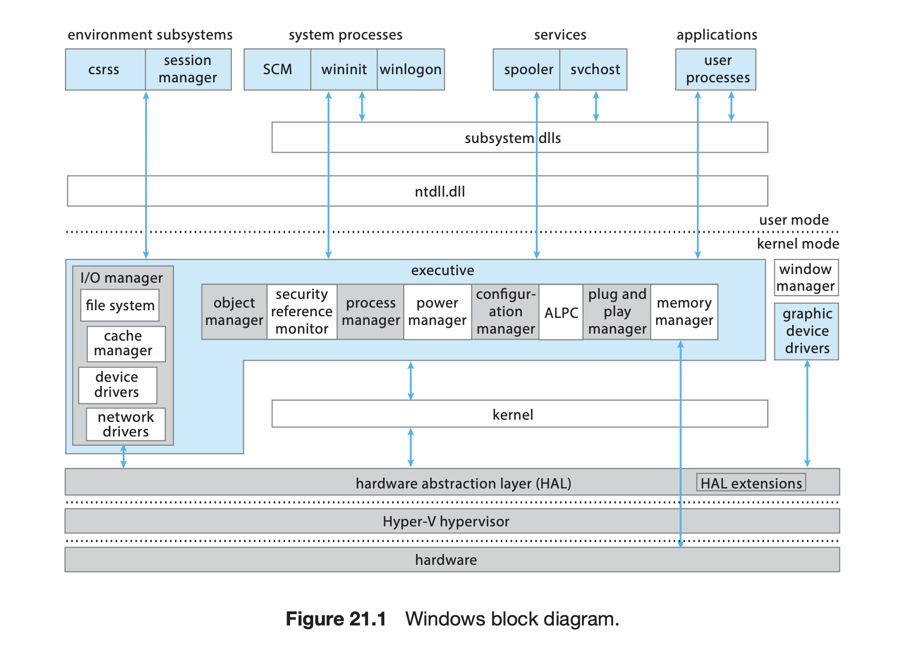
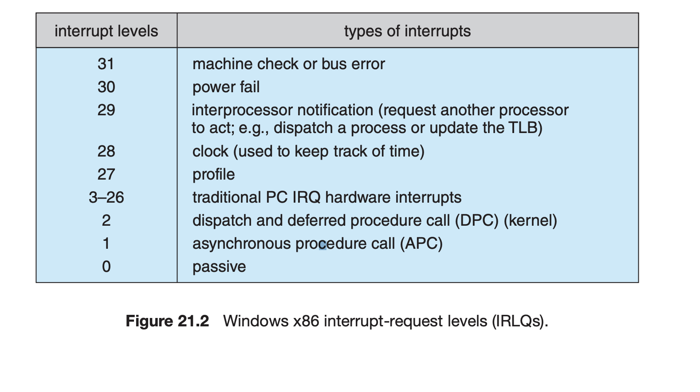
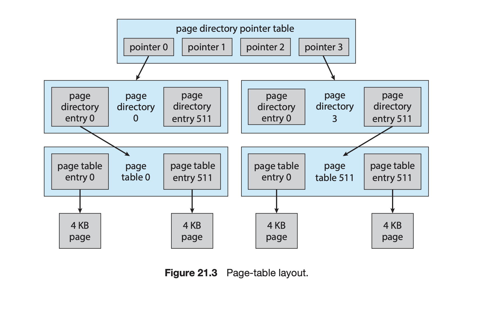
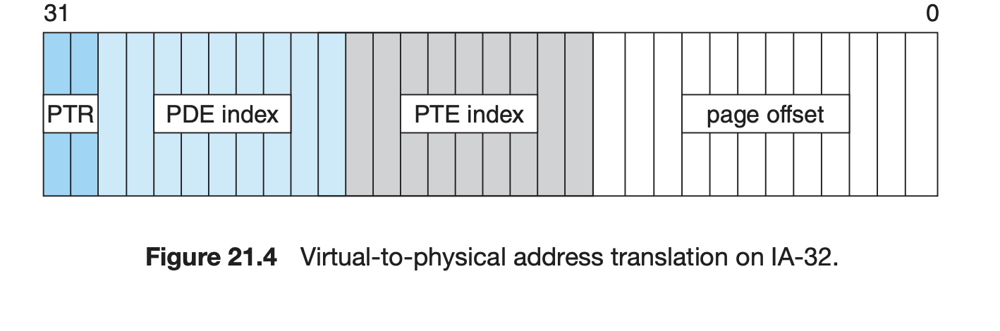
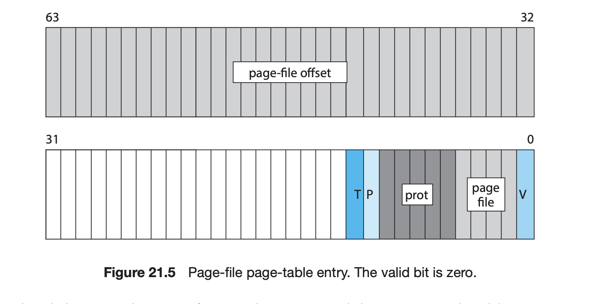
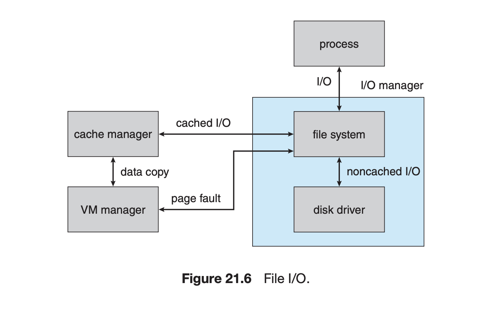
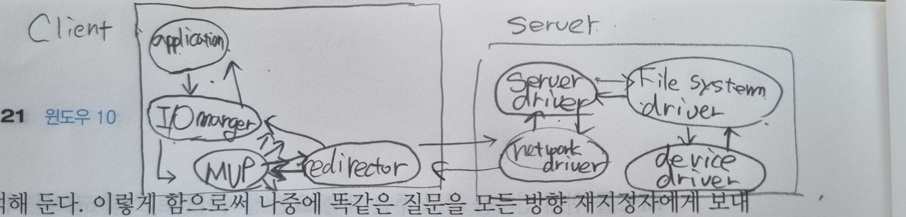

| 작성자  |   작성일   |
| :-----: | :--------: |
| yunselee | 2022.08-05 |

# 21 Windows 10

내용이 많이 미숙하니 읽는데 주의해주세요

- Explore the principles underlying Windows 10’s design and the specific
components of the system.
- Provide a detailed discussion of the Windows 10 file system.
- Illustrate the networking protocols supported in Windows 10.
- Describe the interface available in Windows 10 to system and application programmers.
- Describe the important algorithms implemented with Windows 10.

# 21.1 History

21.1.1 Windows XP, Vista, and 7

21.1.2 Windows 8

21.1.3 Windows 10

# 21.2 Design Principles

## 21.2.1 Security

- C2 보안 분류 (결함이 있는 소프트웨어와 악의적인 공격으로부터 적당한 수준의 보호)
- bug bounty
- 시스템 객체 (ex 파일, 레지스트리 키, 커널 동기화 객체)를 접근 제어 리스트(Access control list ACL section 13.4.2)
- 무결 수준(integrity levels) : 무결성 수준에 따라 권한 결정, 프로세스가 더 높은 무결성 수준을 가지는 개체를 수정 못 하고, 프로세스는 메모리를 읽을 수 없음
- ABAC(attribute based access control), CAVC(claim based access control) 조합
- BitLocker : USB 플래시 드라이브, 전체볼륨 암호화
- ASLR(address space layout randomization), DEP(data execution prevention), CFG(Control Flow Guard), ACG(Arbitrary Code Guard) 적용
    - [Windows DEP](https://docs.microsoft.com/en-us/windows/win32/memory/data-execution-prevention) : 스택 및 메모리 힙을 표시해 코드 실행에 사욜 할 수 없도록 하는 기법
    - ASLR : 메모리 실행 가능 영역의 위치를 무작위로 지정
    - CFG : 컴파일러, 링커, 로더, 메모리 관리자와 협력하여 임의의 간접 분기의 목적지 주소를 유효한 함수와  대조하여 검증
    - 이외에도 30가지 이상 기능을 가지고 있음
- 최근 아예 ISA에 직접 보안 완화를 구축하기 위해 칩 제조업체들과 협력하기 시작
    - [CET(Control flow Enfoncement Technology)](https://www.intel.com/content/www/us/en/developer/articles/technical/technical-look-control-flow-enforcement-technology.html) : 하드웨어 Shadow Stack을 사용하여 ROP공격으로 보호
- 무결성 : 코드 무결성 모듈, 디지털 서명 기능 제공
- Device Guard : 디지털 서명 요구사항, 블랙리스트, 화이트리스트 개별 서명 인증서, 이진해시 등 사용자가 정의 가능

## 21.2.2 Reliability

- 오류 탐지를 위한 소스 코드의 자동 분석
- 검증 실패 시험 도구
- 드라이버 검증기의 동적 검사
- 커널 코드 사용자 모드 서비스로 옮김
    - 서드파티 폰트를 위한 렌더러
    - 음성과 관련된 소프트웨어 스택
- 부트 시간에 선택할 수 있는 메모리 진단 기능
- 런타임 메모리 진단
- 결함 허용 메모리 힙(fault-tolerant memory heap.) : 응용 프로그램 크래시로부터 힙이 학습하여 크래시한 응용 프로그램에 의해 수행된 메모리 연산을 자동으로 조정

## 21.2.3 Windows and Application Compatibility

- 응용 프로그램과 Win32 API사이에 위치하는 shim 엔진이라 불리는 호환성 계층이 있음
    - 이전 버전의 버그까지 복제할 정도로 이전버전과의 호환성을 제공
    - SwitchBranch 기법을 통해 특정 에뮬레이트할 Windows 버전을 선택가능
- wow32(windows on windows32), wow64 제공
- LxCore라는 linux kenel의 재구현 pico provider driver를 통해  WSL기능에 사용 PE로의 재 컴파일 없이 ELF 바이너리 탑재가능

## 21.2.4 Performance

- Windows NT는 SMP를 위해 설계
- CPU 마다 우선순위 기반 선점 스레드 스케줄링을 사용 (디스패처, 인터럽트 수준을 제외하고는 더 높은 우선순위 스레드에 선점될 수 있음)
- 중요한 기능의 코드 경로 길이를 줄이고 대기 중인 스핀락, 푸리록과 같은 락킹 프로토콜을 구현
- 페이지 컬러링 구현
- NUMA 머신 지원
- 병렬 실행을 얻기위한 새로운 모델 ConcRT(Concurrency RunTime), PPL(Paralel Processing Library), TBB(Threading Building Blocks) 등이 등장하고 openMP를 컴파일러 등에서 지원하는 변화가 생김
- [UMS(User mode Scheduling)](https://docs.microsoft.com/en-us/windows/win32/procthread/user-mode-scheduling)지원 (windows 11에선 지원안함)
- GPU에서 SIMD 구조 사용
- DirectX 지원

## 21.2.5 Extensibility



- executive : 커널모드로 실행, 기본적인 시스템 서비스와 시스템이 공유할 수 있는 추상화 제공
- 그 위는 다수의 서비스가 사용자 모드로 동작
- 클라이언트 서버 모델 사용
- 원격 프로시저 호출 (RPC **[Remote procedure call](https://en.wikipedia.org/wiki/Remote_procedure_call)**)을 통한 분산처리 지원

## 21.2.6 Portability

- 대부분 C, C++로 작성
- 칩셋에 의존적인 코드의 대부분을 DLL과 HAL에 분리 시킴

## 21.2.7 International Support

- NLS API를 통해 여러 나라 언어 지원
- UNICODE 사용 UTL-16LE 인코딩 형식으로 되어있음

## 21.2.8 Energy Efficiency

- 가능한 경우 cpu의 클록 주파수를 줄임으로 저전력 상태로 들어감
- 모든 메모리를 보조저장장치에 저장하고 컴퓨터를 끌 수도있음(최대 절전)
- 클럭 인터럽트를 논리적 CPU 0과 활성 CPU에만 제공
- 소프트웨어 타이머를 더 병합하여 CPU 유휴 시간 연장
- 타이머 만료는 분배되지 않고 하나의 CPU가 모든 소프트웨어 타이머를 처리
- WinRT 모델에서는 동적 틱 개념을 도입해 마지막 활성 CPU가 책임

## 21.2.9 Dynamic Device Support

장치가 꽂혔을때 자동으로 장치를 인식, 적절한 드라이버 설치 및 적재 가능

---

# 21.3 System Components

Hyper-V hypervisior(을 사용하여 VTL(Virtual Trust Levels)(21.3.1)을 통해 독립적인 보안 모델을 제공 가능

해당 기능 활성 시 VSM(Virtual Secure Mode) 작동

해당 모드에서는 두가지 특권 시스템이 존재

- Normal World - VTL0 :
    - 커널모드 : HAL(21.3.3), kernel(21.3.4), executive(21.3.5) , 드라이버와 DLL의존성을 적재
    - 사용자 모드 : 시스템 프로세스, Win32 환경 서브시스템 및 서비스 집합
- Secure World VTL1
    - 보안 커널(21.3.2) 및 executive (보안 micro HAL이 내장), 격리된 Trustlet이 사용자모드에서 실행
- 특별한 프로세서 모드 (Intel에서는 VMX Root Mode 명칭)
    - Hyper-v hypervisor 구성요소가 포함, 하드웨어 가상화를 사용하여 보통 - 보안세상의 경계를 구현
    - 사용자 - 커널 모드 경계는 CPU가 제공

# 21.3.1 Hyper-V Hypervisor

- VSM이 활성화 될때 처음으로 초기화되는 구성요소
    - 가상머신 실행을 위한 하드웨어 가상화 기능 제공
    - 하드웨어의 SLAT(Second Level Addreess Translation)기능에 대한 VTL 결계 액세스 제공
    - AMD의 Pacifica(SVMX), Intel Vanderpool(VT-x)같은 CPU별 가상확장을 사용
        - 인터럽트 예외 메모리 액세스, 명령, 포트, 등록 액세스를 가로채 거부,변경,연상, 소스/대상의 방향을 재지정
    - VTL 0 의 커널, VTL1의 보안 커널 및 실행 중인 모든 가상 머신 커널 및 보안 커널과 통신할 수 있는 하이퍼 콜 인터페이스 제공

# 21.3.2 Secure Kernel

- VTL1 사용자 모드 Trustlet 응용 프로그램의 커널 모드 환경으로 작동
- 커널과 동일한 시스템 콜 인터페이스 제공
    - 모든 인터럽트, 예외 및 VTL 1 Trustlet에서 커널 모드로 들어가려는 시도 대신 보안 커널로 진입하도록 함
- context switch, thread schedule, memory menagement, interprocess-communication, 다른 커널 표준 작업은 하지않음
- VTL 1에는 커널 모드 드라이버가 없음
- 일종의 Proxy kernel역할
- attack surface를 줄이기 위해 복잡함 구현은 VTL0의 일반 커널 서비스로 넘김
- DDOS공격에는 취약하나 데이터 프라이버시와 무결성을 우선시함
- TPM(trusted platform module), 코드 무결성 정책에 대한 액세스 제공
- SLAT의 CPU기능을 이용하여 물리페이지로 백업하는 가상 메모리를 할당하는 기능 제공
- Credential Guard 기능 제공

# 21.3.3 Hardware-Abstraction Layer

- 가상 하드웨어 인터페이스 제공
- CPU 구조마다 하나의 드라이버 버전만 있으면 됨

# 21.3.4 Kernel

- thread scheduling
- context switching
- 저수준 프로세서 동기화
- 인터럽트 및 예외처리
- 시스템 콜 인터페이스
- user mode,  kernel mode간 전환

## 21.3.4.1 Dispatcher

- executive와 서브시스템을 위한 기반 제공
- 대부분 메모리 밖으로 페이지 아웃되지 않고 섬점되지 않음
- thread scheduling
- context switching
- 동기화 프리미티브 구현
- 타이머 관리
- 소프트웨어 인터럽트
- 프로세스간 인터럽트
- 예외 디스패칭
- 인터럽트 요청 수준(interrupt request level IRQ) : 인터럽트 우선순위 부여 관리

## 21.3.4.2 Switching Between User-Mode and Kernel-Mode Threads

- UT(User mode thread)
- KT(Kernel mode thread)

스레드는 UT실행을 위한 스택과 KT를 위한 스택이 존재

- UT는 커널모드로 트랩하게 만드는 명령을 실행해 시스템 서비스 요청/인터럽트
- 커널층은 트랩 핸들러 실행 : UT스택에 상응하는 KT스택으로 전환 CPU모드를 Kernel mode로 전환, 실행 완료시 다시 UT로 전환하고 사용자모드에서 계속 실행

## 21.3.4.3 Threads

- 스케줄링 가능한 단위로 사용
- 정보
    - 실제 우선순위
    - 프로세서 선호도
    - CPU 사용정보
    - 상태
        - initializing
        - ready
        - deferred ready
        - standby
        - running
        - waiting
        - transition
        - terminated

### 스케줄링 방식

선점은 즉각적

다른 프로세서에 소프트웨어 인터럽트(DPC deferred procedure call 지연된 프로시저 호출)을 보냄

디스패처는 32단계 우선순위 사용해 스레드 우선순위 결정

우선순위는 가별 클래스(1~15)와 정적 클래스(16~31)의 두 클래스로 나뉨

디스패처 데이터베이스(각 스케줄링 우선순위에 따른 연결 리스트 집합)을 가짐

이 데이터 베이스가 전역에 있을때는  cpur간 많은 race가 발생함에 따라 이상적인 프로세서의 데이터 베이스를 도입함 → 전역락을 흭득할 필요가 없음, 디스패칭 시간은 상수시간 연산이며 기기의 모든 cpu에서 병렬 처리가 가능함

단일 프로세서 시스템에서 준비된 스레드를 찾지 못하면 

1. 주위의 다른  디스패처 데이터베이스를 확인해 스레드를 빼앗아옴 
    1. 다른 프로세서 락 흭득
    2. 캐싱 토폴로지 및 NUMA노드 거리 고려
2. ideal thread라는 특수 스레드 실행 : multicore processor에서 CPU는 각자의 ideal thread를 가짐
- 이런 경우에 지역성 문제가 생길 수가 있고 이를 위해 Windows 7에서는 load balancer 알고리즘을 도입했지만 애매한 상황에서 Windows 8부터는 shared ready queue를 도입

## 21.3.4.4 Thread Scheduling

thread가 준비, 긴 대기 상태가 되거나, 종료, 응용 프로그램이 스레드의 프로세서 선호도를 변경할 때 일어남

스케줄링은 우선순위가 낮은 스레드 자신이 직접 수행 (다른 OS에서는 외부 스케줄러 스레드가 관리)

- 지연시간 단축
- IO, 기타 상태 변경 작업에 오버헤드가 추가되는 비용 지불

강성 실시간 운영체제가 아님

- DPC 및 ISR(interrupt service routine)의 실행동안 무기한 봉쇄가능
- 우선순위 높은 스레드에 선점가능
- 시간할당량이 끝날시에 round robin 될 수 있음

Pentium Pro 이후 모든 프로세서에 포함된 하드웨어 timestamp counter(TSC)를 사용하여 실행시간을 추적

CPU 사용량을 보다 정확하게 계산 할 수 있음

ISR, DPC에도 TSC를 사용하여 인터럽트 시간도 정확하게 추적가능

주어진 시간동안 가능한 모든 CPU 사이클 수를 정확하게 계산하는 것이 가능 CPU사이클 단위로 사용률 측정가능

## 21.3.4.5 Implementation of Synchronization Primitives

디스패치 및 동기화를 제어하기 위한 dispatcher object의 종류

- event : signal
- mutex
- semaphore
- thread
- timer

함수를 통해서 사용자 모드에서 접근 가능

## 21.3.4.6 Interrupt Request Levels (IRQLs)



## 21.3.4.7 Software Interrupts: Asynchronous and Deferred Procedure Calls

software Interrupts 종류는 asynchronous procedure calls (APCs)와 DPC가 존재 


## 21.3.4.8 Exceptions, Interrupts, and IPIs

- Integer or floating-point overflow
- Integer or floating-point divide by zero
- Illegal instruction
- Data misalignment
- Privileged instruction
- Access violation
- Paging file quota exceeded
- Debugger breakpoint

- 트랩핸들러 : 하드웨어 레벨 예외 처리, 커널의 예외 디스패처의 예외처리 코드 호출
- 예외 디스패처 : 예외 상황에 따른 처리기를 찾는다.
- 커널 모드에서 예외가 발생할 경우 예외 디스패처가 처리기를 찾지 못할때 블루 스크린을 띄운다.
- 사용자 모드에서 예외시에 훨씬 복잡함
- 커널 내 인터럽트 디스패처 테이블 : 장치 드라이버가 제공한 ISR 또는 커널 트랩 핸들러 루틴을 호출함으로 처리 , 다중 처리기 컴퓨터 인 경우 코어별로 테이블을 가짐

# 21.3.5 Executive

모든 환경 서브시스템이 사용할 수 있는 서비스 집합을 제공

- object manager
- virtual memory manager
- process manager
- advanced local procedure call facility
- I/O manager
- cache manager
- security reference monitor
- plug-and-play and power managers
- registry
- startup.

## 21.3.5.1 Object Manager

커널 모드 개체 entity를 object라 부름 사용자 모드 프로그램에 의해 조작되는 일반적인 인터페이스 집합

이를 조작하는 구성요소를 object manager라 지칭

object 예시

- 파일
- 레지스트리 키
- 장치
- ALPC 포트
- 드라이버
- 세마포어
- mutex
- event
- process
- thread

user mode 및 kernel mode는 많은 api에서 반환하는 handle로 객체에 액세스 가능

kernel mode에서는 referenced pointer를 이용하여 객체에 액세스 가능

핸들은 프로세스가 종료될 때 암묵적으로 닫힘

커널 핸들은 자동으로 닫히지 않으므로 자원 누수가 될 수 있음

object manager는 객체 핸들을 생성하는 유일한 개체

SRM(Security reference monitor)를 통해 호출

프로세스가 할당할 수 있는 최대 메모리를 제한

프로세스와 스레드는 이름 없이 생성되므로 PID, TID를 통해 참조

## 21.3.5.2 Virtual Memory Manager

가상 주소 공간, 물리 메모리 할당, 페이징 관리하는 구성요소

- 페이지 크기 : 4kb, 2MB 1GB
- IA32, ARM같은 32비트 처리기에서 각 프로세스는 4GB의 가상 주소 공간을 가짐. 디폴트로 상위 2GB는 모든 프로세스가 대분 동일 kernel mode에서 운영체제 코드와 자료구조를 접근하기 위해 사용
- 64비트 운영 체제는 프로세스당 256TB 가상 주소 공간 제공 사용자 모드, 커널 모드가 각각 절반씩 나뉨

가상 메모리 할당

1. 예약
2. commit

공유 메모리

section object를 정의

페이지 메모리 보호

- 읽기 전용
- 읽기 쓰기
- 읽기 쓰기 실행
- 실행 전용
- 접근 불가 : 접근시 exception 발생 : 사용자, 커널 모드 스택의 스택 오버플로 탐지, heap buffer overrun 탐지, 메모리 할당의 할당범위를 벗어난 접근 탐지에 사용
- copy on write



다단계 페이지 테이블

IA-32, AMD64의 경우

1. 가가 프로세스는 하나의 페이지 디렉터리를 가짐
2. 페이지 디렉터리에는 각 8byte크기의 페이지 디렉터리 항목(PDE)가 512개가 들어있다.
3. 각 페이지 디렉터리 항목은 하나의 페이지 테이블을 가르킴
4. 페이지 테이블에는 8byte크기의 페이지 테이블 항목(PTE)이 512개가 있음
5. 각 페이지 테이블 항목은 4kb 페이지 프레임을 가르킴

IA32의 경우 4개의 항목을 가진 두 번째 페이지 디렉터리 단계가 필요



가상주소 - 물리 주소 변환

최상위 비트 부터 4개의 값으로 나눔

- 2비트 : 최상위 4개의 PDE 중 하나 선택
- 9비트 512개의 PDE 중 하나를 선택하는데 사용
- 9비트 PTE table page의 512 PTE중에 하나 선택
- 12비트 : offset

물리 주소는 가상 주소의 비트 수와 다를 수 있음

PDE와 PTE를 찾는 오버헤드를 피하기 위해 TLB를 사용 TLB는 PTE로 매핑하기 위한 메모리 캐시를 가지고 있음

TLB는 MMU의 일부

물리메모리의 7가지 상태

- free
- zeroed filled
- modified : 프로세스에 의해 내용이 변경되어 다른 프로세스에 의해 사용되기 전에 반드시 보조 저장장치에 기록되어야하는 페이지
- standby 보조저장장치에 저장된 페이지의 복사본
- bad : 하드웨어 오류로 인한 사용 불가능한 페이지
- transition : 보조저장장치로부터 물리 메모리 내의 페이지 프레임으로 이동 중인 페이지
- valid :

유효 페이지들은 프로세스의 페이지 테이블에 저장

다른 상태의 페이지들은 상태마다 별도의 리스트에 유지

페이지 프레임 번호(page frame number, PEN) 데이터 베이스의 항목을 연결하여 구축

- 참조 계수
- 락
- NUMA 정보 등 포함

- PEN DB는 물리 메모리의 페이지
- PTE는 가상 메모리의 페이지를 나타냄

PTE 의 유효비트가 0이면 하드웨어는 다른 모든 비트를 부시하고, MM은 다른 목적으로 비트들을 사용할 수 있음



PTE구조

- 페이지를 교체 정책으로 LRU사용 페이지의 나이를 따져 가용 메모리가 부족해지면 MM은 작업 집합의 규모를 줄임
- 페이지의 나이는 참조된 이후의 시간
- 줄이는 정도는 휴리스틱을 이용
- 프로세스가 사용할 수 있는 메모리 양에 hard limit를 받으면 메모리가 충분하더라도 작업 집합을 줄일 수 있음
- prefetching 기법 : MM은 지역성을 고려하여 하나의 page fault발생시 이웃한 페이지들도 미리 가져옴
- Super Fetch : 사용자 모드 서비스와 파일 시스템 필터를 포함한 특수 커널 모드 코드를 결합하여 시스템의 모든 페이징 작업을 모니터링
- 압축 저장소 관리자 : 메모리 압축 프로세스의 작업 집합에 페이지의 압축된 저장소를 생성. 하드웨어 압축 알고리즘이 내장된 현대의 보조저장장치 입출력 비용보다 적은 CPU 패널티를 가짐

## 21.3.5.3 Process Manager

프로세스 스레드 및 작업을 생성, 삭제, 조회, 관리

작업의 프로세스 그룹화

스레드의 우선순위, 선호도를 설정하는 것 외에는 스케줄링에 관여 X

프로세스는 최소 하나 이상의 스레드가 포함 되고 프로세스는 **작업 객체**라고 하는 큰 단위로 묶일 수 있다.

프로세서 생성 방식이 매우 복잡함 Win32 환경에서 프로세스 생성의 예 


1. A Win32 application calls CreateProcess().
2. A number of parameter conversions and behavioral conversions are done from the Win32 world to the NT world.
3. CreateProcess() then calls the NtCreateUserProcess() API in the process manager of the NT executive to actually create the process and its initial thread.
4. The process manager calls the object manager to create a process object and returns the object handle to Win32. It then calls the memory manager to initialize the address space of the new process, its handle table, and other key data structures, such as the process environment block (PEBL) (which contains internal process management data).
5. The process manager calls the object manager again to create a thread
object and returns the handle to Win32. It then calls the memory manager to create the thread environment block (TEB) and the dispatcher
to initialize the scheduling attributes of the thread, setting its state to
initializing.
6. The process manager creates the initial thread startup context (which
will eventually point to the main() routine of the application), asks the
scheduler to mark the thread as ready, and then immediately suspends
it, putting it into a waiting state.
7. A message is sent to the Win32 subsystem to notify it that the process is
being created. The subsystem performs additional Win32-specific work to
initialize the process, such as computing its shutdown level and drawing
the animated hourglass or “donut” mouse cursor.
8. Back in CreateProcess(), inside the parent process, the
ResumeThread() API is called to wake up the process’s initial thread.
Control returns to the parent.
9. Now, inside the initial thread of the new process, the user-mode link
loader takes control (inside ntdll.dll, which is automatically mapped
into all processes). It loads all the library dependencies (DLLs) of the application, creates its initial heap, sets up exception handling and application
compatibility options, and eventually calls the main() function of the
application.

unix 방식의 fork도 지원

## 21.3.5.4 Facilities for Client–Server Computing

## 21.3.5.5 I/O Manager

장치 드라이버와 드라이버가 서로 커널과 사용자 모드 클라이언트 및 소비자와 통신할 수 있도록 하는 통신 모델을 구현하고 정의

memory mapped file io를 제공

전체 입출력 시스템의 캐싱을 관리하는 캐시 관리자 제어

기본적으로 비동기 작동

- 다수의 비동기 입출력 완료 모델 지원
    - 이벤트 설정
    - 호출 프로세스 상태 변수 갱신
    - 스레드 초기화를 위한 APC 전달
    - 입출력 완료 포트 사용

입출력 요청을 위한 버퍼관리

장치 드라이버는 장치마다 하나의 리스트로 구성(드라이버, 입출력 스택이라 부름)


## 21.3.5.6 Cache Manager

논리/가상 파일 수준에서 작동하는 중앙 집중식 캐싱 기능을 제공

MM과 협력하여 IO관리자의 제어하에 있는 모든 구성 요소에 대한 캐시 서비스 제공

캐시는 256kb의 블록들로 나뉨 

각 캐시 블록은 memory mapped region을 가질 수 있음

각 캐시 블록은 가상 주소 제어 블록(virtual address control block VACB)에 의해 기술

- 가상 주소
- 파일 오프셋
- 사용 프로세스들의 수

페이지 폴트로 인해 복사가 실패할 경우 MM은 입출력 관리자에게 캐시를 거치지 않는 직접적인 읽기 요청



;;;;

## 21.3.5.7 Security Reference Monitor

스레드가 보호된 자료구조에 대한 핸들을 열 때마다 유효 보안 토큰과 객체의 보안 디스크립터를 확인

보안 디스크립터 해당 리스트를 포함

- 임의 액세스 제어 리스트 (discretionary access control, DACL)
- 시스템 액세스 제어리스트 (system access control list, SACL)

보안 토큰은 스레드의 프로세스 토큰 일 수도있고 스레드 자신의 토큰 일 수도 있음

각 프로세스는 관련 보안토큰을 가짐

토큰을 다음을 가짐

- 사용자 SID
- 그룹 SID
- 사용자의 권한
- 프로세스 무결성 수준
- 사용자 특성 및 클레임 및 관련 자격

## 21.3.5.8 Plug-and-Play Manager

하드웨어 구성의 변화를 인식하고 적응하는 관리자

## 21.3.5.9 Power Manager

## 21.3.5.10 Registry

구성정보를 구성 관리자가 관리하는 내부 데이터 저장소에 유지하는데 이를 hives라고 부르고 흔히 레지스트리로 알려져있음

## 21.3.5.11 Booting

---

# 21.4 Terminal Services and Fast User Switching

# 21.5 File System

Windows의 파일 시스템은 NTFS

모든 지역적 볼륨에 사용

호환성을 위해 USB 드라이브, 카메라의 플래시 메모리 및 외장 저장 장치는 32 bit FAT  파일 시스템으로 포맷 될 수 있다.

개별 파일에 대한 접근을 제어하기 위해 ACL을 이용하고 (BitLokcer 이용), 암묵적 암호화를 지원

- 자료 복구 data recovery
- 결함 허용 fault tolerance
- 대용량 파일 및 파일 시스템
- 다중 데이터 스트림
- 유니코드 이름
- 성긴 파일
- 저널링
- 볼륨 섀도 복사본
- 파일 압축

등 구현

# 21.5.1 NTFS Internal Layout

- 기본 개체는 볼륨 volume
- 논리 디스크 관리 유틸리티(logical disk management utility)에 의해 생성
- 논리 디스크 파티션(logical disk partition)을 기반으로 함
- clusters를 저장장치 할당 단위로 사용 2의 거듭제곱 수 크기
- 디폴트 클러스터의 크기는 볼륨의 크기에 따라 정해짐 볼륨이 2GB보다 클때 디폴트 클러스터 크기는 4KB
- 저장 장치 주소로 논리 클러스터 번호(logical cluster numbers LCNs)사용
- NTFS에서 파일은 UNIX처럼 byte stream이 아니라 속성(attributes)들로 구성된 구조화된 객체 이다.
- 각 속성은 각각이 독립적인 byte stream이며 개별적으로 생성 삭제 읽기 쓰기를 할 수 있다.
- 모든 파일에 대한 정보는 MET(master file table)이라 불리는 특수 파일에 배열에 레코드로 저장 되어있다.

## 21.5.1.1 NTFS B+ Tree

name space는 디렉터리의 계층으로 구성 되어있다 각 디렉터리는 파일명들의 색인을 저장하기 위해 B+트리라는 자료구조를 사용한다.

## 21.5.1.2 NTFS Metadata

- 로그 파일 : 파일 시스템의 메타데이터 갱신사항 기록
- 볼륨 파일 : 볼륨 이름과 볼륨을1 포맷한 NTFS 버전
- 속성 정의표 : 볼륨내에서 사용된 속성들의 종류, 연상들 저장
- 루트 디렉터리 : 파일 시스템 계층 구조에서 최상위 디렉터리
- 비트맵 파일 : 볼륨 내에서 파일에 할당된 클러스터 및 사용되지않은 클러스터 표시
- 부트 파일
- 손상 클러스터 파일

# 21.5.2 Recovery

- 모든 파일 시스템 자료구조에 대한 갱신이 내부 트랜잭션(transaction)으로 수행.
- redo, undo 관련된 정보를 포함한 log record를 기록하며 자료구조에 대한 변경이 문제없이 끝나면 트랜잭션이 성공적으로 끝났음을 로그에 저장
- 시스템 크래시가 났을때 로그레코드를 처리하여 committed 트랜잭션 연산을 재실행하고 완료되지 않은 트랜잭션은 취소함으로 복구

# 21.5.3 Security

- windows 객체 모델에 기반해 접근 제어 리스트를 참고

# 21.5.4 Compression

- NTFS는 파일, 디렉터리 안의 모든 데이터 파일을 압축 할 수 있다
- 압축단위(compression unit)라는 블록으로 한 블록은 16개의 연속적인 클러스터로 이루어짐
- 성긴 파일(sparse file)이나 대부분이 0으로 채워진 파일에 대해서 공간을 절약하기 위해 한번도 쓰기가 일어나지안아 0만을 포함하고 있는 클러스터는 실제로 할당되지 않고 보조저장장치에 저장되지 않는다. MET 항에 저장 되는 가상 클러스터 번호의 열에 공백을 남긴다.

# 21.5.5 Mount Points, Symbolic Links, and Hard Links

- 마운트 포인트 : 디렉터리에 한정된 일종의 심볼링 링크

# 21.5.6 Change Journal

파일 시스템에 행해진 모든 변경을 기술하는 저널을 유지

# 21.5.7 Volume Shadow Copies

볼륨의 일관적인 뷰를 백업하는 데 사용 가능한 shadow 복사본을 만드는 능력을 구현하고 있다. 스냅숏이라고도 불린다.

---

# 21.6 Networking

- peer to peer
- client server

간 네트워킹 지원

network component는 다음 기능을 제공

- data transport
- interprocess communication
- 네트워크를 통한 파일 공유
- 원격 프린터 작업

# 21.6.1 Network Interfaces

두 개의 내부 네트워킹 인터페이스가 존재

- 네트워크 장치 인터페이스 명세(Network Device Interface Specification NDIS)
    - 네트워크 어댑터를 트랜스포트 프로토콜로부터 분리하여 서로 분리하여 서로 영향을 주지않고 변경을 할 수 있음
    - OSI 모델의 데이터 연결 제어층(data link control layer)과 매체접근 제어층 (media access control layer) 사이에 존재
- 트랜스포트 드라이버 인터페이스(TDI)
    - 전송층(transport layer :layer 4)과 세션층(session layer: layer 5) 사이의 인터페이스
    - 연결형 전송과 비연결형 전송을 모두 지원

# 21.6.2 Protocols

프로토콜은 드라이버로 구현되어 있음

## 21.6.2.1 Server Message Block

SMB

## 21.6.2.2 Transmission Control Protocol/Internet Protocol

- 인터넷에서 사용되는 이 프로토콜을 사실상의 표준으로 자리 잡고 있음
- Windows는 다양한 종류의 운영체제나 하드웨어 플랫폼에 접속하기 위해서 사용
- Windows TCP/IP패키지에는 다음의 지원을 포함
    - Simple network management protocol(SNMP)
    - dynamic host configuration protocol(DHCP)
    - Windows Internet name service(WINS)
- 이후 IPv6 IPv4를 지원하는 TCP/IP의 새로운 구현을 소개
- 네트워크 스택을 고성능 하드웨어에서 구현하는 것도 지원
- TCP 포트를 제한하는 소프트웨어 방화벽을 제공

## 21.6.2.3 Point-to-Point Tunneling Protocol

PPTP

- Windows 서버에서 실행중인 원격 접근 서버 모듈과 다른 클라이언트 시스템 사이의 통신을 위해 제공하는 프로토콜
- 전송하는 데이터를 암호화 할 수 있음
- VPN 제공

## 21.6.2.4 HTTP Protocol

- www를 이용해 get/put 정보를 주고받는데 사용
- 커널 모드 드라이버를 이용해 HTTP를 구현하여 웹서버가 네트워크 스택에 연결할때 낮은 오베헤드
- RPC 구현을 위한 전송층의 대안으로 사용
- 

## 21.6.2.5 Web-Distributed Authoring and Versioning Protocol

## 21.6.2.6 Named Pipes

- 연결지향 메세지 교환방식(connection oriented messaging mechanism)
- 같은 시스템에서 동작하고 있는 프로세스와 정보를 교환하기 위해 사용
- 파일 시스템의 인터페이스를 통해 접근 되기에 파일 객체에 대한 보안 기법이 그대로 적용
- SMP프로토콜이 지명 파이프를 지원하기에 다른 시스템의 프로세스와 통신하는 데에도 사용 가능
- 지명 파이프의 이름은 Uniform naming convention(UNC)라는 포맷을 가진다
- 전형적인 원격 파일 이름과 같은 형식을 가짐
    - UNC의 포맷 : ∖∖server name∖share name∖x∖y∖z,
    - ∖∖server name : 네트워크상의 서버
    - share name : 디렉터리, 파일 지명 파이프,프린터와 같은 네트워크 사용자에게 허가된 자원의 이름
    - ∖x∖y∖z 일반적인 파일의 경로명

## 21.6.2.7 Remote Procedure Calls

클라이언트 서버 기법

## 21.6.2.8 Component Object Model

- 공통 객체 모델
- Windows를 위해 개발된 프로세스간 통신 기법
- 예를들어 OLE(object linking and embedding)기술이 스프레드 시트를 WORD 문서에 삽입하기 위해 사용하는 기본 구조
- COM 인터페이스 제공
- DCOM : 분산 시스템용 확장, RPC를 사용하는 네트워크에서 사용 될 수 있음

# 21.6.3 Redirectors and Servers

- 원격 컴퓨터에서 파일에 접근하기 위해 Windows I/O API를 사용하는 클라이언트 프로그램과 CIFS 서버(section 15.6.2)를 사용 중인 경우 파일을 지역파일 인 것처럼 접근 할 수 있다.
- 방향 재지정자는 클라이언트 측 객체로 원격 시스템에 대한 입출력 요청을 서버 측으로 보내 줌
- 성능과 보안의 이유로 방향 재지정자와 서버는 커널모드에서 실행

원격 파일의 접근은 다음 과정을 통함



1. Client 응용프로그램에서 I/O manager를 호출해 표준 UNC 포맷의 파일 이름을 가진 파일을 열어달라고 요청
2. I/O manager는 21.3.5.5 section에 설명된 방법으로 I/O request packet을 만듬
3. 접근하려는 해당 파일이 원격 파일임을 알아내고 MUP(multiple UNC provider) 호출
4. MUP가 I/O request packet을 시스템에 등록된 모든 방향 재지정자에게 비동기 식으로 보냄
5. 가능한 방향 재지정자가 MUP에 응답하고 MUP는 해당 방향재지정자를 캐싱함(4를 생략하기 위함)
6. 해당 방향 재지정자는 네트워크를 통해 원격 시스템에 요청
7. 원격 시스템의 네트워크 드라이버가 해당 요청을 받아 이를 서버 드라이버로 전달
8. 서버 드라이버가 해당 요청을 적절한 파일 시스템 드라이버에 전송
9. 데이터에 접근하기 위한 적절한 장치 드라이버가 호출
10. 결과가 서버에 전달되면 서버는 네트워크를 통해 방향 재지정자에게 전달 → 방향 재지정자는 결과를 입출력 관리자를 통해 응용 프로그램에 돌려줌

- UNC 서비스 대신 Win 32 네트워크 API사용하는 응용프로그램의 경우도 비슷한 절차를 거친다 MUP대신 multi-provider router모듈 사용
- 이식성을 위해 방향 재지정자와 서버는 네트워크 전송에 TDI API를 사용
- 요청 자체는 기본적으로 SMB 프로토콜이 행함
- 방향 재지정자의 목록은 레지스트리 시스템 hive에 존재

## 21.6.3.1 Distributed File System

- DFS(distributed file system)프로토콜을 지원
- 네트워크 관리자가 단일 분산 이름 공간을 사용해 다수의 서버에 있는 파일을 제공가능

## 21.6.3.2 Folder Redirection and Client-Side Caching

- 클라이언트 측 캐싱 (CSC) : 방향 재지정한 파일에 대한 오프라인 접근을 지원하기 위함
- 서버 파일의 복사본을 로컬 기계에 유지할 때 사용
- 서버 갱신은 다시 온라인으로 작동할때까지 지연

# 21.6.4 Domains

- Windows 도메인 : 공통의 보안 정책과 사용자 데이터베이스를 공유하는 Windows 워크스테이션과 서버의 그룹을 지칭
- 신뢰와 인증을 위해 커베로스(Kerberos)프로토콜 사용

# 21.6.5 Active Directory

- 활성 디렉터리 : LDAP(lightweight directory access protocol) 서비스를 Windows상에서 구현한 것
- 영역 기반의 사용자 및 그룹 계정과 패스워드를 유지

# 21.7 Programmer Interface

Win 32API는 Wdinwos의 capabilities에 대한 기본적인 인터페이스

아래 section은 다음에 대해 다룸

1. 커널 객체에 대한 접근
2. 프로세스간 객체 공유
3. 프로세스 관리
4. 프로세스 간 통신
5. 메모리 관리

# 21.7.1 Access to Kernel Objects

커널은 응용단에서 커널 객체를 조작할 수 있도록 제공

- CreateXXX()를 통해 XXX 핸들러를 반환하면서 XXX 커널 객체에 접근가능
- CloseHandle() 를 통해 핸들을 닫음

# 21.7.2 Sharing Objects Between Processes

객체를 공유하는 세가지 방법

1. 자식프로세스가 객체에 대한 핸들을 상속 받는것

```cpp
SECURITY_ATTRIBUTES sa;
sa.nlength = sizeof(sa);
sa.lpSecurityDescriptor = NULL;
sa.bInheritHandle = TRUE;
HANDLE hSemaphore = CreateSemaphore(&sa, 1, 1, NULL);
WCHAR wszCommandline[MAX PATH];
StringCchPrintf(wszCommandLine, countof(wszCommandLine),
L"another process.exe %d", hSemaphore);
CreateProcess(L"another process.exe", wszCommandline,
NULL, NULL, TRUE, . . .);
```

1. CreateXXX를 호출할때 bInheritHandle을 true로 갖는 SECURITY ATTRIBUTES를 제공
2. 자식 프로세스 생성 CreateProcess 호출시에 bInheritHandle 인자에 true로 넘긴다

1. 객체가 생성될 때 한 프로세스는 객체에 이름을 붙이고 두번째 프로세스가 그 이름을 여는 것.

```cpp
// Process A
...
HANDLE hSemaphore = CreateSemaphore(NULL, 1, 1, L"MySEM1");
...
// Process B
...
HANDLE hSemaphore = OpenSemaphore(SEMAPHORE ALL ACCESS,
FALSE, L"MySEM1");
...
```

단점

1. 이름이 중복되는 이름인지 검사할 방법을 제공하지 않음
2. 객체의 이름이 전역변수이면서 서로 다른 객체를 원하는데 같은 이름으로 겹치는 문제가 생길 수 있음

장점 : 관련 없는 프로세스가 객체를 바로 공유 할 수 있음

1. DuplicateHandle()함수 사용

```cpp
// Process A wants to give Process B access to a semaphore
// Process A
DWORD dwProcessBId; // must; from some IPC mechanism
HANDLE hSemaphore = CreateSemaphore(NULL, 1, 1, NULL);
HANDLE hProcess = OpenProcess(PROCESS DUP HANDLE, FALSE,
dwProcessBId);
HANDLE hSemaphoreCopy;
DuplicateHandle(GetCurrentProcess(), hSemaphore,
hProcess, &hSemaphoreCopy,
0, FALSE, DUPLICATE SAME ACCESS);
// send the value of the semaphore to Process B
// using a message or shared memory object
...
// Process B
HANDLE hSemaphore = // value of semaphore from message
// use hSemaphore to access the semaphore
...
```

 복제된 핸들을 넘겨주기 위해 다른 방식의 프로세스간 통신을 해야함

# 21.7.3 Process Management

프로세스 : 응용 프로그램의 적재된 Instance

스레드

생성 : CreateProcess(), CreateThread()

thread는 개별적인 스택을 가지는데 CreateThread에 달리 인자를 명시하지 않으면 1MB할당

 

## 21.7.3.1 Scheduling Rule

다음의 우선순위 클래스를 설정 가능

1. IDLE PRIORITY CLASS (NT priority level 4)
2. BELOW NORMAL PRIORITY CLASS (NT priority level 6)
3. NORMAL PRIORITY CLASS (NT priority level 8)
4. ABOVE NORMAL PRIORITY CLASS (NT priority level 10)
5. HIGH PRIORITY CLASS (NT priority level 13)
6. REALTIME PRIORITY CLASS (NT priority level 24)

프로세스의 우선순위 클래스는 프로세스 안의 모든 스레드의 디폴트 우선순위가 된다

SetPriorityClass()함수나 start 명령에 넘겨지는 인자에 의해 변경될 수 있다.

## 21.7.3.2 Thread Priorities

스레드는 자신의 클래스에 의해 결정된 초기 우선순위로 시작하나 SetThreadPriority()함수로 스레드의 상대적인 우선순위 변경 가능 

- THREAD PRIORITY LOWEST: base − 2
- THREAD PRIORITY BELOW NORMAL: base − 1
- THREAD PRIORITY NORMAL: base + 0
- THREAD PRIORITY ABOVE NORMAL: base + 1
- THREAD PRIORITY HIGHEST: base + 2

우선순위를 조정하기 위해 두개의 구분이 사용 

- THREAD_PRIORITY_IDLE : 실시간 스레드를 위해서 우선순위 16, 가변우선순위 스레드를 위해서 1로 설정
- THREAD_PRIORITY_TIME_CRITICAL : 실시간 스레드를 위해서 31, 가변 우선순위 스레드를 위해서 15로 설정

커널이 스레드가 I/O를 하는가 CPU연산을 주로 하는가에 따라 우선순위를 동적으로 조정한다. SetProcessPriorityBoost(),SetThreadPriorityBoost()를 통해 동적인 조정을 불가능하게 하는 방법을 제공한다.

## 21.7.3.3 Thread Suspend and Resume

- SuspendThread()함수를 통해 스레드를 보류상태로 놓을 수 있다.
- ResumeThread()를 통해 보류상태에서 빠져나올 수 잇음
- 카운터를 가지고 있기에 한 스레드에 대해 Suspend시긴만큼 Resume을 호출해야한다.

## 21.7.3.4 Thread Synchronization

 semaphore나 mutex를 커널이 제공함

커널 객체에 대해 동기화를 하는 함수들

- WaitForSingleObject()
- WaitForMultipleObject()

스레드가 코드를 배타적으로 실행하기를 원할때는 Win32 임계구역 객체가 존재

커널진입 없이 흭득되고 반활 할 수 있는 사용자모드 mutex객체

다중 처리기에서 Win32 임계구역은 다른 스레드가 반환할때까지 busy waiting를 함. busy waiting이 길어질때 커널  mutex를 할당받고 CPU를 양보함

- InitializeCriticalSection() : 임계구역을 사용하기전에 일부 스레드는 호출해야함
- EnterCriticalSection() :mutex를 얻기
- LeaveCriticalSection() : mutex반환
- TryEnterCriticalSection() : block당하지 않고 mutex를 얻으려고 시도

mutex가 아닌 user mode read writer 락을 원하는 프로그램을 위해 SRW락을 지원

- InitializeSRWLock()
- AcquireSRWLcokXXX()
- ReleaseSRWLockXXX()
- XXX에는 객체에대해 read, write에 따라 Exclusive, Shared가 들어간다.

또한 CriticalSection과 SRWLock과 함께 쓸 수 있는 condition variable(조건변수) 지원

## 21.7.3.5 Thread Pool

- SubmitThreadpoolWork() :작업 요청
- RegisterWaitForSignleObject() : 대기 가능한 핸들에 콜백을 연결(bind)해주는 API
- CreateThreadpoolTimer() WaitForThreadpoolTimerCallbacks() : 타이머와 작업하기 위한 API

성능을 향상하고 메모리 사용량을 줄이기 위함

## 21.7.3.6 Fibers

## 21.7.3.7 User-Mode Scheduling UMS and ConcRT

## 21.7.3.8 Winsock

- Windows의 소켓 API
- Session layer interface Unix socket과 호환가능
- Windows 개방 시스템 구조(Windows Open System Architecture WOSA)모델을 따름 : 응용과 네트워크 프로토콜 사이에 표준 서비스 공급자 인터페이스(SPI)를 제공

# 21.7.4 IPC Using Windows Messaging

1. 일반적인 고성능 방법은 로컬 RPC, named pipe사용
2. 공유된 커널 객체 
3. Windows 메시징 설비 이용
    1. PostMessage()
    2. PostThreadMessage()
    3. SendMessage()
    4. SendThreadMessage()
    5. SendMessageCallback()
    6. 함수를 이용하여 다른 스레드나 window로 메시지를 보낼 수 있음
    7. Post와 send의 차이 :
        1. post : 비동기 즉시 되돌아옴
        2. send: 동기 제대로 전달되어 처리될 때까지 스레드 block

# 21.7.5 Memory Management

## 21.7.5.1 Virtual Memory

```cpp
// reserve 16 MB at the top of our address space
PVOID pBuf = VirtualAlloc(NULL, 0x1000000,
MEM RESERVE | MEM TOP DOWN, PAGE READWRITE);
// commit the upper 8 MB of the allocated space
VirtualAlloc((LPVOID)((DWORD PTR)pBuf + 0x800000), 0x800000,
MEM COMMIT, PAGE READWRITE);
// do something with the memory
...
// now decommit the memory
VirtualFree((LPVOID)((DWORD PTR)pBuf + 0x800000), 0x800000,
MEM DECOMMIT);
// release all of the allocated address space
VirtualFree(pBuf, 0, MEM RELEASE);
```

- VirtualAlloc()  : 64kb경계로 할당된 메모리 반환
- VirtualFree()
- VirtualAllockEx() : 별도의 프로세스에서 메모리를 할당 해제
- VirtualFreeEx()
- VirtualAllocExNuma()

## 21.7.5.2 Memory-Mapped Files

```cpp
// set the file mapping size to 8MB
DWORD dwSize = 0x800000;
// open the file or create it if it does not exist
HANDLE hFile = CreateFile(L"somefile.ext",
GENERIC READ | GENERIC WRITE,
FILE SHARE READ | FILE SHARE WRITE, NULL,
OPEN ALWAYS, FILE ATTRIBUTE NORMAL, NULL);
// create the file mapping
HANDLE hMap = CreateFileMapping(hFile,
PAGE READWRITE | SEC COMMIT, 0, dwSize, L"SHM 1");
// now get a view of the space mapped
PVOID pBuf = MapViewOfFile(hMap, FILE MAP ALL ACCESS,
0, 0, 0, dwSize);
// do something with the mapped file
...
// now unmap the file
UnmapViewOfFile(pBuf);
CloseHandle(hMap);
CloseHandle(hFile);
```

- 메모리 매핑은 두 프로세스가 메모리를 공유하는 경우 편리한 방법
- 여러 프로세스가 같은 파일을 각 프로세스의 가상 메모리에 매핑
- 단지 다른 프로세스와 메모리 영역을 공유하기 위해서는 파일이 필요없음 0xffffffff라는 파일 핸들과 특정 크기를 이용해 CreateFileMapping()을 호출할 수 있다.

## 21.7.5.3 Heaps

- Win32 환경의 힙은 미리 예약된 주소 공간의 영역
- 프로세스가 초기화될때 디폴트 힙과 함께 생성
- 모든 힙 할당은 동일한 페이지를 공유하기 때문에 힙 메모리는 공유되거나 읽기 전용으로 표시될 수 없음
- HeapCreate() : 생성
- HeapProtect() : 읽기 전용 표시, 특정 Numa 노드에 할당 가능

여러 API

- HeapCreate()
- HeapAlloc()
- HeapRealloc()
- HeapSize()
- HeapFree()
- HeapDestroy()
- HeapLock(), HeapUnlock()을 통해 한 스레드가 힙에 대해 다른 스레드가 접근하지 못하게 할 수 있다

## 21.7.5.4 Thread-Local Storage

```cpp
// reserve a slot for a variable
DWORD dwVarIndex = T1sAlloc();
// make sure a slot was available
if (dwVarIndex == TLS OUT OF INDEXES)
return;
// set it to the value 10
T1sSetValue(dwVarIndex, (LPVOID)10);
// get the value
DWORD dwVar = (DWORD)(DWORD PTR)T1sGetValue(dwVarIndex);
// release the index
T1sFree(dwVarIndex);
```

- 전역, 정적 데이터에 의존하는 함수는 멀티스레드 환경에서는 적절하게 수행되지 못함.
- TLS기법은 실행중인 함수에게는 전역적이나 다른 스레드와 공유하지 않는 변수의 인스턴스를 유지하는 방법을 제공
- 전역 힙 저장소를 할당받고 그 장소를 모든 사용자 스레드에 할당해주는 스레드 환경 블록(TEB)에 부착한다. TEB는 각 스레드가 바로 접근 가능

## 21.7.5.5 AWE Memory

- 주소창 확장  Address Windowing Extension (AWE)
- AllocateUserPhysicalPages()을 통해 memory manager로부터 사용가능한 물리페이지를 요청어한 다음 VirtualAlloc()을 사용해 물리페이지를 사용하는 가상 메모리를 commit 할 수 있음
- 이 방법을 이용해 가상 주소공간보다 더 많은 물리 메모리에 액세스가 가능

# 21.8 Summary

- Microsoft designed Windows to be an extensible, portable operating system—one able to take advantage of new techniques and hardware.
- Windows supports multiple operating environments and symmetric multiprocessing, including both 32-bit and 64-bit processors and NUMA computers.
- The use of kernel objects to provide basic services, along with support for
client–server computing, enables Windows to support a wide variety of
application environments.
- Windows provides virtual memory, integrated caching, and preemptive
scheduling.
- To protect user data and guarantee program integrity, Windows supports
elaborate security mechanisms and exploit mitigations and takes advantage of hardware virtualization.
- Windows runs on a wide variety of computers, so users can choose and
upgrade hardware to match their budgets and performance requirements
without needing to alter the applications they run.
- By including internationalization features, Windows can run in a variety
of countries and many languages.
- Windows has sophisticated scheduling and memory-management algorithms for performance and scalability.
- Recent versions of Windows have added power management and fast
sleep and wake features, and decreased resource use in several areas to
be more useful on mobile systems such as phones and tablets.
- The Windows volume manager and NTFS file system provide a sophisticated set of features for desktop as well as server systems.
- The Win32 API programming environment is feature rich and expansive,
allowing programmers to use all of Windows’s features in their programs.

Practice Exercises

Further Reading

Bibliography

Chapter 21 Exercises